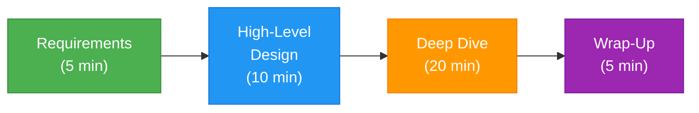

# 🎯 Interview Preparation Hub

> This page is your **one-stop resource** for System Design interview preparation. Use it to review strategies, practice answers, and avoid common pitfalls.

---

⏱ 15 min read
🟡 All Levels

---

## 🧠 How System Design Interviews Work

Most System Design interviews follow this structure:

| Phase | Duration | What To Do |
|-------|----------|-----------|
| **Requirements** | ~5 min | Ask clarifying questions. Define scope. Identify users and scale. |
| **High-Level Design** | ~10 min | Draw the major components. Show data flow. Identify APIs. |
| **Deep Dive** | ~20 min | Go deep on 1-2 components. Discuss trade-offs. Handle edge cases. |
| **Wrap-Up** | ~5 min | Summarize. Mention what you'd improve with more time. |

---

## 📋 The SCALE Framework

Use this framework to structure every System Design answer:

| Letter | Step | What To Do |
|--------|------|-----------|
| **S** | Scenario | Define the problem, users, and scale |
| **C** | Constraints | Identify bottlenecks, SLAs, and limits |
| **A** | Architecture | Draw high-level components and data flow |
| **L** | Layers | Deep dive into each layer — database, cache, API |
| **E** | Evolution | How does the design scale 10x? Handle failures? |

---

## 🗄️ Database Scaling — Quick Interview Reference

### One-Line Definitions

| Concept | Definition |
|---------|-----------|
| Vertical Scaling | Upgrade the hardware of the same server |
| Horizontal Scaling | Add more servers to distribute the load |
| Partitioning | Split data inside a single database |
| Sharding | Split data across multiple independent databases |
| Shard Key | The field that determines which shard stores the data |
| Replication | Maintain copies of the database for reads and availability |
| Failover | Promote a replica when the primary fails |
| Replication Lag | Delay between primary write and replica sync |

### Two-Minute Answers

??? note "How would you scale a database for 100 million users?"

    **Start with why**: A single database cannot handle 100M users — it will hit CPU, memory, storage, and connection limits.

    **Scaling approach**:

    1. **Start with vertical scaling** — upgrade CPU and RAM. This works up to ~10M users.
    2. **Add read replicas** — distribute read traffic across 3-5 replicas. Primary handles writes only.
    3. **Introduce caching** — Redis in front of the database. Most reads (80-90%) served from cache.
    4. **Shard the database** — split by user_id. Each shard handles a subset of users.
    5. **Each shard gets replicas** — for read scaling and high availability.

    **Architecture**: Load Balancer → API Servers → Redis → Shard Router → Shards (Primary + Replicas)

    **Key trade-offs**: Sharding makes cross-shard joins expensive. Choose the shard key carefully.

??? note "Difference between Partitioning and Sharding?"

    **Partitioning** splits data within a single database instance. The database manages partitions internally. Think of it as organizing files into folders on the same hard drive.

    **Sharding** splits data across multiple independent database servers. Each shard is a separate process, often on a separate machine. Think of it as distributing files across multiple hard drives.

    **Key difference**: Partitioning = one database, internal organization. Sharding = multiple databases, distributed data.

    **When to use which**: Start with partitioning. Move to sharding when a single server can't handle the load.

??? note "Why doesn't replication improve write performance?"

    All writes go to the primary. Replicas are read-only copies. Adding more replicas only improves **read** throughput.

    To improve write performance, you need **sharding** — splitting writes across multiple independent databases.

    **Common follow-up**: "What about multi-primary replication?" — It exists but introduces conflict resolution complexity. Most systems avoid it.

---

## ⚡ Decision Matrix — All Topics

Use this during interviews to quickly choose the right technique:

| Problem | Solution | Why |
|---------|----------|-----|
| CPU/RAM limit on one server | Vertical Scaling | Upgrade hardware — simplest first step |
| Single server can't handle traffic | Horizontal Scaling | Add more servers |
| Large table, slow queries | Partitioning | Organize data inside one DB |
| One DB can't hold all data | Sharding | Distribute across multiple DBs |
| Read-heavy workload | Replication | Multiple read replicas |
| Frequent reads of same data | Caching (Redis) | Sub-millisecond responses |
| Global user base | CDN + Geo-sharding | Serve from nearest location |
| Services need independence | Microservices | Separate deployment cycles |
| Loose coupling between services | Event-Driven Architecture | Async communication |

---

## 🔥 Top 20 Interview Questions

### Database & Storage

1. How would you design a database for an e-commerce platform with 100M users?
2. When would you choose SQL vs NoSQL?
3. How does database sharding work? What are the challenges?
4. What is replication lag and how do you handle it?
5. How would you design a URL shortener?

### Scalability

6. How would you scale a system from 1K to 100M users?
7. What is a load balancer and how does it work?
8. How does consistent hashing solve the redistribution problem?
9. What caching strategies would you use and why?
10. How does a CDN work?

### Architecture

11. Design Instagram's feed system
12. Design a chat application like WhatsApp
13. Design a notification system
14. Design a rate limiter
15. Design a distributed file storage system

### Reliability

16. How do you handle failures in a distributed system?
17. What is the CAP theorem? How does it affect design decisions?
18. How would you implement distributed transactions?
19. What is the difference between eventual and strong consistency?
20. How do you monitor and alert on a production system?

---

## ❌ Common Mistakes Candidates Make

!!! warning "Avoid These in Every Interview"

    **1. Not asking clarifying questions**

    - ❌ Immediately drawing a database and API server
    - ✅ "How many users? What's the read/write ratio? What are the SLAs?"

    **2. Over-engineering from the start**

    - ❌ "We'll need 50 shards, Kafka, Redis cluster, and a service mesh"
    - ✅ Start simple, then scale. Show how the architecture evolves.

    **3. No trade-offs discussed**

    - ❌ "We should use NoSQL" (without explaining why)
    - ✅ "NoSQL gives us horizontal scaling but we lose JOIN support and ACID transactions"

    **4. Ignoring failure modes**

    - ❌ "The load balancer distributes traffic" (and nothing else)
    - ✅ "If the primary database crashes, a replica is promoted automatically via failover"

    **5. Not estimating scale**

    - ❌ Generic architecture with no numbers
    - ✅ "100M users × 10 reads/day = 1B reads/day ≈ 12K QPS. A single PostgreSQL can handle ~5K QPS, so we need at least 3 read replicas."

---

## 📊 Back-of-the-Envelope Estimation Cheat Sheet

| Metric | Value |
|--------|-------|
| 1 day | 86,400 seconds |
| 1 million requests/day | ~12 QPS |
| 1 billion requests/day | ~12,000 QPS |
| Single PostgreSQL read throughput | ~5,000-10,000 QPS |
| Redis read throughput | ~100,000 QPS |
| 1 KB × 1 billion = | ~1 TB |
| Average HTTP response time (good) | < 200ms |
| P99 latency (acceptable) | < 1 second |

---

## 🎯 Module-Specific Cheat Sheets

For detailed, topic-specific interview preparation:

| Module | Cheat Sheet |
|--------|------------|
| Database Scaling | [Interview Cheat Sheet](../system-design/database-scaling/09-interview-cheatsheet.md) |

*More modules coming soon.*

---

## 💡 Final Interview Tips

!!! success "Remember These"

    1. **Drive the conversation** — don't wait for the interviewer to tell you what to do next.
    2. **Think out loud** — interviewers want to see your thought process, not just the final answer.
    3. **Start simple, then evolve** — show how the architecture grows with scale.
    4. **Always discuss trade-offs** — there's no perfect design, only trade-offs.
    5. **Use real numbers** — back-of-the-envelope calculations show maturity.
    6. **Know your weak spots** — if you don't know something, say so and explain how you'd find out.

---

[⬅️ Home](../index.md)

[Database Scaling ➡️](../system-design/database-scaling/index.md)

