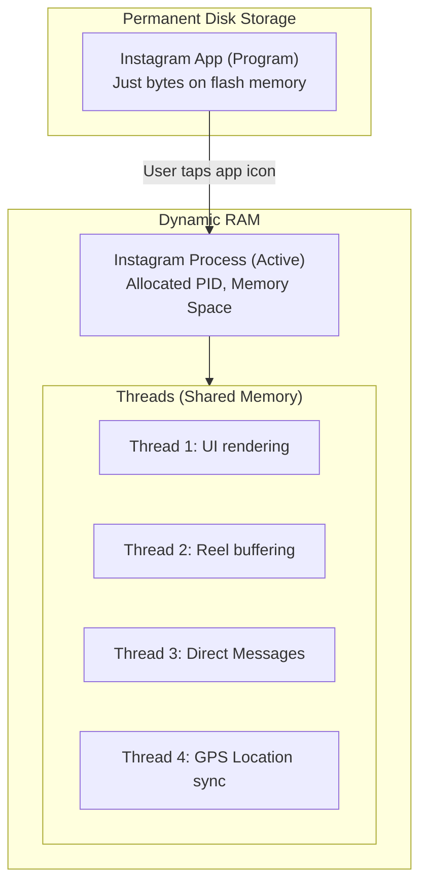

# 🧵 Programs, Processes & Threads

> Before analyzing memory performance, we must understand the core execution blocks of an Operating System: **Programs**, **Processes**, and **Threads**.

---

<div class="chapter-meta" markdown>
<span class="meta-item meta-reading-time">⏱ 6 min read</span>
<span class="meta-item meta-difficulty-beginner">🟢 Beginner</span>
</div>

---

## 📖 The Real-Life Metaphor: The Restaurant Kitchen

To understand the division of tasks, let's look at a restaurant kitchen:


1. **The Recipe Book (Program):** A set of written instructions sitting on a shelf. It does nothing on its own, consumes no kitchen ingredients, and is completely passive.
2. **The Cooking Process (Process):** When the manager allocates kitchen space, burner time, and ingredients to execute a recipe. Cooking is active.
3. **The Kitchen Staff (Threads):** The individual workers in the kitchen. One chops tomatoes, one boils pasta, and one plates the food. They all share the same kitchen space, counters, and spices (shared memory).

---

## 📱 Mobile Example: Instagram

Let's look at how this applies to your smartphone:



- **Instagram in Storage (Program):** Before you tap the icon, Instagram is a **Program**. It sits passively on your SSD/HDD using $0\%$ CPU and $0\%$ RAM.
- **Instagram in RAM (Process):** When you tap it, the OS loads it into RAM. It assigns a Process ID (PID) and dedicates memory (Stack, Heap, Registers). It is now an active **Process**.
- **Instagram Execution Tasks (Threads):** Inside the running app, multiple tasks happen at once. One **Thread** displays the user interface, another **Thread** buffers Reel videos, and a third **Thread** downloads new Direct Messages in the background.

---

## 🗂️ Detailed Allocation Breakdown

### What is inside a Process?
When the Operating System creates a Process, it allocates a secure sandbox containing:
* **PID:** A unique Process Identifier.
* **Code Segment (Text):** The compiled binary instructions.
* **Heap:** Volatile memory for dynamic allocations (object creations).
* **Stack:** Fast memory storing function call scopes, local variables, and return pointers.
* **Data Segment:** Storing global and static variables.

### What is inside a Thread?
A thread is the smallest unit of scheduling. Inside a process, threads **share** the Code Segment, Heap, and Data Segment. However, each thread retains its own:
* **Program Counter (PC):** Tracking which assembly line of code it is executing.
* **Register Set:** CPU registers dedicated to its active calculations.
* **Private Stack:** Dedicated to local variables of its independent execution path.

```
┌────────────────────────────────────────────────────────┐
│                      PROCESS                           │
│  ┌──────────────────┐ ┌─────────────────────────────┐  │
│  │   Code Segment    │ │            Heap             │  │
│  └──────────────────┘ └─────────────────────────────┘  │
│  ┌───────────────┐ ┌───────────────┐ ┌───────────────┐ │
│  │   Thread 1    │ │   Thread 2    │ │   Thread 3    │ │
│  │  ┌─────────┐  │ │  ┌─────────┐  │ │  ┌─────────┐  │ │
│  │  │ Registers│ │ │  │ Registers│ │ │  │ Registers│  │ │
│  │  └─────────┘  │ │  └─────────┘  │ │  └─────────┘  │ │
│  │  ┌─────────┐  │ │  ┌─────────┐  │ │  ┌─────────┐  │ │
│  │  │ Stack   │  │ │  │ Stack   │  │ │  │ Stack   │  │ │
│  │  └─────────┘  │ │  └─────────┘  │ │  └─────────┘  │ │
│  └───────────────┘ └───────────────┘ └───────────────┘ │
└────────────────────────────────────────────────────────┘
```

---

## 📊 Comparison Matrix

| Property | Program | Process | Thread |
|---|---|---|---|
| **Location** | Disk Storage (SSD/HDD) | Active RAM | Active RAM (inside a process) |
| **Activity State**| Passive | Active | Active |
| **CPU Usage** | None | Uses CPU cycles | Uses CPU cycles |
| **Resource Scope**| None allocated | Own exclusive memory space | Shares parent process's memory |
| **Creation Cost** | Zero (just file copy) | Expensive (OS must allocate memory) | Cheap (shares existing allocations) |
| **Metaphor** | Recipe Book | The cooking activity | Kitchen workers |

---

## 🧠 Self-Assessment Quiz

??? question "Question 1: Why do threads share heap memory, but need separate stacks?"
    **Answer:** The Heap is used for shared data objects and resources (e.g., loading a picture in Instagram that multiple threads need to display or process). The Stack holds local variables and function execution states. Since each thread executes a different function or path of code, they must have private stacks to avoid corrupting each other's execution histories.

??? question "Question 2: What is a 'Context Switch' and why is it more expensive for processes than threads?"
    **Answer:** A Context Switch is the process of the CPU saving the state of an active task and loading the state of another task. Switching processes is expensive because the OS must flush CPU caches, swap out virtual memory maps, and load a completely new memory space. Switching threads is cheap because the memory space remains identical; the CPU only swaps registers and stacks.

??? question "Question 3: If a thread crashes (e.g., NullPointerException), does the process survive?"
    **Answer:** Usually, no. Because threads share the same address space (Heap and Data), a fatal, unhandled crash in one thread can corrupt shared memory or trigger an OS exception that terminates the entire parent Process.

---

<div class="navigation-footer" markdown>

[⬅️ Thrashing Overview](index.md)

[➡️ Memory Hierarchy: RAM vs Storage](02-ram-vs-storage.md)

</div>
