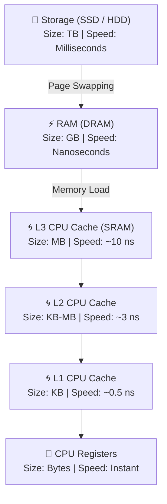

# 💾 Memory Hierarchy: RAM vs Storage

> To understand performance issues like Thrashing, we must examine the memory hardware pipeline. Not all memory is created equal—computer architecture balances speed, capacity, and cost using a multi-tiered hierarchy.

---

⏱ 6 min read
🟢 Beginner

---

## 🚪 Permanent Storage vs. RAM

Operating systems divide memory into two main categories:

### 1. Storage (Non-Volatile)
* **Hardware:** SSD (Solid State Drive) or HDD (Hard Disk Drive).
* **Properties:** Permanent, high capacity (e.g., 512GB – 2TB), relatively slow access speeds.
* **Role:** Storing programs, operating system binaries, photos, videos, and documents. Data is retained when the power is turned off.

### 2. RAM (Volatile)
* **Hardware:** DRAM (Dynamic Random Access Memory) sticks.
* **Properties:** Temporary, low capacity (e.g., 8GB – 32GB), extremely fast access speeds.
* **Role:** Storing only the processes and libraries that are **currently running**. Data is instantly wiped when the power is turned off.

---

## 📚 The Real-Life Metaphor: Wardrobe vs. Study Table

Imagine you are studying for a university exam:

* **The Wardrobe (Storage):** Can hold **200 books**. However, if you need to read a chapter, you must stand up, walk over, open the doors, search, and bring the book back. This takes time (slow latency).
* **The Study Table (RAM):** Can hold only **5 books** at once. But any book on the table is immediately within arm's reach (microsecond latency).

!!! success "The Operational Flow"
    You store all your books in the wardrobe. When you start studying, you bring the 3 books you currently need to the table. When you finish, you put them back and bring other books.

---

## 🧠 Does RAM Act Like a Cache?

### Conceptually: Yes
Like a cache, RAM holds a temporary subset of the data stored on the slower disk drive so the processor can access it quickly.

### Technically: No
In hardware engineering, RAM and CPU Cache are distinct. The CPU does not query RAM directly for every instruction. Instead, it queries a series of static memory tiers built directly onto the silicon processor die (L1, L2, and L3 cache).

---

## 📱 Mobile App Startup Pipeline

When you boot an application on your phone:
1. **Selection:** You tap Spotify (stored on SSD/Flash Storage).
2. **Loading:** The OS loads Spotify's core pages from Storage into RAM.
3. **Execution:** The CPU reads instruction codes from RAM, loads active scopes into the CPU Cache (L3 $\to$ L2 $\to$ L1), and processes them inside CPU Registers.

---

## 🧠 Self-Assessment Quiz

??? question "Question 1: Why can't we use RAM as permanent storage?"
    **Answer:** RAM is volatile. It requires continuous electrical power to maintain the state of its capacitors (which represent bits). The moment power is cut off, the electrical charges dissipate, and all stored data is permanently lost.

??? question "Question 2: What is the speed difference between SSD access and RAM access?"
    **Answer:** Accessing RAM takes roughly $50$ to $100$ nanoseconds. Accessing a fast SSD takes about $50$ to $100$ microseconds. This means RAM is roughly **1,000 times faster** than SSD storage (and older magnetic HDDs are up to 100,000 times slower).

??? question "Question 3: If we have CPU caches (L1/L2/L3), why do we need RAM at all?"
    **Answer:** SRAM (Static RAM used for CPU Cache) is extremely expensive, runs hot, and takes up massive physical space on the silicon die. While a 16GB DRAM stick is cheap, a 16GB CPU cache is technically and economically impossible to build on a consumer CPU.

---

[⬅️ Programs, Processes & Threads](01-programs-processes-threads.md)

[➡️ Page Faults & Thrashing](03-page-faults-thrashing.md)

