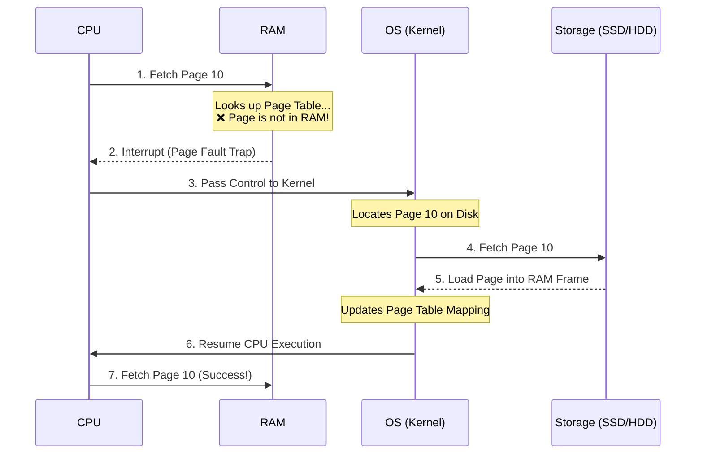

# 🌀 Page Faults & Thrashing

> To fit large applications into small RAM sticks, operating systems use a technique called **Virtual Memory**. However, if virtual memory is misconfigured or overloaded, the system enters a state of perpetual disk thrashing.

---

<div class="chapter-meta" markdown>
<span class="meta-item meta-reading-time">⏱ 8 min read</span>
<span class="meta-item meta-difficulty-intermediate">🟡 Intermediate</span>
</div>

---

## 📄 What Are Memory Pages?

A common point of confusion for beginners is the word **"Page"**.

!!! warning "Clarification"
    In Operating Systems, **Pages are NOT HTML files or website pages**. 
    
    A **Page** is a small, fixed-size block of virtual memory (typically **4 KB**). When a program is compiled, the OS divides its code and data into these 4 KB Pages.

```
                      INSTALLED PROCESS
┌────────────────────────────────────────────────────────┐
│ Page 1 (4KB) | Page 2 (4KB) | Page 3 (4KB) | Page 4... │
└────────────────────────────────────────────────────────┘
```

The physical RAM is similarly divided into blocks of the same size, called **Frames**. The OS uses a mapping table called the **Page Table** to keep track of which virtual Page lives in which physical Frame in RAM.

---

## 🛑 What Is a Page Fault?

Because RAM is small, the OS does not load all pages of a process at startup. It loads only the active pages.

When the CPU tries to read an instruction and it is not currently in RAM:



!!! success "Is a Page Fault an Error?"
    **No.** A page fault is a normal event. Every operating system experiences page faults as it dynamically loads pieces of software from disk to RAM on demand.

---

## 🍽️ The Real-Life Metaphor: The Kitchen Cooking Swap

To understand when page faults become a problem, let's look at a kitchen:

```
┌─────────────────────────────────────────────────────────┐
│                    KITCHEN CABINETS                     │
│  [Tomatoes] [Onions] [Salt] [Garlic] [Beef] [Pepper]   │
└─────────────────────────────────────────────────────────┘
                           │
                 Need Tomato (Page Fault)
                           │
                           ▼
                    ┌─────────────┐
                    │ PREP TABLE  │
                    │ [Tomatoes]  │
                    └─────────────┘
```

* **Prep Table (RAM):** A tiny table that can hold only **3 ingredients** at once.
* **Fridge/Cabinets (Storage):** Holds **15 ingredients** needed for a complex recipe.
* **Cooking (CPU):** The chef executing the recipe.

### The Swap Disaster (Thrashing)
Suppose the chef is cooking a stew that requires tomatoes, onions, garlic, salt, and beef. 
1. Chef needs **Tomatoes** $\to$ Goes to fridge $\to$ Places on table (Table has: Tomatoes).
2. Chef needs **Onions** $\to$ Goes to fridge $\to$ Places on table (Table has: Tomatoes, Onions).
3. Chef needs **Garlic** $\to$ Goes to fridge $\to$ Places on table (Table has: Tomatoes, Onions, Garlic).
4. Chef needs **Salt** $\to$ Table is full! Chef must remove **Tomatoes** back to the fridge, and bring **Salt** (Table has: Onions, Garlic, Salt).
5. Chef needs **Beef** $\to$ Table is full! Chef must remove **Onions** back to the fridge, and bring **Beef** (Table has: Garlic, Salt, Beef).
6. Chef needs **Tomatoes** again $\to$ Table is full! Chef removes **Garlic**, brings **Tomatoes**.

If the prep table is too small, **the chef spends 95% of their time walking back and forth to the fridge, and only 5% of their time actually cooking.**

---

## 🌀 What Is Thrashing?

When the operating system experiences this prep-table disaster, it is called **Thrashing**.

!!! success "One-Line Mass Definition"
    **"Pani cheyyadam kanna pages ni RAM nunchi Storage ki, Storage nunchi RAM ki tiragadam ekkuva ayithe danne Thrashing antaru."**
    
    *(When the system spends more time moving pages between RAM and Storage than executing the actual process instructions, the OS is Thrashing).*

```
           High RAM Demand
                 │
                 ▼
         Many Page Faults
                 │
                 ▼
    Continuous Disk Swapping (I/O)
                 │
                 ▼
      CPU Waits for Disk read
                 │
                 ▼
     🚨 SYSTEM FREEZES (THRASHING)
```

---

## 🧠 Self-Assessment Quiz

??? question "Question 1: Why does the system freeze or become unresponsive during Thrashing?"
    **Answer:** Permanent storage (SSD/HDD) is extremely slow compared to CPU registers. When Thrashing occurs, the CPU is constantly put into a **waiting state** (I/O wait) while the OS kernel reads pages from disk. Since the CPU is idle waiting for hardware transfers, the user interface freezes.

??? question "Question 2: What is the 'Working Set' of a process?"
    **Answer:** The Working Set is the set of pages that a process actively uses during a specific execution window. If the physical RAM allocated to a process is smaller than its working set, page faults are guaranteed to happen continuously, triggering Thrashing.

??? question "Question 3: How does virtual memory allocation differ between Windows and Linux when dealing with disk swapping?"
    **Answer:** Both use a dedicated space on the hard drive to swap out pages when RAM is full. Windows uses a system file called `pagefile.sys` (page file), while Linux uses a dedicated disk partition called **Swap Space**.

---

<div class="navigation-footer" markdown>

[⬅️ Memory Hierarchy: RAM vs Storage](02-ram-vs-storage.md)

[➡️ CPU Utilization & Multiprogramming](04-multiprogramming-utilization.md)

</div>
