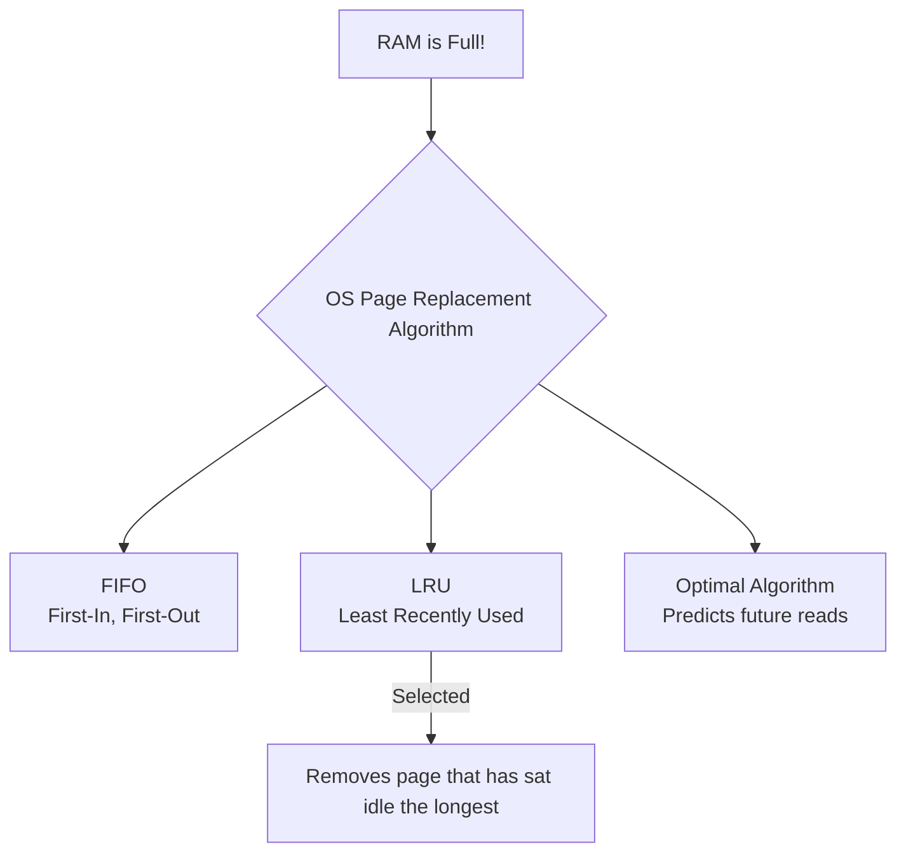

# 🛠️ How to Prevent Thrashing

> System slowdown due to memory thrashing is a common bottleneck. Resolving it requires a combination of hardware scaling, process management, and optimal caching logic.

---

⏱ 6 min read
🔴 Advanced

---

## 🎯 Strategies to Eliminate Thrashing

There are three primary strategies to solve and prevent system thrashing:

---

### 1. Hardware Upgrade: Increase RAM Capacity
The most direct and permanent hardware solution is increasing the physical RAM size (e.g., upgrading a laptop from 8GB to 16GB RAM).

* **Metaphor Alignment:** Upgrading your **Study Table** to a massive desk.
* **Why it works:** A larger study table can comfortably hold 15 books at the same time. The chef/student no longer needs to walk to the wardrobe because all the required books/ingredients fit within arm's reach simultaneously. Page faults drop to near zero.

---

### 2. Software Control: Reduce the Degree of Multiprogramming
If you cannot upgrade the hardware, you must configure the operating system to limit concurrent execution.

* **Metaphor Alignment:** The lab teacher keeping the door locked and limiting entry to 10 active students at a time.
* **Why it works:** By closing unused applications (or configuring the OS scheduler to suspend background processes and write their state to disk), you increase the number of physical RAM frames allocated to the remaining active processes. With more frames, each process can hold its full working set, eliminating swapping loops.

---

### 3. Algorithmic Optimization: Smart Page Replacement
When RAM is full, the OS must choose which page to swap out to disk. A bad algorithm (like randomly selecting pages) will swap out pages that the CPU needs immediately, triggering another Page Fault. We must use intelligent algorithms.

#### LRU (Least Recently Used)
The OS keeps track of when each loaded page was last read by the CPU. When a frame must be evicted, **LRU removes the page that has not been accessed for the longest duration.**
* **Why it is effective:** Based on the **Principle of Locality** (if you haven't read a page for 5 minutes, you probably won't need it in the next 5 seconds). This keeps the active "working set" pages pinned in RAM.

---

## 🧠 Self-Assessment Quiz

??? question "Question 1: What is 'Belady's Anomaly' and does it happen in LRU?"
    **Answer:** Belady's Anomaly is a phenomenon where adding more physical memory frames results in *more* page faults. This occurs in FIFO (First-In, First-Out) algorithms. However, **it does not happen in LRU**, because LRU belongs to a class of "stack algorithms" where the set of pages in memory for $N$ frames is always a subset of the pages for $N+1$ frames.

??? question "Question 2: What is the Optimal Page Replacement Algorithm (OPT)?"
    **Answer:** The Optimal algorithm evicts the page that will not be used for the longest time in the future. It guarantees the absolute lowest page fault rate. However, **it is impossible to implement in practice** because the OS cannot predict the future memory requests of a running program. It is used only as a benchmark to measure other algorithms.

??? question "Question 3: How does 'Thrashing' relate to 'Memory Leaks'?"
    **Answer:** A memory leak occurs when a process allocates memory (on the Heap) but fails to release it. Over time, the leaking process consumes more and more RAM frames. This starves other processes of memory, lowering the available frames below their working sets and eventually triggering system-wide Thrashing.

---

[⬅️ CPU Utilization & Multiprogramming](04-multiprogramming-utilization.md)

[➡️ Interview Cheat Sheet (Charan Style)](06-interview-cheatsheet.md)

