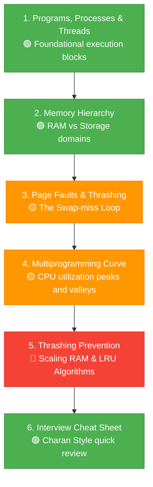

# 🧠 Thrashing & Memory Management

> An Operating System must coordinate CPU execution with dynamic RAM and permanent storage. When physical RAM runs low, a system can enter a dangerous loop of continuous disk swapping called **Thrashing**. This module explains how memory virtualization works, from the basic definitions of threads to solving system lag.

---

⏱ 40 min total
🟢 Beginner
🟡 Intermediate
🔴 Advanced
📋 Basic Computer Architecture, CPU & RAM understanding

---

## 🎯 Learning Objectives

After completing this module, you will be able to:

- [ ] Differentiate between a Program, a Process, and a Thread
- [ ] Diagram the system memory hierarchy from registers down to permanent storage
- [ ] Define pages, frames, and trace the sequence of a Page Fault event
- [ ] Explain why Thrashing occurs and its relationship to low CPU utilization
- [ ] Analyze the CPU Utilization vs. Degree of Multiprogramming curve
- [ ] Apply mitigations to resolve Thrashing, including hardware upgrades and page replacement algorithms (LRU)

---

## 📖 Chapter Overview

| # | Chapter | What You'll Learn | Difficulty | Time |
|---|---------|------------------|------------|------|
| 1 | [Programs, Processes & Threads](01-programs-processes-threads.md) | Recipe book metaphors, active vs passive execution, threads | 🟢 Beginner | 6 min |
| 2 | [Memory Hierarchy: RAM vs Storage](02-ram-vs-storage.md) | Wardrobes, study tables, and volatile vs non-volatile memory | 🟢 Beginner | 6 min |
| 3 | [Page Faults & Thrashing](03-page-faults-thrashing.md) | Virtual pages, page miss traps, and the kitchen-fridge swap loop | 🟡 Intermediate | 8 min |
| 4 | [CPU Utilization & Multiprogramming](04-multiprogramming-utilization.md) | Multiprogramming degrees, CPU waiting times, lab metaphors | 🟡 Intermediate | 8 min |
| 5 | [How to Prevent Thrashing](05-prevention-solutions.md) | Hardware upgrades, process scaling, LRU page replacement | 🔴 Advanced | 6 min |
| 6 | [Interview Cheat Sheet (Charan Style)](06-interview-cheatsheet.md) | 30-sec revision, memory pipelines, Charan style summaries, Q&A | 🟢 All Levels | 6 min |

---

## 🗺️ Learning Roadmap

This module traces how static code executes, maps onto RAM, and how overloading leads to swapping loops:

---

## 🔗 Related Topics

- [Load Balancing](../../system-design/load-balancing/index.md)
- [Database Scaling](../../system-design/database-scaling/index.md)

---

## 🚀 Start Learning

➡️ **Next:** [Programs, Processes & Threads](01-programs-processes-threads.md)
