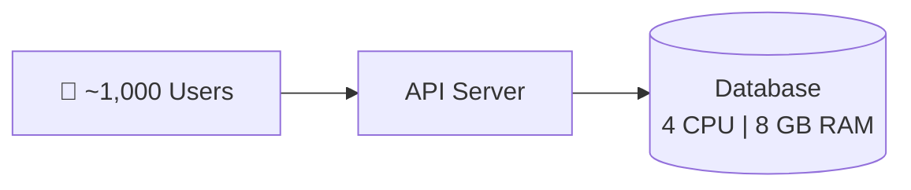
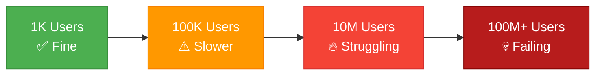
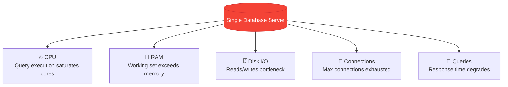
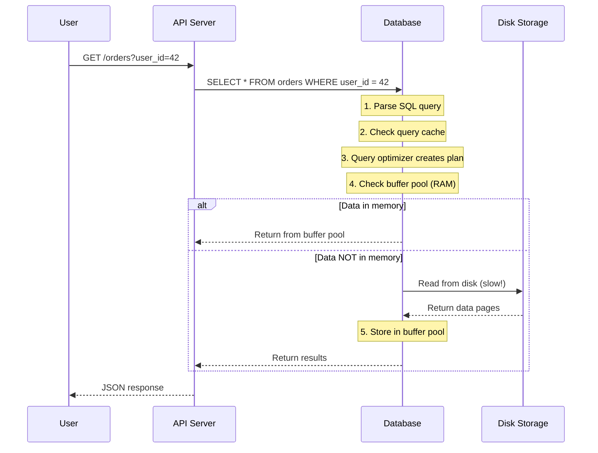
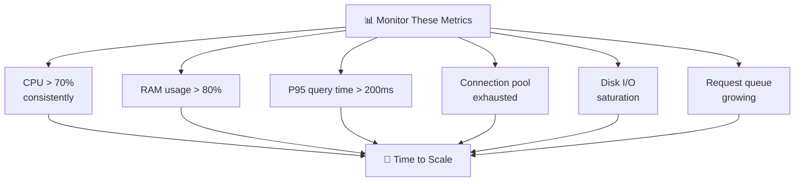

# Why Do We Need Database Scaling?

> As applications grow, the database is usually the **first component** to become a performance bottleneck — not the API server, not the frontend. Understanding *why* this happens is the foundation of everything else in System Design.

---

⏱ 7 min read
🟢 Beginner
📋 Basic SQL, Client-Server

---

## 🎯 Learning Objectives

By the end of this chapter, you'll understand:

- Why the database is almost always the first bottleneck
- What specific resources become exhausted under load
- How to recognize the warning signs that scaling is needed
- The real-world impact of database bottlenecks

---

#### 📖 Key Terms

Scalability
:   The ability of a system to handle increasing load by adding resources.

Throughput
:   The number of operations a system can handle per unit of time (e.g., queries per second).

Latency
:   The time it takes to complete a single operation (e.g., response time for a query).

Bottleneck
:   The component that limits the overall performance of the system.

QPS
:   Queries Per Second — a common metric for database performance.

---

## 📖 The Intuition — A Restaurant Analogy

Before diving into databases, think about a restaurant.

When a restaurant has **10 customers**, one chef handles everything easily. Orders come in, food goes out, everyone is happy.

Now imagine **1,000 customers** arrive at the same time. That one chef:

- Can't cook fast enough → **CPU overload**
- Runs out of counter space → **Memory exhaustion**
- Runs out of ingredients → **Storage limits**
- Can't take all orders at once → **Connection limits**
- Customers wait too long → **Increased latency**

The solution? You need **more chefs**, a **bigger kitchen**, or **multiple restaurants**.

This is exactly what happens with databases.

---

## 🏗️ The Journey of an Application

Imagine Amazon when it first started. The architecture was simple:

Everything worked perfectly:

- ✅ Fast queries (< 10ms)
- ✅ Low CPU usage (< 20%)
- ✅ Plenty of RAM
- ✅ Small database (< 1 GB)
- ✅ Few concurrent connections (< 50)

---

## 📈 As the Application Grows

Over months and years, the user base grows:

At first, nothing seems wrong. Queries are a little slower, but users don't notice. Then gradually:

- Response times go from 50ms → 500ms → 5 seconds
- Some requests start timing out
- Customer complaints increase
- Revenue is affected

---

## 🚨 What Breaks in a Single Database

When too many users hit a single database simultaneously, **every resource** is affected:

### Concrete Numbers

Here's what a typical single database server can handle:

| Resource | Comfortable | Warning | Critical |
|----------|-------------|---------|----------|
| CPU | < 60% | 60-80% | > 80% |
| Memory | < 70% | 70-85% | > 85% |
| Connections | < 100 | 100-500 | > 500 |
| Query time | < 50ms | 50-500ms | > 500ms |
| QPS (PostgreSQL) | < 5,000 | 5,000-10,000 | > 10,000 |
| Storage | < 70% | 70-85% | > 90% |

!!! warning "The Numbers Game"

    A single PostgreSQL instance can typically handle **5,000–10,000 QPS** for simple queries. Redis, by comparison, can handle **100,000+ QPS**.

    If your application receives **50,000 QPS**, a single database simply cannot keep up — no matter how powerful the hardware.

---

## 🔍 Internal Working — What Happens Behind the Scenes

When a user makes a request, here's what happens inside the database:

**Why this matters for scaling:**

- Step 4 (buffer pool check) fails more often as data grows beyond RAM
- Disk reads are **100x slower** than memory reads
- More concurrent queries = more CPU for query parsing and optimization
- More connections = more memory overhead per connection

---

## 💡 Why Can't We Just Ignore It?

Consider Amazon's scale:

| Metric | Volume |
|--------|--------|
| Daily active users | ~300 million |
| Products | ~350 million |
| Orders per day | ~1.6 million |
| Peak QPS (Prime Day) | ~100,000+ |
| Database size | Petabytes |

Trying to serve all of this from a **single database server** means:

- Response time increases from milliseconds to seconds
- Users see loading spinners → they leave
- Checkout failures → lost revenue
- Payment timeouts → customer trust erodes

!!! info "Amazon's Rule"

    Amazon found that every **100ms of latency** costs them approximately **1% in sales**. At Amazon's scale, that's hundreds of millions of dollars per year.

---

## 💼 Signs Your Database Needs Scaling

You should consider scaling when you observe these warning signs:

### The Monitoring Checklist

- [ ] CPU utilization consistently above 70%
- [ ] Memory pressure — frequent page swaps
- [ ] P95 query latency above 200ms
- [ ] Connection pool frequently exhausted
- [ ] Disk I/O wait time increasing
- [ ] Replication lag increasing (if replicas exist)
- [ ] Dead tuples accumulating (PostgreSQL)

---

## 🌍 Real-World Examples

!!! info "Amazon"

    Amazon didn't start with a globally distributed database. Like many startups, it began with a simple monolithic architecture. As traffic grew to millions of daily users, the company progressively adopted scaling techniques — vertical scaling first, then sharding, replication, and caching.

!!! info "Netflix"

    Netflix's early architecture used a single Oracle database. When a major database corruption event in 2008 caused a 3-day outage, they began their migration to distributed systems. Today they use Cassandra for streaming data (handling 30+ million reads/second) and EVCache for caching.

!!! info "Uber"

    Uber's original database was a single PostgreSQL instance. As they expanded to hundreds of cities, the database couldn't keep up with real-time ride matching. They eventually built Schemaless (a distributed data store on top of MySQL shards) and later migrated to CockroachDB for some workloads.

---

## 🧠 Key Insight

!!! success "Remember This"

    Scaling is **not** about making the application "faster."

    Scaling is about ensuring the application **continues to perform well** as the number of users, requests, and data increases.

    A well-designed application at 1,000 users should perform just as well at 10 million users — that's what scaling achieves.

---

## ⚖️ Trade-offs — When NOT to Scale

Scaling is not always the answer. Before scaling, consider:

| Instead of Scaling | Try This First |
|-------------------|---------------|
| Adding more servers | Optimize slow queries (add indexes) |
| Sharding | Use connection pooling (PgBouncer) |
| Adding read replicas | Add Redis caching for hot data |
| Horizontal scaling | Vertical scaling (cheaper hardware upgrade) |

!!! warning "Premature Scaling"

    Scaling too early adds complexity without benefit. If your database is at 20% CPU with 1,000 users, you don't need sharding — you need to focus on building features.

    **Scale when you have evidence**, not when you imagine future problems.

---

## 🎯 Interview Cheat Sheet

??? note "One-Line Definition"

    Database scaling is increasing a database's capacity to handle growing traffic, data, and concurrent users.

??? note "Two-Minute Interview Answer"

    "The database is typically the first bottleneck in a growing application because every request eventually reads or writes to it. As traffic increases, CPU, RAM, storage, and connection limits are reached. This manifests as slower queries, timeouts, and degraded user experience. Scaling is the process of addressing these limits — either by upgrading the server (vertical) or distributing the load across multiple servers (horizontal). In practice, companies like Amazon and Netflix combine multiple techniques: vertical scaling first, then read replicas, caching, and finally sharding."

??? note "Common Follow-Up Questions"

    **Q: Why is the database the bottleneck and not the API server?**

    A: API servers are stateless — you can add more behind a load balancer easily. Databases are stateful — they hold the data. Distributing stateful systems is fundamentally harder.

    **Q: Can't you just buy a bigger server?**

    A: Yes, that's vertical scaling. It works up to a point, but hardware has physical limits, and the cost curve is exponential. A server with 2x the CPU doesn't cost 2x — it often costs 4-5x.

---

## ⚠️ Common Mistakes

!!! warning "Misconceptions to Avoid"

    **❌ "The API server becomes slow first"**

    ✅ The database is almost always the first bottleneck because it handles all persistent state.

    ---

    **❌ "Scaling means adding more servers"**

    ✅ Scaling also includes query optimization, indexing, caching, connection pooling, partitioning, and architectural changes.

    ---

    **❌ "We need to scale now because we might have 1M users"**

    ✅ Scale based on current metrics and projected growth, not hypothetical scenarios. Premature scaling adds unnecessary complexity.

---

## 📝 Summary

In this chapter, we learned:

- Applications start with a simple single-database architecture
- User growth increases database load across CPU, RAM, disk, and connections
- A single database server has hard limits (~5K-10K QPS for PostgreSQL)
- The database is usually the first bottleneck because it handles all persistent state
- Scaling should be driven by monitoring data, not premature optimization
- Companies like Amazon, Netflix, and Uber all started simple and scaled incrementally

---

## 🔗 Related Topics

- [Scaling Types](02-scaling-types.md) — How to actually scale (vertical vs horizontal)
- [Partitioning](03-partitioning.md) — Splitting data within one database
- [Sharding](04-sharding.md) — Splitting data across multiple databases
- [Replication](06-replication.md) — Creating copies for read scaling

---

[⬅️ Overview](index.md)

[Scaling Types ➡️](02-scaling-types.md)

