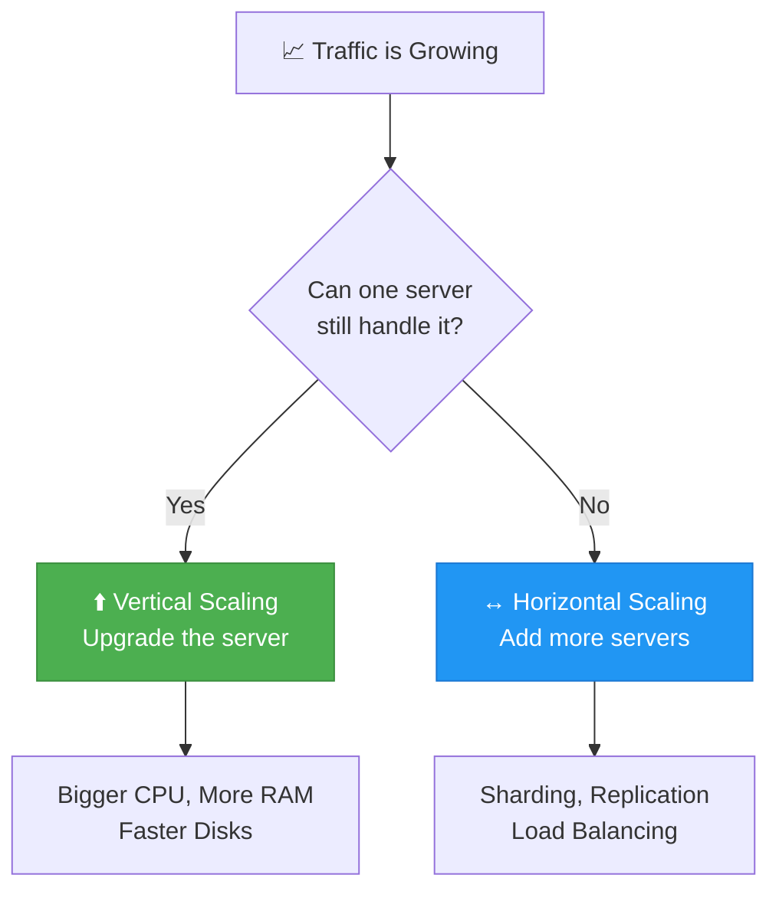
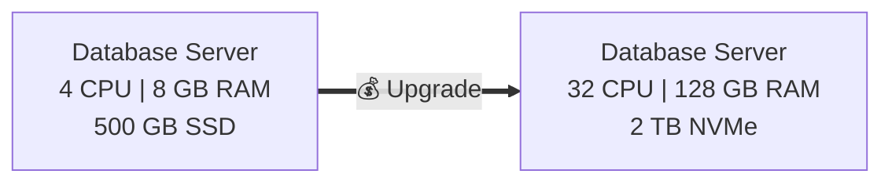
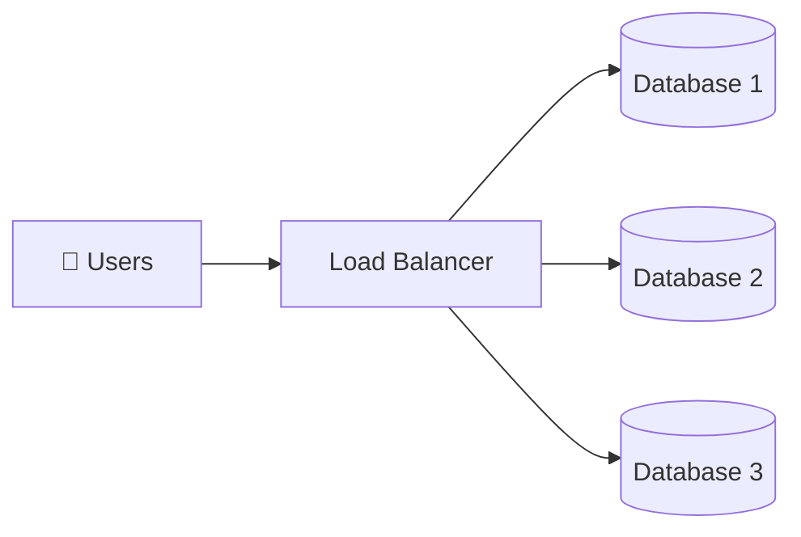
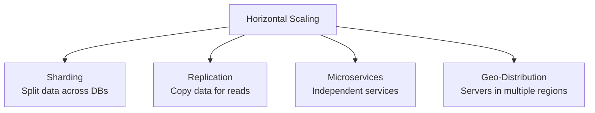
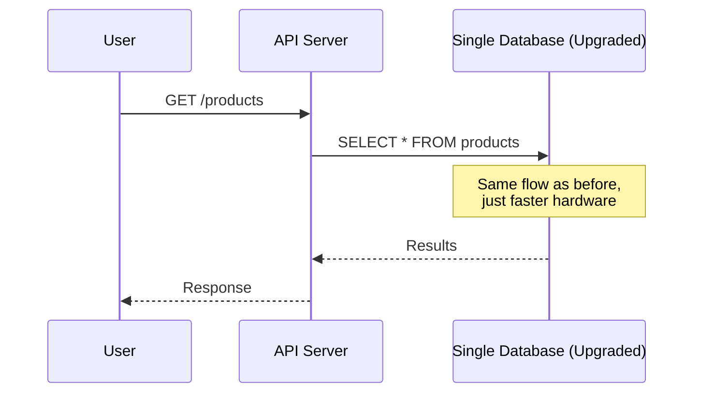
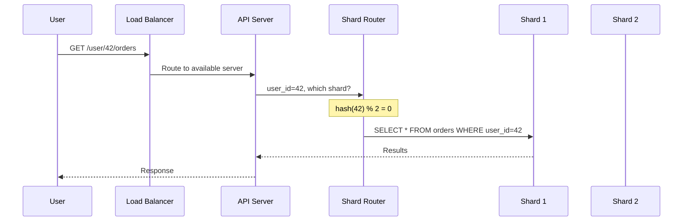
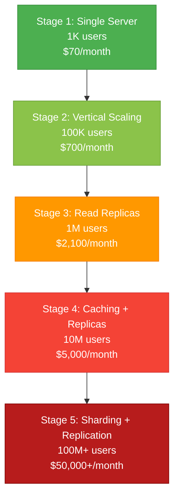

# Scaling Types — Vertical vs Horizontal

> There are two fundamental ways to scale a database: **Scale Up** (make the server bigger) or **Scale Out** (add more servers). Choosing the right one — or the right combination — is one of the first architectural decisions you'll face.

---

⏱ 10 min read
🟢 Beginner
📋 Chapter 1 — Why Scaling

---

## 🎯 Learning Objectives

After completing this chapter, you'll understand:

- What Vertical Scaling is and when to use it
- What Horizontal Scaling is and when to use it
- Cost and complexity trade-offs between the two
- How companies like Instagram and Netflix decide
- A decision framework for choosing your scaling strategy

---

#### 📖 Key Terms

Vertical Scaling (Scale Up)
:   Increasing the resources (CPU, RAM, storage) of an existing server.

Horizontal Scaling (Scale Out)
:   Adding more servers and distributing the workload across them.

Single Point of Failure (SPOF)
:   A component whose failure brings down the entire system.

Connection Pooling
:   Reusing database connections instead of creating new ones for each request.

---

## 🧠 The Intuition

Imagine you run a restaurant with one kitchen.

**Vertical Scaling** = buying a bigger oven, a larger refrigerator, and a faster stove. Same kitchen, better equipment.

**Horizontal Scaling** = opening a second restaurant in a different location. More kitchens, more capacity, but now you need to coordinate menus, inventory, and staff across locations.

Both work. The question is: **which is cheaper, simpler, and more appropriate for your current stage?**

---

## Two Approaches to Scaling

---

## ⬆️ Vertical Scaling (Scale Up)

Vertical Scaling means **upgrading the hardware of the same server** — more CPU cores, more RAM, faster SSDs.

The application code doesn't change. The database doesn't change. Only the machine gets more powerful.

### Architecture

### Example — AWS RDS Instance Pricing

| Instance | vCPUs | RAM | Approx. Monthly Cost |
|----------|-------|-----|---------------------|
| db.t3.medium | 2 | 4 GB | ~$70 |
| db.r5.large | 2 | 16 GB | ~$175 |
| db.r5.2xlarge | 8 | 64 GB | ~$700 |
| db.r5.8xlarge | 32 | 256 GB | ~$2,800 |
| db.r5.24xlarge | 96 | 768 GB | ~$8,400 |

!!! warning "The Cost Curve"

    Notice the pricing is not linear. Going from 4 GB RAM to 768 GB RAM costs **120x more**, not 192x the capacity. But you're still limited by what a single machine can do — and the most powerful instances are extremely expensive.

### Advantages

| Advantage | Explanation |
|-----------|-------------|
| ✅ Simple | No code changes, no distributed systems complexity |
| ✅ Fast | Can be done in minutes (resize instance) |
| ✅ No data distribution | All data stays on one server |
| ✅ ACID guaranteed | Single database = easy transactions |
| ✅ Simple monitoring | One server to watch |

### Disadvantages

| Disadvantage | Explanation |
|--------------|-------------|
| ❌ Hardware limits | Even the biggest server has a ceiling |
| ❌ Exponential cost | 2x performance ≠ 2x price (often 4-5x) |
| ❌ Single Point of Failure | One server down = entire database down |
| ❌ Downtime for upgrades | May require restarts |
| ❌ No geographic distribution | Can't serve users in multiple regions |

### When to Use Vertical Scaling

!!! success "Use Vertical Scaling When"

    - Your application is in its early stages (< 1M users)
    - You have a small engineering team
    - Your database is not yet at hardware limits
    - You want to avoid distributed systems complexity
    - **Most startups should start here**

### When NOT to Use

!!! warning "Avoid Vertical Scaling When"

    - You're already on the largest available instance
    - Single Point of Failure is unacceptable
    - You need geographic distribution
    - Your growth rate suggests you'll hit limits within 6-12 months

---

## ↔️ Horizontal Scaling (Scale Out)

Horizontal Scaling means **adding more servers** and distributing the workload across them.

Instead of one powerful machine, you use multiple smaller machines working together.

### Architecture

### What Horizontal Scaling Enables

Horizontal scaling is the foundation for several advanced techniques:

### Advantages

| Advantage | Explanation |
|-----------|-------------|
| ✅ Nearly unlimited scale | Keep adding servers as needed |
| ✅ Fault tolerance | One server down ≠ system down |
| ✅ High availability | No single point of failure |
| ✅ Geographic distribution | Servers near your users |
| ✅ Cost-effective at scale | Many small servers < one huge server |

### Disadvantages

| Disadvantage | Explanation |
|--------------|-------------|
| ❌ Complex architecture | Distributed systems are hard |
| ❌ Data consistency challenges | CAP theorem comes into play |
| ❌ Network overhead | Servers communicate over the network |
| ❌ Cross-server operations | JOINs across databases are expensive |
| ❌ Operational complexity | More servers = more things to monitor |

### When to Use Horizontal Scaling

!!! success "Use Horizontal Scaling When"

    - Vertical scaling has reached its limits
    - You need high availability (no single point of failure)
    - You need to serve users in multiple geographic regions
    - Your data is too large for a single server
    - Your traffic exceeds what one server can handle

### When NOT to Use

!!! warning "Avoid Horizontal Scaling When"

    - Your application is small and vertical scaling is sufficient
    - Your team lacks experience with distributed systems
    - Your data model requires many cross-table JOINs
    - The added complexity doesn't justify the benefit

---

## 📊 Vertical vs Horizontal — Complete Comparison

| Feature | Vertical Scaling | Horizontal Scaling |
|---------|-----------------|-------------------|
| Strategy | Bigger server | More servers |
| Cost curve | Exponential | Linear |
| Complexity | Low | High |
| Code changes | Usually none | Often required |
| Max capacity | Hardware limited | Nearly unlimited |
| Fault tolerance | Low (SPOF) | High |
| Downtime for scaling | Often yes | Usually no |
| Data consistency | Strong (single DB) | Eventually consistent |
| Geographic distribution | No | Yes |
| Best for | Small-medium apps | Internet-scale apps |

---

## 🔍 Internal Working — How Each Approach Handles a Request

### Vertical Scaling — Request Flow

Everything is the same — just faster.

### Horizontal Scaling — Request Flow

More moving parts, but distributed load.

---

## 🏗️ Architecture Evolution — How Companies Scale

Most companies follow this progression:

!!! tip "The Golden Rule"

    **Start with the simplest architecture that meets your needs.** Add complexity only when metrics prove it's necessary.

    Instagram ran on a single PostgreSQL server for much longer than you'd expect.

---

## 🌍 Real-World Examples

!!! info "Instagram"

    Instagram scaled to **300 million users** on PostgreSQL. They started with vertical scaling, then added read replicas, then eventually sharded. Their approach: "Do the simplest thing that works, then iterate."

!!! info "Netflix"

    Netflix uses both approaches. Their control plane services use vertically scaled PostgreSQL. Their streaming data plane uses horizontally scaled Cassandra clusters with hundreds of nodes.

!!! info "Shopify"

    Shopify runs one of the world's largest Rails applications on MySQL. They used vertical scaling for years, then built a custom sharding solution called Pods — each "pod" is an independent set of services with its own databases, handling a subset of merchants.

---

## ⚙️ Production Notes

#### 🏭 Production Engineering

**Connection Pooling** — Before scaling, ensure you're using connection pooling (PgBouncer for PostgreSQL, ProxySQL for MySQL). Many "scaling" issues are actually connection management issues.

**Monitoring** — Set up alerts for CPU > 70%, memory > 80%, and P95 query time > 200ms. These are your scaling triggers.

**Cost Optimization** — Reserved instances (AWS) or committed use discounts (GCP) can reduce vertical scaling costs by 40-60%.

**Managed Services** — AWS RDS, Google Cloud SQL, and Azure Database handle many operational tasks automatically — backups, patching, failover. This reduces the operational burden of vertical scaling significantly.

---

## 🎯 Interview Cheat Sheet

??? note "One-Line Definition"

    Vertical scaling upgrades the hardware of one server; horizontal scaling adds more servers to distribute the load.

??? note "Two-Minute Interview Answer"

    "There are two fundamental approaches to scaling a database. Vertical scaling, or scaling up, means upgrading the CPU, RAM, and storage of your existing server. It's simple and requires no code changes, but it has hardware limits and creates a single point of failure. Horizontal scaling, or scaling out, means adding more servers and distributing data across them. It offers nearly unlimited scalability and fault tolerance but introduces distributed systems complexity like data consistency challenges and cross-server queries. In practice, most companies start with vertical scaling because it's simpler and cheaper, then gradually move to horizontal scaling as they grow. Instagram, for example, ran on a single PostgreSQL instance for years before sharding."

??? note "Senior-Level Answer"

    "The vertical vs horizontal decision isn't binary — it's a spectrum. I'd evaluate based on current metrics (CPU utilization, QPS, connection count), growth projections, team expertise, and budget. For a startup with < 1M users, vertical scaling with read replicas is usually sufficient. The inflection point for horizontal scaling is when you're consistently above 70% resource utilization on the largest practical instance, or when you need multi-region availability. The real challenge with horizontal scaling isn't technical — it's operational. You need monitoring, automated failover, shard rebalancing, and engineers who understand distributed systems. Before horizontal scaling, I'd exhaust optimizations: query optimization, indexing, connection pooling, and caching."

??? note "Common Follow-Up Questions"

    **Q: Why not just use horizontal scaling from the start?**

    A: Because it introduces significant complexity (distributed transactions, data consistency, operational overhead) that's unnecessary for small applications. The additional engineering effort delays feature development.

    **Q: What about cloud auto-scaling?**

    A: Auto-scaling works well for stateless services (API servers). Databases are stateful — you can't just spin up another database instance and expect it to work. Data needs to be distributed or replicated, which requires planning.

---

## ⚠️ Common Mistakes

!!! warning "Misconceptions to Avoid"

    **❌ "Horizontal scaling is always better than vertical scaling"**

    ✅ Horizontal scaling adds complexity. If vertical scaling meets your needs, it's the better choice.

    ---

    **❌ "Horizontal scaling just means adding more servers"**

    ✅ It requires re-architecting — sharding strategies, data distribution, cross-shard query handling, and distributed transaction management.

    ---

    **❌ "Vertical scaling is only for small applications"**

    ✅ Many large applications use vertical scaling extensively. Stack Overflow runs on just a few powerful servers.

    ---

    **❌ "You need to choose one or the other"**

    ✅ Production systems almost always combine both. Vertical scaling for each individual node, horizontal scaling for the cluster.

---

## 📝 Summary

In this chapter, we learned:

- **Vertical Scaling** upgrades the same server — simple but hardware-limited
- **Horizontal Scaling** adds more servers — complex but nearly unlimited
- Vertical scaling is the right first step for most applications
- Horizontal scaling becomes necessary at internet scale
- Companies like Instagram, Netflix, and Shopify combine both approaches
- The decision should be driven by metrics, not assumptions
- Always exhaust simple optimizations before adding infrastructure complexity

---

## 🔗 Related Topics

- [Partitioning](03-partitioning.md) — Splitting data inside one database (horizontal scaling technique)
- [Sharding](04-sharding.md) — Splitting data across databases (horizontal scaling technique)
- [Replication](06-replication.md) — Copying data for read scaling

---

[⬅️ Why Scaling](01-why-scaling.md)

[Partitioning ➡️](03-partitioning.md)

