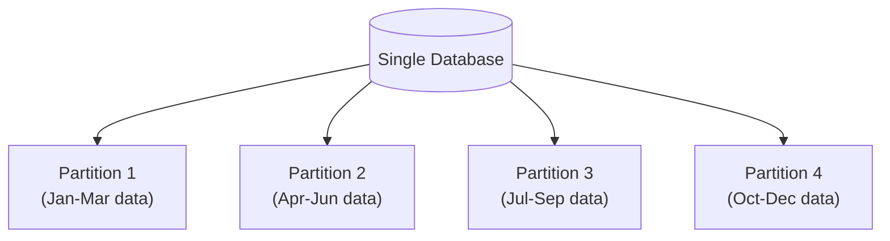
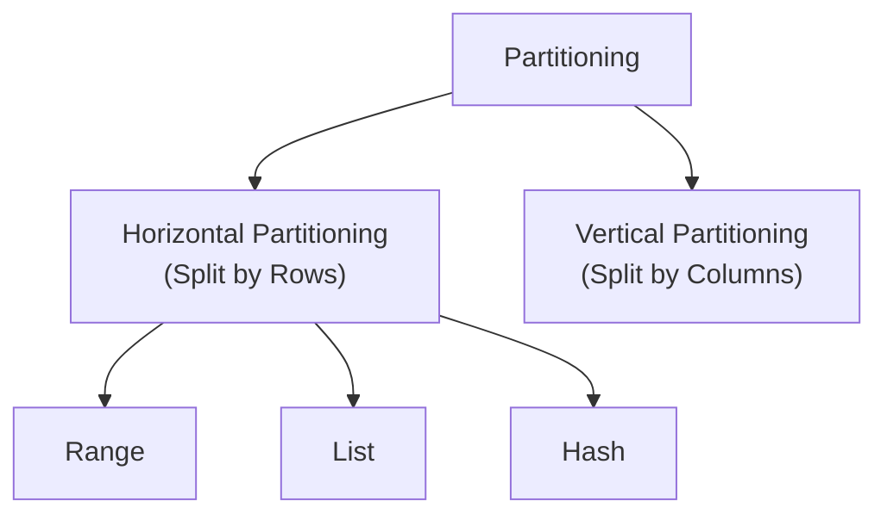
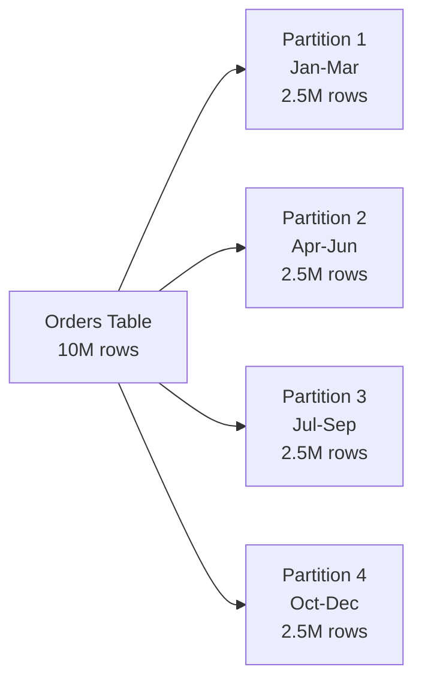
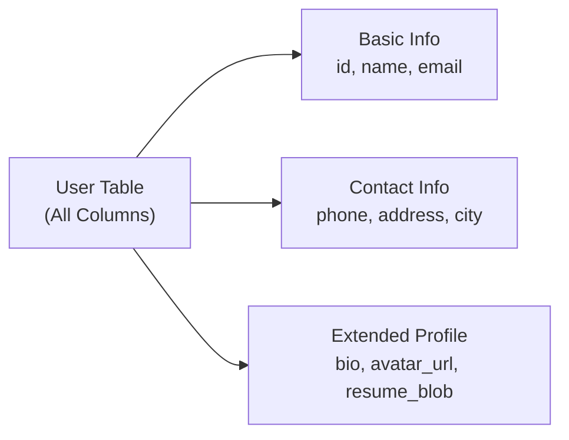
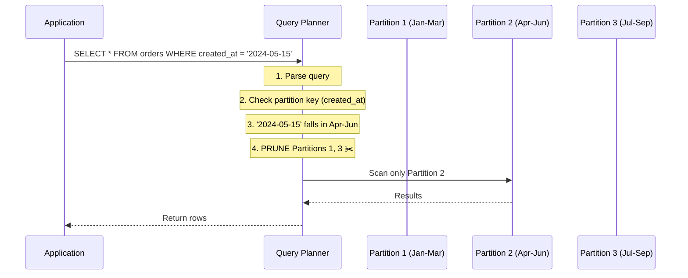
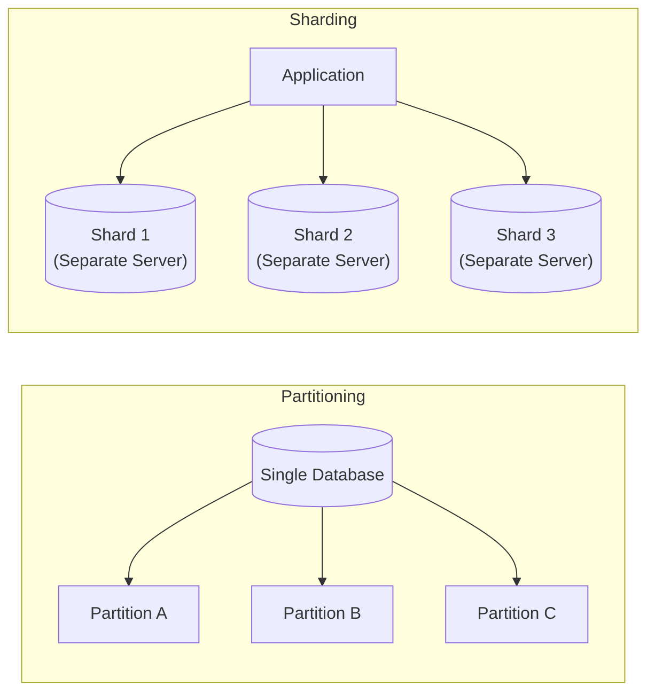

# Database Partitioning

> Partitioning divides a large table into smaller, more manageable pieces — while keeping everything inside the **same database**. Think of it as organizing a filing cabinet into labeled drawers instead of throwing everything into one pile.

---

<div class="chapter-meta" markdown>
<span class="meta-item meta-reading-time">⏱ 12 min read</span>
<span class="meta-item meta-difficulty-intermediate">🟡 Intermediate</span>
<span class="meta-item meta-prerequisites">📋 Chapter 2 — Scaling Types</span>
</div>

---

## 🎯 Learning Objectives

After completing this chapter, you'll understand:

- What partitioning is and why it exists
- Horizontal Partitioning (splitting rows)
- Vertical Partitioning (splitting columns)
- Partition strategies — Range, List, Hash
- How the database engine routes queries to the correct partition
- SQL syntax for creating partitioned tables
- When to use partitioning vs sharding

---

<div class="key-terms" markdown>

#### 📖 Key Terms

Partition
:   A logical subdivision of a table, where each partition stores a subset of the data.

Partition Key
:   The column used to determine which partition stores a given row.

Partition Pruning
:   The database's ability to skip irrelevant partitions when executing a query.

Horizontal Partitioning
:   Splitting a table by **rows** — each partition has the same columns but different rows.

Vertical Partitioning
:   Splitting a table by **columns** — each partition has different columns but the same rows.

</div>

---

## 🧠 The Problem — Why Partition?

Imagine a `transactions` table at a bank:

| Metric | Value |
|--------|-------|
| Total rows | 2 billion |
| Table size | 500 GB |
| Index size | 80 GB |
| Average query time | 3.2 seconds |
| Backup time | 6 hours |

Every query scans massive indexes. Every backup takes hours. Adding a new index takes days.

**Partitioning** solves this by splitting the table into smaller pieces that the database can manage independently.

---

## 🏗️ What is Partitioning?

Partitioning splits data **inside a single database** into smaller logical sections called **partitions**.

After partitioning:

- There is still **only one database**
- The application still connects to the **same database**
- The database engine internally manages which partition to read/write
- Queries automatically target the correct partition(s)



!!! info "Key Distinction"

    Partitioning organizes data **inside one database**. It does **not** create multiple independent databases — that's [Sharding](04-sharding.md).

---

## Types of Partitioning



---

## ↔️ Horizontal Partitioning

Horizontal Partitioning divides a table by **rows**. Every partition has the **same columns** but stores **different rows**.

### Example — Order History by Date



Each partition contains all columns (order_id, user_id, amount, date) — but only rows for that date range.

### Three Strategies for Horizontal Partitioning

#### 1. Range Partitioning

Data is divided based on a **range of values** in the partition key.

=== "PostgreSQL"

    ```sql
    CREATE TABLE orders (
        order_id    BIGINT,
        user_id     BIGINT,
        amount      DECIMAL(10,2),
        created_at  DATE
    ) PARTITION BY RANGE (created_at);

    -- Create partitions for each quarter
    CREATE TABLE orders_q1_2024 PARTITION OF orders
        FOR VALUES FROM ('2024-01-01') TO ('2024-04-01');

    CREATE TABLE orders_q2_2024 PARTITION OF orders
        FOR VALUES FROM ('2024-04-01') TO ('2024-07-01');

    CREATE TABLE orders_q3_2024 PARTITION OF orders
        FOR VALUES FROM ('2024-07-01') TO ('2024-10-01');

    CREATE TABLE orders_q4_2024 PARTITION OF orders
        FOR VALUES FROM ('2024-10-01') TO ('2025-01-01');
    ```

=== "MySQL"

    ```sql
    CREATE TABLE orders (
        order_id    BIGINT,
        user_id     BIGINT,
        amount      DECIMAL(10,2),
        created_at  DATE
    )
    PARTITION BY RANGE (YEAR(created_at) * 100 + MONTH(created_at)) (
        PARTITION q1_2024 VALUES LESS THAN (202404),
        PARTITION q2_2024 VALUES LESS THAN (202407),
        PARTITION q3_2024 VALUES LESS THAN (202410),
        PARTITION q4_2024 VALUES LESS THAN (202501)
    );
    ```

**Best for:** Time-series data, log tables, order history, financial transactions.

#### 2. List Partitioning

Data is divided based on **specific values** in the partition key.

=== "PostgreSQL"

    ```sql
    CREATE TABLE customers (
        customer_id  BIGINT,
        name         VARCHAR(100),
        country      VARCHAR(50)
    ) PARTITION BY LIST (country);

    CREATE TABLE customers_india PARTITION OF customers
        FOR VALUES IN ('India');

    CREATE TABLE customers_usa PARTITION OF customers
        FOR VALUES IN ('USA', 'Canada');

    CREATE TABLE customers_europe PARTITION OF customers
        FOR VALUES IN ('UK', 'Germany', 'France');
    ```

**Best for:** Data with clear categorical divisions (country, region, status, type).

#### 3. Hash Partitioning

Data is divided using a **hash function** on the partition key, ensuring even distribution.

=== "PostgreSQL"

    ```sql
    CREATE TABLE sessions (
        session_id   BIGINT,
        user_id      BIGINT,
        data         JSONB
    ) PARTITION BY HASH (user_id);

    CREATE TABLE sessions_p0 PARTITION OF sessions
        FOR VALUES WITH (MODULUS 4, REMAINDER 0);

    CREATE TABLE sessions_p1 PARTITION OF sessions
        FOR VALUES WITH (MODULUS 4, REMAINDER 1);

    CREATE TABLE sessions_p2 PARTITION OF sessions
        FOR VALUES WITH (MODULUS 4, REMAINDER 2);

    CREATE TABLE sessions_p3 PARTITION OF sessions
        FOR VALUES WITH (MODULUS 4, REMAINDER 3);
    ```

**Best for:** Even data distribution when there's no natural range or category.

### Strategy Comparison

| Strategy | Distribution | Best For | Risk |
|----------|-------------|----------|------|
| Range | By value range | Time-series, ordered data | Uneven partitions if data skewed |
| List | By specific values | Categories, regions | Limited flexibility |
| Hash | By hash function | Even distribution | Can't do range queries efficiently |

---

## ↕️ Vertical Partitioning

Vertical Partitioning divides a table by **columns**. Each partition stores **different columns** for the **same rows**.

### Example — User Profile



### Why Split Columns?

Consider a `users` table:

| Column | Size | Access Frequency |
|--------|------|-----------------|
| id | 8 bytes | Every request |
| name | 50 bytes | Every request |
| email | 100 bytes | Every request |
| phone | 20 bytes | Occasionally |
| address | 200 bytes | Rarely |
| bio | 2,000 bytes | Rarely |
| avatar_url | 200 bytes | Some requests |
| resume_blob | 500,000 bytes | Very rarely |

Loading the full row for every request means reading ~500 KB, when you usually only need ~158 bytes (id + name + email).

**Vertical partitioning** separates frequently accessed columns from rarely accessed ones.

=== "SQL Implementation"

    ```sql
    -- Frequently accessed data (hot table)
    CREATE TABLE users_core (
        user_id     BIGINT PRIMARY KEY,
        name        VARCHAR(100),
        email       VARCHAR(255)
    );

    -- Occasionally accessed data
    CREATE TABLE users_contact (
        user_id     BIGINT PRIMARY KEY REFERENCES users_core(user_id),
        phone       VARCHAR(20),
        address     TEXT,
        city        VARCHAR(100)
    );

    -- Rarely accessed, large data
    CREATE TABLE users_profile (
        user_id     BIGINT PRIMARY KEY REFERENCES users_core(user_id),
        bio         TEXT,
        avatar_url  VARCHAR(500),
        resume_blob BYTEA
    );
    ```

### When to Use Vertical Partitioning

- A table has many columns (wide tables)
- Some columns are accessed much more frequently than others
- Large blob/text columns are rarely needed
- You want to fit hot data entirely in RAM

---

## 🔍 Internal Working — How the Database Routes Queries

When you query a partitioned table, the database uses **partition pruning** to skip irrelevant partitions:



**Without partitioning:** The database scans the entire 10M-row table.

**With partitioning:** The database scans only the relevant partition (2.5M rows) — a **75% reduction** in work.

You can verify partition pruning with `EXPLAIN`:

```sql
EXPLAIN SELECT * FROM orders WHERE created_at = '2024-05-15';

-- Output shows:
-- Append
--   -> Seq Scan on orders_q2_2024   ← Only this partition is scanned
```

---

## 📊 Partitioning vs Sharding

Many beginners confuse these two concepts. They are fundamentally different.



| Feature | Partitioning | Sharding |
|---------|-------------|----------|
| Databases | One | Multiple |
| Servers | Usually one | Multiple |
| Data management | Database engine handles it | Application handles routing |
| JOINs | Normal SQL JOINs work | Cross-shard JOINs are expensive |
| Complexity | Low | High |
| Scalability | Limited (by one server) | Nearly unlimited |
| Transactions | Normal ACID | Distributed transactions needed |

!!! success "Rule of Thumb"

    **Use partitioning first** when a single database server is sufficient but tables are too large.

    **Move to sharding** when one database server can no longer handle the total workload.

---

## 🌍 Real-World Examples

!!! info "Uber — Trip Data"

    Uber partitions trip data by **date range**. Since most queries are for recent trips (last 7 days), partitioning by date ensures that the hot partition fits in memory while historical data is on disk.

!!! info "Banking Systems"

    Banks partition transaction tables by **account number range** or **date**. This is critical because transaction tables grow by millions of rows per day and must support fast lookups for individual accounts.

!!! info "E-Commerce (Flipkart, Amazon)"

    Order tables are partitioned by **order date**. This makes it efficient to query "orders in the last 30 days" without scanning the entire order history.

---

## ⚙️ Production Notes

<div class="production-notes" markdown>

#### 🏭 Production Engineering

**Partition Maintenance** — Create new partitions proactively (e.g., create next quarter's partition before the current quarter ends). Automate this with a cron job.

**Monitoring** — Track partition sizes. If one partition grows disproportionately, your partition key may not be ideal.

**Index Strategy** — Each partition has its own indexes. This makes index operations (CREATE, REBUILD) faster because they operate on smaller datasets.

**Backup Efficiency** — You can back up individual partitions instead of the entire table. This is especially useful for archiving old data.

**Partition Count** — Don't over-partition. Hundreds of partitions add overhead. Aim for 12-50 partitions for most use cases.

</div>

---

## ⚖️ Trade-offs

| Aspect | Advantage | Disadvantage |
|--------|-----------|--------------|
| Query Performance | Partition pruning skips irrelevant data | Queries without partition key scan ALL partitions |
| Maintenance | Index/vacuum operations are faster per partition | More partitions to manage |
| Backups | Can backup/archive individual partitions | Need to track partition lifecycle |
| Data Loading | Can load/swap entire partitions | Partition key is hard to change later |

### When NOT to Use Partitioning

- Tables are small (< 10 million rows) — partitioning adds overhead without benefit
- Most queries don't filter on the partition key
- You need to frequently JOIN across partitions
- Your table has < 10 GB of data

---

## 🎯 Interview Cheat Sheet

??? note "One-Line Definition"

    Partitioning divides a large table into smaller logical pieces within the same database, improving query performance through partition pruning.

??? note "Two-Minute Interview Answer"

    "Partitioning splits a large table into smaller pieces called partitions, all within the same database. There are two types: horizontal partitioning splits by rows (same columns, different rows), and vertical partitioning splits by columns (same rows, different columns). For horizontal partitioning, you choose a strategy: range-based for time series data, list-based for categories, or hash-based for even distribution. The key benefit is partition pruning — the database skips irrelevant partitions when your query includes the partition key. For example, if orders are partitioned by quarter and you query for May orders, the database only scans the Q2 partition. It's important to note that partitioning is different from sharding: partitioning is within one database, while sharding distributes data across multiple independent databases."

??? note "Common Follow-Up Questions"

    **Q: What happens if a query doesn't include the partition key?**

    A: The database must scan ALL partitions (partition fan-out), which can be slower than an unpartitioned table due to overhead.

    **Q: When would you move from partitioning to sharding?**

    A: When the single database server can't handle the total workload — either CPU, memory, storage, or connection limits are reached.

---

## ⚠️ Common Mistakes

!!! warning "Misconceptions to Avoid"

    **❌ "Partitioning distributes data across multiple servers"**

    ✅ Partitioning keeps all data on one server. For multi-server distribution, use [Sharding](04-sharding.md).

    ---

    **❌ "Partitioning always makes queries faster"**

    ✅ Only queries that filter on the partition key benefit from pruning. Queries without the partition key may actually be slower.

    ---

    **❌ "More partitions = better performance"**

    ✅ Too many partitions add planning overhead. The query planner must evaluate each partition. Keep it reasonable (12-50).

---

## 📑 Quick Revision

| Concept | Remember |
|---------|---------|
| Horizontal Partitioning | Split by **rows** (same columns) |
| Vertical Partitioning | Split by **columns** (same rows) |
| Range Partitioning | By value range (dates, IDs) |
| List Partitioning | By specific values (country, type) |
| Hash Partitioning | By hash function (even distribution) |
| Partition Pruning | Database skips irrelevant partitions |
| Still one database | ≠ Sharding |

---

## 📝 Summary

In this chapter, we learned:

- Partitioning splits data inside a single database for better management
- Horizontal Partitioning splits by rows; Vertical Partitioning splits by columns
- Three strategies: Range, List, and Hash — each suited to different data patterns
- Partition pruning is the key performance benefit
- Partitioning ≠ Sharding (same database vs multiple databases)
- Production systems need automated partition management

---

## 🔗 Related Topics

- [Sharding](04-sharding.md) — When one database isn't enough
- [Shard Key](05-shard-key.md) — How data routing works across databases
- [Replication](06-replication.md) — Copying data for read scaling

---

<div class="navigation-footer" markdown>

[⬅️ Scaling Types](02-scaling-types.md)

[Sharding ➡️](04-sharding.md)

</div>