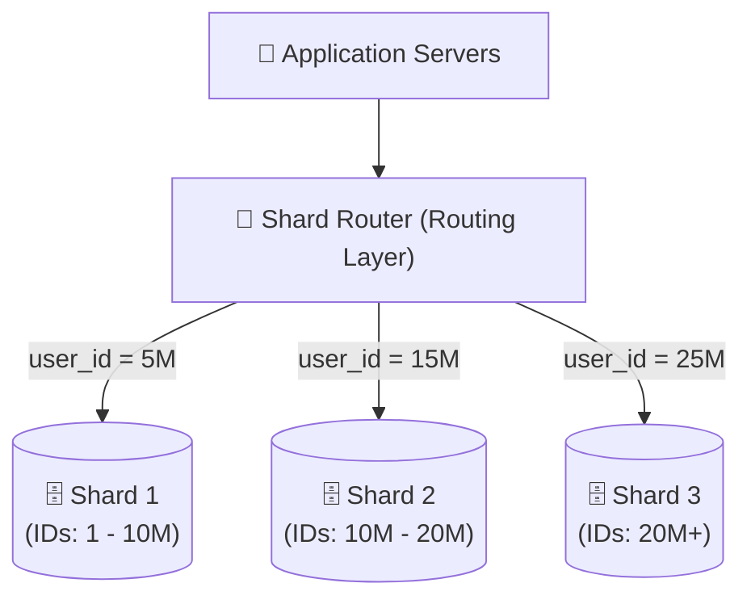
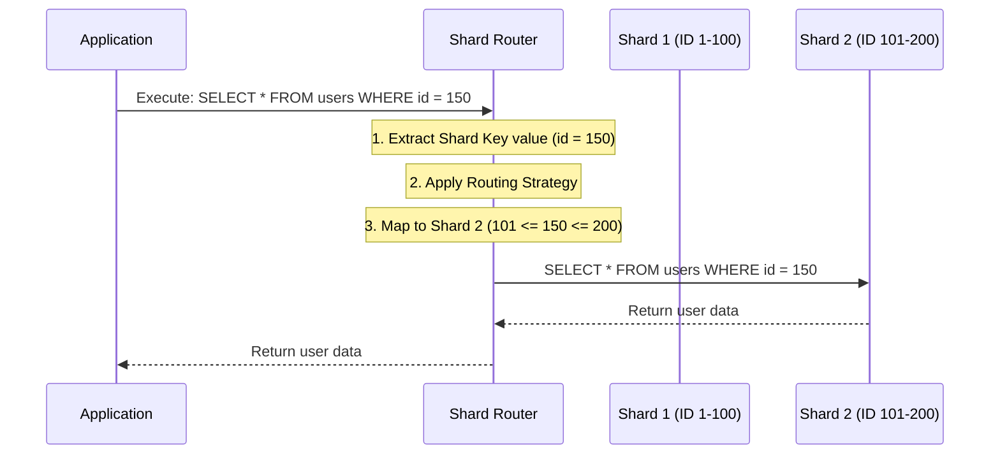
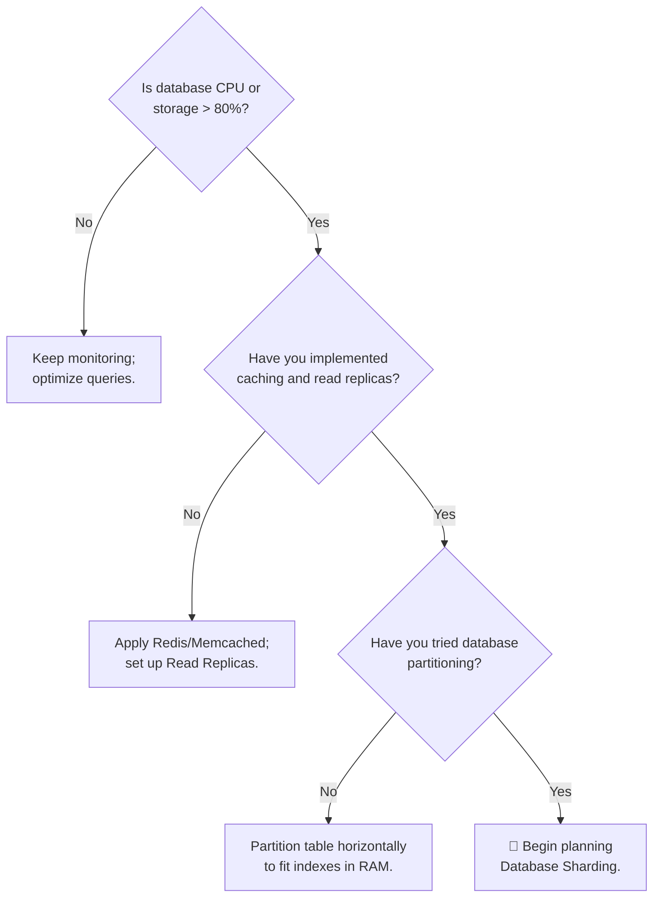

# Database Sharding

> When a single database server cannot hold your data or handle your write traffic even after vertical scaling and partitioning, it is time to split the data across **multiple independent database servers**. This is Database Sharding.

---

<div class="chapter-meta" markdown>
<span class="meta-item meta-reading-time">⏱ 15 min read</span>
<span class="meta-item meta-difficulty-intermediate">🟡 Intermediate</span>
<span class="meta-item meta-prerequisites">📋 [Chapter 3 — Partitioning](03-partitioning.md)</span>
</div>

---

## 🎯 Learning Objectives

After completing this chapter, you will understand:
- The fundamental difference between partitioning and sharding
- Why sharding is required at internet scale
- Sharding architectures and routing layers
- Sharding strategies: Range-based, Directory-based, Hash-based, and Geo-sharding
- The pain points of sharding: Cross-shard joins, Distributed transactions, and Resharding
- Real-world case studies from Instagram and Discord
- Production tools (e.g., Vitess, Citus) and monitoring guidelines

---

<div class="key-terms" markdown>

#### 📖 Key Terms

Shard
:   An individual, independent database instance that stores a subset of the total dataset.

Shard Key
:   The column or columns in a table used to determine which shard a specific row belongs to.

Shard Router (Routing Layer)
:   A stateless middleware component that inspects the shard key of a request and forwards it to the correct shard.

Cross-Shard Join
:   A query that requires joining tables located on different physical database instances.

Hotspot (Shard Skew)
:   An uneven distribution of traffic or data where one shard handles significantly more workload than the others.

Resharding (Rebalancing)
:   The process of moving data between shards to redistribute the load, typically when adding new shards.

</div>

---

## 🧠 The Problem — Why Sharding?

Suppose you are building a platform like Instagram or Twitter. Let's look at the growth trajectory of your user database:

| Stage | Users | Daily Writes (Posts) | DB Storage/Year | Operational Status |
|-------|-------|----------------------|-----------------|--------------------|
| **Small** | 100K | 50K | ~15 GB | ✅ Easy on single server |
| **Medium** | 10M | 5M | ~1.5 TB | 🟡 Partitioning / Read Replicas |
| **Large** | 100M | 50M | ~15 TB | ❌ RAM & Disk limits exceeded |
| **FAANG** | 500M+ | 250M+ | ~75 TB | 💀 Single server physically fails |

At large scale, a single database server crashes because:
1. **Physical RAM limit**: The database indexes no longer fit in memory. Reads hit disk, causing latency to spike.
2. **Write I/O bottleneck**: Read replicas can scale reads, but *all writes* must go to a single primary database. A single disk controller cannot write fast enough.
3. **Storage exhaustion**: You physically run out of disk space on a single machine.
4. **Network bandwidth limit**: The network card of a single database machine is saturated by concurrent connections.

**The Solution:** Break the dataset into smaller logical slices and store each slice on a completely **different machine**. This is **Sharding**.

---

## 🏗️ Sharding Architecture

In a sharded system, the application no longer communicates with a single large database. Instead, requests flow through a routing layer to multiple independent databases (shards):



- Each shard is a **fully independent database instance** (e.g., a separate EC2 instance running PostgreSQL).
- Each shard contains a **portion of the total database rows**, but has the **same schema**.
- Shards do not share resources or know about each other.

---

## 🔍 Internal Working — How Shard Routing Works

Let's look at what happens behind the scenes when an application executes a query:



### Routing Layer Implementation Options

Where does the routing logic live?

1. **Client-Side Routing**: The application code itself determines the shard destination using a library.
    - *Pros*: Faster (no extra network hop).
    - *Cons*: Every application client must maintain shard configurations; harder to change database topology.
2. **Proxy-Based (Middleware) Routing**: A stateless proxy sits between the application and databases (e.g., **Vitess** for MySQL).
    - *Pros*: Applications see it as a single standard database; configuration is centralized.
    - *Cons*: Extra network latency (hop to proxy); proxy becomes a bottleneck if not scaled.

---

## 🛠️ Sharding Strategies

How do we decide which shard gets which data?

### 1. Range-Based Sharding
Data is routed based on a range of values of the shard key.
- *Example*: Shard 1 stores users with IDs `1` to `1,000,000`; Shard 2 stores users with IDs `1,000,001` to `2,000,000`.
- **Pros**: Easy to implement; range queries on the shard key (e.g., get users 10 to 50) are fast and hit only one shard.
- **Cons**: Severe write hotspots. If new users get auto-incrementing IDs, all writes will hit the newest shard, leaving older shards idle.

### 2. Hash-Based (Key-Value) Sharding
A hash function is applied to the shard key, and the modulus operation determines the shard.
- *Example*: `Shard = Hash(user_id) % Number_of_Shards`
- **Pros**: Even distribution of data and traffic; prevents write hotspots.
- **Cons**: Adding or removing a shard requires redistributing almost all the data, which is an expensive process. (Solved by *Consistent Hashing*).

### 3. Directory-Based Sharding
A lookup service (like ZooKeeper or a dedicated lookup database) stores the mapping between shard keys and physical database servers.
- *Example*: The application queries the lookup service: "Where is user 42?" Lookup service replies: "Server B."
- **Pros**: Extremely flexible; easy to move data or add shards without changing routing logic.
- **Cons**: The lookup database becomes a Single Point of Failure and a major latency bottleneck.

### 4. Geo-Sharding
Data is sharded based on the user's geographic location.
- *Example*: Users in Europe go to a European database cluster; users in the US go to a US cluster.
- **Pros**: Low latency (data is physically close to users); complies with regional data residency laws (e.g., GDPR).
- **Cons**: High complexity when users travel or interact across regions.

---

## 💻 Code Example: Shard Router Implementation in Python

Here is a simplified Python class demonstrating how an application routes queries dynamically using **Hash-Based Sharding**:

```python
import hashlib
import psycopg2

class ShardRouter:
    def __init__(self, shard_connections):
        # Dictionary mapping shard index to database connection details
        self.shards = shard_connections
        self.num_shards = len(shard_connections)

    def _get_shard_index(self, shard_key):
        """Applies MD5 hashing and modulo to determine the shard index."""
        hash_val = hashlib.md5(str(shard_key).encode()).hexdigest()
        # Convert hex string to integer
        int_val = int(hash_val, 16)
        return int_val % self.num_shards

    def get_connection(self, shard_key):
        """Returns a database connection to the correct shard."""
        shard_idx = self._get_shard_index(shard_key)
        connection_info = self.shards[shard_idx]
        
        # Connect to the selected database shard
        print(f"Routing key '{shard_key}' to Shard {shard_idx} ({connection_info['host']})")
        return psycopg2.connect(**connection_info)

    def insert_user(self, user_id, name, email):
        """Inserts user data into the correct shard database."""
        conn = self.get_connection(user_id)
        cursor = conn.cursor()
        try:
            cursor.execute(
                "INSERT INTO users (id, name, email) VALUES (%s, %s, %s);",
                (user_id, name, email)
            )
            conn.commit()
            print("Insert successful!")
        except Exception as e:
            conn.rollback()
            print(f"Error during insert: {e}")
        finally:
            cursor.close()
            conn.close()

# Mock configuration for 3 database shards
shard_config = {
    0: {"host": "shard-us-east.db.internal", "database": "users_0", "user": "app"},
    1: {"host": "shard-us-west.db.internal", "database": "users_1", "user": "app"},
    2: {"host": "shard-eu-central.db.internal", "database": "users_2", "user": "app"}
}

# Example Usage
# router = ShardRouter(shard_config)
# router.insert_user(user_id=14205, name="John Doe", email="john@example.com")
```

---

## 💀 The Pain Points of Sharding

Sharding is **not** a silver bullet. It solves hardware resource limits at the cost of massive application and operational complexity:

### 1. Cross-Shard Joins
In a standard SQL database, joining two tables is simple:
```sql
SELECT * FROM users u JOIN orders o ON u.id = o.user_id WHERE u.id = 42;
```
If `users` and `orders` tables are sharded differently, or if you need to query multiple users' orders across different database servers, a standard SQL JOIN is impossible.

**How to solve it:**
- **Denormalize**: Store critical joined fields directly in the target table (e.g., store the `user_name` inside the `orders` table to avoid joining).
- **Application-Side Join**: Query Shard A for the user, query Shard B for the orders, and merge the datasets in your application memory (expensive).
- **Global Tables**: Duplicate rarely-changing lookup tables (e.g., `countries`, `roles`) across *every* shard.

### 2. Distributed Transactions (ACID Loss)
If a transaction updates data spanning multiple shards, you lose the safety of atomic database commits.

**How to solve it:**
- **Avoid multi-shard writes**: Try to design your shard key so that all tables updated in a single transaction share the same key (e.g., store a user's profile, settings, and orders on the same shard using `user_id` as the shard key).
- **Two-Phase Commit (2PC)**: A protocol where a transaction coordinator asks all shards to vote "prepare to commit" before executing the final commit.
    - *Warning*: 2PC introduces extreme network latency and blocks if a coordinator node crashes.
- **Saga Pattern (Eventual Consistency)**: Execute local transactions on each shard sequentially. If one fails, execute compensating transactions (rollbacks) on the previously updated shards.

### 3. Resharding (The Rebalancing Nightmare)
As your data grows, Shard 1 might run out of disk space while Shard 2 is only 30% full. Or, you need to add a 4th shard to your cluster. Moving Terabytes of data between active, live databases without causing downtime is one of the hardest operations in software engineering.

---

## ⚖️ Trade-offs

| Advantages | Disadvantages & Limitations |
|------------|----------------------------|
| **Write Scalability**: Scales write QPS beyond single-disk throughput. | **Operational Burden**: Running 50 databases is harder than running 1. |
| **Unlimited Storage**: Storage capacity grows linearly as you add nodes. | **Loss of ACID**: Transactions across shards are hard and slow. |
| **Fault Isolation**: If Shard A crashes, users on Shards B and C are unaffected. | **Schema Migration Complexity**: Altering a table schema must be done across all nodes. |

### Decision Flow: When to Shard



---

## 🌍 Real-World Case Studies

### 1. Instagram: Sharding PostgreSQL
When Instagram reached millions of photos uploaded daily, they sharded PostgreSQL. They chose **hash-based sharding** using `user_id` as the shard key. This ensured that a single user's photos and comments were colocated on the same database shard, avoiding cross-shard joins for profile pages. They wrote custom ID generation logic (using Snowflake IDs) containing the shard ID embedded inside the photo ID.

### 2. Discord: Moving from MongoDB to Cassandra to ScyllaDB
Discord originally stored messages in a single MongoDB replica set. As chat traffic exploded, writes saturated MongoDB. They migrated to Cassandra (and later ScyllaDB) which has **native, automatic sharding** built-in (using consistent hashing on a partition key composite of `channel_id` and `bucket`). This allowed them to scale message storage horizontally without writing custom routing code in their applications.

---

## ⚙️ Production Notes

<div class="production-notes" markdown>

#### 🏭 Production Engineering

**Operational Tools (Don't build your own)**
Instead of writing custom shard routers, use industry-standard sharding middleware:
- **Vitess**: A database clustering system for horizontal scaling of MySQL (used by Slack and YouTube).
- **Citus**: An open-source extension that transforms PostgreSQL into a distributed database (sharding automatically).

**Monitoring Shard Balance**
- Track **Disk space skew**: Alert if the difference in storage usage between the most utilized shard and the least utilized shard exceeds 20%.
- Track **CPU skew**: A hot shard key will cause a CPU spike on a single server.
- Set up monitoring dashboards with aggregated CPU, RAM, and Disk space *per shard group*.

**Operational Complexity**
Schema migrations (e.g., adding a column) must be executed in a zero-downtime rolling manner across all shards. Tools like **gh-ost** (GitHub Online Schema Tracker) are essential.

</div>

---

## 🎯 Interview Cheat Sheet

??? note "One-Line Definition"

    Sharding is a horizontal database scaling technique that distributes data across multiple independent physical database instances using a shard key.

??? note "Two-Minute Interview Answer"

    "Database sharding is horizontal scaling applied to stateful databases. Unlike partitioning, which organizes tables inside one database server, sharding splits data across completely independent database servers, each holding a subset of rows. We sharded because we hit the physical limits of a single machine—specifically write disk I/O and RAM limits for indexes. In an interview, I would detail how data is routed using range-based, list-based, or hash-based routing. I would explicitly point out that sharding introduces major trade-offs: we lose atomic ACID transactions across shards, SQL JOINs across shards become expensive, and resharding data when adding nodes is operationally complex. For an e-commerce scale design, I'd suggest sharding by `user_id` to colocate a user's data on a single shard, minimizing cross-shard queries."

??? note "Common Interview Questions"

    **Q: What is the hotspot (or celebrity) problem in sharding, and how do you solve it?**

    A: If you shard a social media DB by `user_id`, a celebrity user (like Elon Musk) will cause their shard to receive massive write/read traffic, creating a hotspot. Solution: Identify hot keys and append a random suffix (e.g., `user_id_1`, `user_id_2`) to distribute the celebrity data across multiple shards, or route celebrity data to a dedicated database cluster.

    **Q: What is the difference between sharding and consistent hashing?**

    A: Sharding is the general architectural pattern of splitting databases. Consistent hashing is a specific routing algorithm used to distribute data across shards in a way that minimizes data relocation when the number of database servers changes.

---

## ⚠️ Common Mistakes

!!! warning "Misconceptions to Avoid"

    **❌ "We should shard our database on day one to prepare for growth."**

    ✅ Never shard prematurely. It introduces distributed transactions and ACID loss immediately, severely slowing down feature development. Scale vertically first.

    ---

    **❌ "Read replicas can solve our write performance issues."**

    ✅ Read replicas only scale reads. Since all writes must go to the single primary database instance, sharding is required to scale writes.

    ---

    **❌ "Choosing any unique key (like UUID) as the shard key is fine."**

    ✅ Choosing a bad shard key causes hotspots or forces you to scan *all shards* (scatter-gather) for every query. The shard key must align with your application's query patterns.

---

## 📑 Quick Revision

| Concept | Remember |
|---------|----------|
| Sharding | Independent databases on separate servers |
| Primary Goal | Scale writes and storage |
| Shard Key | Routes data to the correct database |
| Shard Router | Stateless middleware proxy |
| The Sharding Tax | Lose cross-shard JOINs and ACID transactions |
| Scaling Strategy | Always exhaust Caching → Read Replicas → Partitioning first |

---

## 📝 Summary

In this chapter, we learned:
- Sharding scales write QPS and storage by distributing rows across physically separate database machines.
- Shard routing can happen on the client-side or via middleware proxies (like Vitess).
- Sharding strategies range from range-based to hash-based and geo-sharding.
- The cost of sharding is high: complex cross-shard joins, loss of ACID transactions, and resharding overhead.
- Sharding should be treated as a last resort when caching, replicas, and partitioning are exhausted.

---

## 🔗 Related Topics
- [Shard Key](05-shard-key.md) — How to select the optimal routing key
- [Replication](06-replication.md) — Combining sharding with read replicas
- [Production Architecture](07-production-architecture.md) — High availability for sharded clusters

---

<div class="navigation-footer" markdown>

[⬅️ Partitioning](03-partitioning.md)

[Shard Key ➡️](05-shard-key.md)

</div>