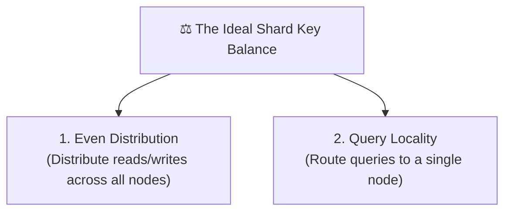
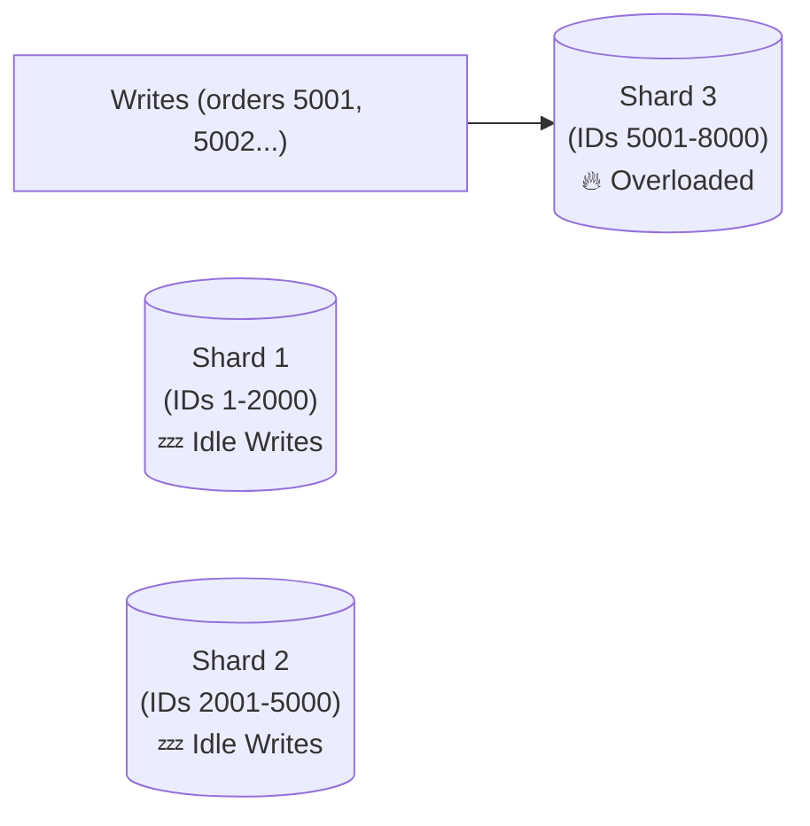
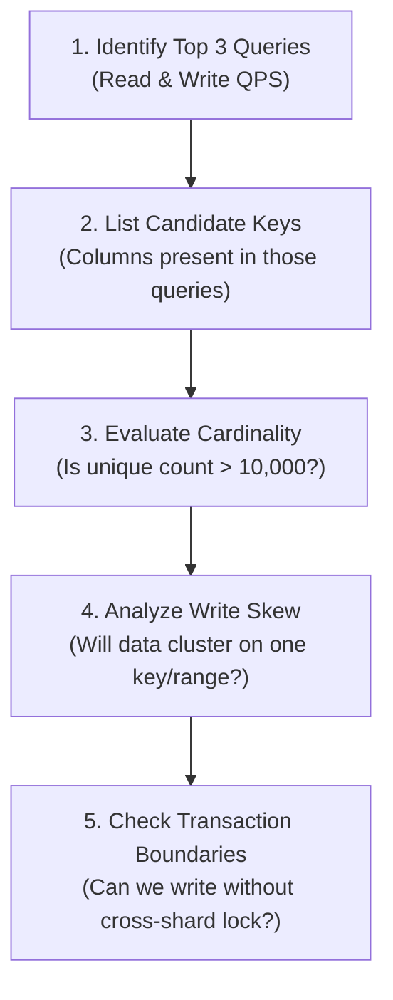

# Shard Key

> Selecting the correct **Shard Key** is the single most critical decision when sharding a database. A bad shard key will degrade a distributed database so severely that it performs worse than a single, underpowered database server.

---

<div class="chapter-meta" markdown>
<span class="meta-item meta-reading-time">⏱ 10 min read</span>
<span class="meta-item meta-difficulty-intermediate">🟡 Intermediate</span>
<span class="meta-item meta-prerequisites">📋 [Chapter 4 — Sharding](04-sharding.md)</span>
</div>

---

## 🎯 Learning Objectives

After completing this chapter, you will understand:
- What a shard key is and how it routes queries
- Cardinality and why it determines data distribution limit
- The Hotspot (Celebrity) problem and how to mitigate it
- Compound shard keys and how they balance data distribution with join locality
- How Slack and WhatsApp select shard keys in production
- A 5-step evaluation framework for choosing a shard key

---

<div class="key-terms" markdown>

#### 📖 Key Terms

Cardinality
:   The number of unique values in a particular column. High cardinality means many unique values (e.g., `user_id`). Low cardinality means few unique values (e.g., `gender`).

Hotspot (Celebrity)
:   A single shard database node receiving a disproportionately high volume of read or write requests due to uneven shard key distribution.

Compound Shard Key
:   A shard key created by combining multiple columns (e.g., `tenant_id` + `created_at`) to route data and optimize query performance.

Consistent Hashing
:   A routing algorithm that maps keys to nodes on a virtual ring, allowing nodes to be added/removed with minimal data relocation.

Data Locality
:   Storing related data elements on the same physical database node to avoid network hops during queries.

</div>

---

## 🧠 The Shard Key Concept

In a sharded architecture, the application (or a routing middleware) needs to know where to insert or find a row:

```mermaid
flowchart LR
    Write["📥 Write User 42"] --> Router["Shard Router"]
    Router -->|Hash(42) % 3 = 1| S1[("Shard 1\n(Hosts User 42)")]
    Router -.-> S0[("Shard 0")]
    Router -.-> S2[("Shard 2")]
```

Without a shard key, the database would have to query *every single shard* to find a record (a practice known as **Scatter-Gather**), which completely destroys performance.

---

## 🔍 Critical Criteria for a Shard Key

To ensure your sharded cluster stays healthy, your shard key must satisfy two major requirements:



### 1. High Cardinality
If your database has 10 shards, but your shard key has only 2 unique values, 8 shards will sit empty.
- **Bad (Low Cardinality)**: `gender` (2 values), `is_active` (2 values), `status` (3-4 values).
- **Good (High Cardinality)**: `user_id` (millions of values), `order_id`, `email`.

### 2. High Frequency in Queries
The shard key must be present in the `WHERE` clause of your application's most frequent queries.
- If you shard by `user_id`, queries like `SELECT * FROM users WHERE user_id = 42` route instantly to one shard.
- A query like `SELECT * FROM users WHERE email = 'john@example.com'` does not contain the shard key. The router has to query **all shards**, reducing system throughput.

---

## 💀 The Hotspot Problem in Depth

Even with high cardinality, a bad shard key can lead to traffic skew.

### Case A: Auto-Incrementing IDs (Range-Based Sharding)
If you shard by `order_id` range, and your database auto-increments IDs:
- All new orders have the highest IDs.
- All write queries hit the newest shard.
- Older shards act as read-only historical archives.



### Case B: The Celebrity Problem (Write Skew)
If you shard a social media site by `user_id`:
- Average user writes 1 post/day.
- A celebrity user writes 50 posts/day, and has 50M followers reading those posts.
- The shard hosting that celebrity user's ID becomes a hotspot, while other shards remain idle.

```mermaid
flowchart LR
    App["App Traffic"] --> Router
    Router -->|Average users| S1[("Shard 1\n💤 Underutilized")]
    Router -->|Average users| S2[("Shard 2\n💤 Underutilized")]
    Router -->|Elon Musk (user_id = 999)| S3[("Shard 3\n🔥 CPU 100%")]
```

---

## 🛠️ Mitigating Hotspots with Compound Shard Keys

A **Compound Shard Key** combines two columns to split data.

### Example: SaaS Multi-Tenant Platform
Imagine a platform like Slack where users belong to a workspace (tenant).
- Sharding by `tenant_id` keeps all workspace data together (good for JOINs).
- *The Problem*: Large enterprise workspaces (like IBM with 300K users) will overwhelm their shard, while small 5-user workspaces leave shards empty.

**The Solution:** Use a compound shard key: `tenant_id` + `user_id` or `tenant_id` + `created_at`.
- Small workspaces still fit on one shard.
- Large workspaces have their data distributed across multiple shards using the second key component.

=== "Algorithm Pseudocode"

    ```python
    def determine_shard(tenant_id, user_id, total_shards):
        # Calculate primary routing based on tenant
        base_hash = hash(tenant_id)
        
        # If the tenant is a known giant, distribute its users
        if is_giant_tenant(tenant_id):
            # Combine tenant_id and user_id to route
            compound_hash = hash(f"{tenant_id}_{user_id}")
            return compound_hash % total_shards
        else:
            # Route all data of normal tenants to the same shard
            return base_hash % total_shards
    ```

---

## 📋 Shard Key Evaluation Framework

Use this 5-step checklist during system design interviews:



---

## ⚖️ Trade-offs: Query Locality vs Data Distribution

Choosing a shard key is a balance between keeping related data together (locality) and distributing it evenly (distribution):

| Shard Key | Query Locality | Data Distribution | Ideal For |
|-----------|----------------|-------------------|-----------|
| **Tenant ID / Workspace ID** | High (All tenant data on 1 shard; fast JOINs) | Low (Large tenants create hotspots) | Small-medium SaaS platforms |
| **User ID** | High (User profile & metadata colocated) | High (Evenly distributed if hashed) | Consumer apps (Instagram) |
| **Timestamp / Date** | Low (Queries scan multiple shards for historical ranges) | Low (Writes always cluster on current date) | Log analysis (rarely used alone) |
| **Compound (Tenant + User)** | Medium (Requires tenant & user context to route) | High (Prevents single-tenant skew) | Large enterprise SaaS (Slack) |

---

## 🌍 Real-World Examples

!!! info "Slack"

    Slack originally sharded by `workspace_id`. This kept message histories for a single company on one shard, making channel rendering fast. As giant companies adopted Slack, they migrated to compound routing mechanisms to prevent large workspaces from saturating single database nodes.

!!! info "WhatsApp"

    WhatsApp shards message databases by phone number (`phone_number`). Phone numbers have high cardinality and are globally unique. Hashing the phone number distributes writes and reads evenly across database clusters, and messages between two users are routed dynamically.

---

## ⚙️ Production Notes

<div class="production-notes" markdown>

#### 🏭 Production Engineering

**Hotspot Detection**
- Monitor query latency per shard node. If one node shows higher latency, inspect query logs for key distribution.
- Use **Consistent Hashing** rings (like Cassandra or Dynomite) to make adding shards simple, minimizing the amount of data moved during rebalancing.

**Secondary Indexing Challenge**
- If you shard by `user_id`, searching by `username` requires scanning all shards.
- *Production Pattern*: Maintain a mapping table (e.g., in Redis or a secondary global lookup index) mapping `username` → `user_id`. When querying by username, first resolve the `user_id`, then route directly to the user's shard database.

</div>

---

## 🎯 Interview Cheat Sheet

??? note "One-Line Definition"

    A Shard Key is the routing field that determines which physical database node in a sharded cluster stores and retrieves a specific row of data.

??? note "Two-Minute Interview Answer"

    "Choosing a shard key is a balance between query locality and even data distribution. If you choose a key with low cardinality (like status), you'll get skewed data distribution. If you choose a key that isn't queried often, the routing layer must perform a scatter-gather query across all shards, which degrades throughput. For consumer applications, `user_id` is typically the best shard key because it has high cardinality and matches user-centric query patterns. In multi-tenant enterprise systems, we often use compound keys (like `tenant_id` + `user_id`) to keep a workspace's data close together while preventing massive enterprise tenants from creating hotspots on a single database instance."

??? note "Common Interview Questions"

    **Q: Can we change the shard key later?**

    A: Changing a shard key is extremely difficult. It requires setting up a new database cluster with the new shard key schema, dual-writing to both old and new databases, backfilling historical data, verifying consistency, and then cutting over. It is best avoided by careful initial design.

    **Q: How do you choose a shard key for an e-commerce platform?**

    A: If the primary queries are customer-centric (viewing profile, placing orders), use `user_id`. If queries are merchant-centric, use `merchant_id`. If both are critical, you may need a dual-sharding architecture where data is replicated across two separate sharded clusters optimized for different keys.

---

## ⚠️ Common Mistakes

!!! warning "Misconceptions to Avoid"

    **❌ "Choosing the primary key (like auto-incrementing ID) is always the best shard key."**

    ✅ Auto-increment keys create severe write hotspots in range-based sharding because all new records are written to the highest range.

    ---

    **❌ "Sharding by a low-cardinality column like Country is fine if we have few shards."**

    ✅ If your database expands later or if one country (e.g., India) accounts for 80% of your traffic, it will create a massive hotspot that is hard to fix.

    ---

    **❌ "We don't need secondary lookup tables; we can just query all shards if we query by another column."**

    ✅ Scatter-gather queries degrade distributed database throughput. Use mapping layers or secondary index tables for non-shard-key lookups.

---

## 📑 Quick Revision

| Rule | Action |
|------|--------|
| **High Cardinality** | Essential to spread data across nodes |
| **Even Distribution** | Prevents single-node CPU/Disk saturation |
| **Query Locality** | Match key to your `WHERE` clauses |
| **SaaS / B2B** | Prefer `tenant_id` or Compound Keys |
| **B2C / Consumer** | Prefer `user_id` |

---

## 📝 Summary

In this chapter, we learned:
- Shard keys route reads and writes to physical nodes.
- Good shard keys require high cardinality and query frequency alignment.
- Low cardinality and skewed keys cause hotspots.
- Compound shard keys are used to distribute giant tenants while maintaining locality.
- Secondary indexing requires mapping indices to avoid scatter-gather queries.

---

## 🔗 Related Topics
- [Consistent Hashing](../load-balancing/04-consistent-hashing.md) — Routing algorithm for distributed nodes
- [Replication](06-replication.md) — Adding high availability to sharded databases
- [Production Architecture](07-production-architecture.md) — Combining sharding and replication

---

<div class="navigation-footer" markdown>

[⬅️ Sharding](04-sharding.md)

[Replication ➡️](06-replication.md)

</div>