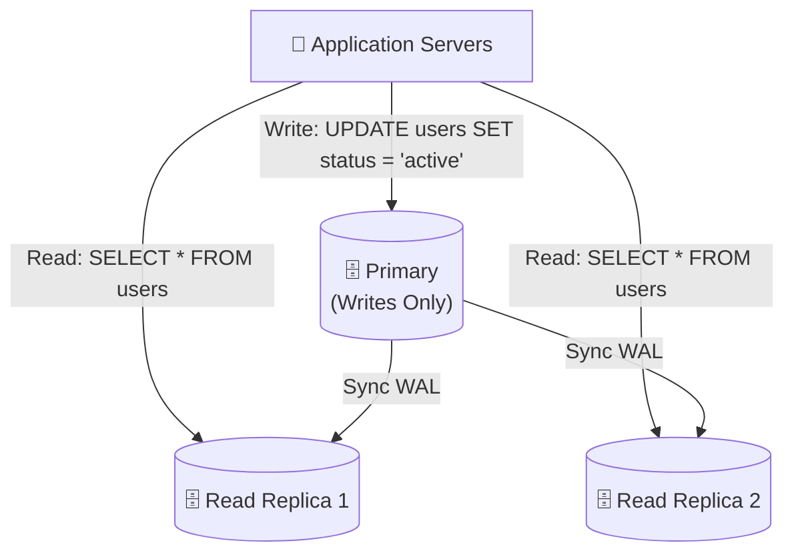
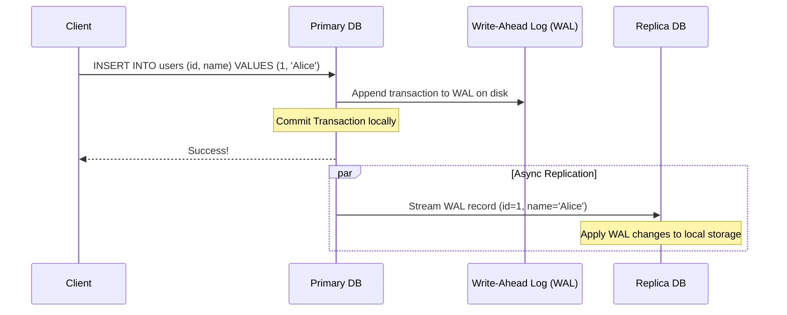
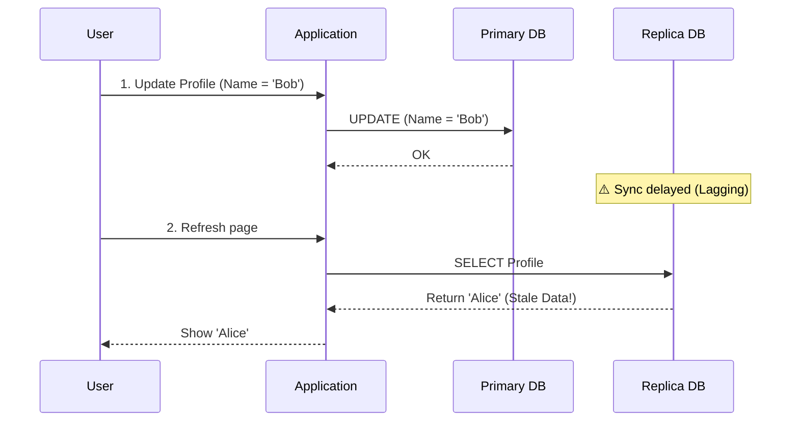
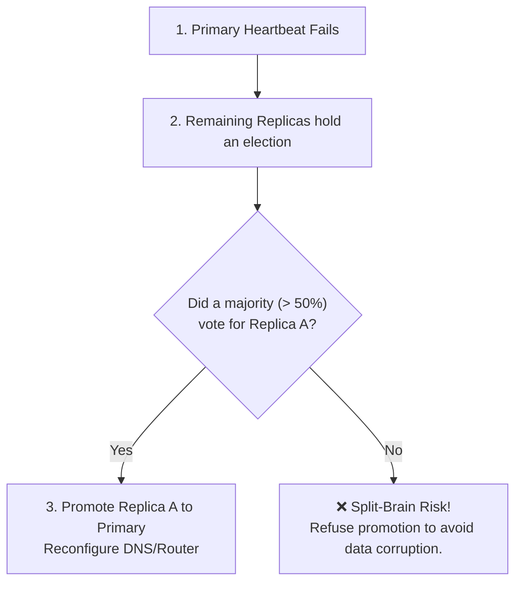

# Database Replication

> To prevent data loss when a server physically fails and to scale read capacity, you must maintain **copies of the same database** on different physical machines. This is Database Replication.

---

<div class="chapter-meta" markdown>
<span class="meta-item meta-reading-time">⏱ 15 min read</span>
<span class="meta-item meta-difficulty-intermediate">🟡 Intermediate</span>
<span class="meta-item meta-prerequisites">📋 [Chapter 2 — Scaling Types](02-scaling-types.md)</span>
</div>

---

## 🎯 Learning Objectives

After completing this chapter, you will understand:
- Primary-Replica (Master-Slave) topology and read/write splitting
- How replication logs (WAL) sync databases behind the scenes
- Synchronous, Asynchronous, and Semi-Synchronous replication models
- Replication lag and consistency anomalies (Read-your-own-writes)
- Automated Failover, consensus algorithms (Raft), and the Split-Brain problem
- Multi-Primary (Multi-Master) replication challenges
- Real-world architectures from GitHub and Facebook

---

<div class="key-terms" markdown>

#### 📖 Key Terms

Primary (Master)
:   The database instance that handles all write operations (INSERT, UPDATE, DELETE).

Replica (Secondary/Slave)
:   A read-only copy of the primary database.

Write-Ahead Log (WAL)
:   An append-only log file on disk where database modifications are written *before* they are applied to the database pages.

Replication Lag
:   The time delay between a write transaction committing on the primary and that same write being applied on a replica.

Failover
:   The automated process of promoting a read replica to primary when the primary database node crashes.

Split-Brain
:   A critical failure state where two nodes in a cluster simultaneously believe they are the active Primary, leading to data corruption.

</div>

---

## 🧠 The Problem — Why Replicate?

If your system runs on a single database node, you face two catastrophic risks:
1. **Data Loss & Downtime**: If the server motherboard burns out, your application is down, and any data written since the last backup is lost.
2. **Read Saturation**: Even if writes are low, if thousands of users fetch dashboards, search profiles, or read feeds simultaneously, the CPU will saturate, slowing down the application.

**The Solution:** Set up a Primary database to receive writes, and constantly synchronize the data to multiple **Read Replicas**.



---

## 🔍 Internal Working — The WAL Mechanism

How does a replica duplicate the primary's state? Most databases use **Log-Based Replication**:



1. **WAL Logging**: Every write query is recorded sequentially in the Primary's Write-Ahead Log (WAL) on disk.
2. **Log Streaming**: The Primary streams these WAL entries over the network to the Replicas.
3. **Log Replay**: The Replica reads the WAL stream and applies the transactions locally in the exact same sequence.

---

## 🛠️ Replication Models

How does the Primary wait for Replicas before responding to the user?

### 1. Asynchronous Replication
The Primary commits the transaction locally and immediately replies "Success" to the client, streaming the update to replicas in the background.
- **Pros**: Extremely fast writes; low latency.
- **Cons**: Risk of data loss if the Primary crashes before the update reaches replicas. Replicas can serve stale data due to replication lag.

### 2. Synchronous Replication
The Primary writes the update, sends it to all replicas, and waits until *every* replica confirms receipt before returning "Success" to the client.
- **Pros**: Strong consistency; zero data loss during failover.
- **Cons**: Writes are extremely slow (constrained by the slowest replica's network latency). If a single replica goes down, all writes fail.

### 3. Semi-Synchronous Replication
The Primary waits for confirmation from **at least one** replica before returning "Success". Other replicas sync asynchronously.
- **Pros**: Protects against data loss (at least one copy exists outside the primary) with better write performance than fully synchronous replication.
- **Cons**: Writes still experience network latency from the fastest replica.

---

## 💀 The Replication Lag Problem

In Asynchronous and Semi-Synchronous systems, replicas are slightly behind the primary. This creates user experience anomalies:

### Read-Your-Own-Writes Anomaly
A user updates their profile name from "Alice" to "Bob", submits the form, and refreshes the page.
- The update write goes to the **Primary**.
- The page refresh query is sent to a **Replica** (which has 2 seconds of replication lag).
- The user still sees "Alice" on their screen, making them think the save failed.



#### How to Solve It:
- **Read from Primary for Hot Data**: Route queries that edit data (like profile updates) to the Primary for a short period (e.g., 5 seconds) after a write, or read the user's *own profile* exclusively from the Primary.
- **Version Tracking (Session Consistency)**: Track the latest transaction ID the user's client has written. If a replica is not updated to that transaction ID, query the primary instead.

---

## 💻 Code Example: Read/Write Split Routing in Python

Here is how an application routes read and write queries dynamically using a database adapter:

```python
import random

class ReadWriteSplitDb:
    def __init__(self, primary_conn, replica_conns):
        self.primary = primary_conn
        self.replicas = replica_conns

    def execute_query(self, sql_query, params=None):
        # Inspect query type
        is_write = any(sql_query.strip().upper().startswith(prefix) 
                       for prefix in ["INSERT", "UPDATE", "DELETE", "ALTER", "CREATE"])
        
        if is_write:
            print("Routing Write Query to Primary Database")
            return self._execute(self.primary, sql_query, params)
        else:
            # Pick a random replica to distribute read load
            selected_replica = random.choice(self.replicas)
            print(f"Routing Read Query to Replica: {selected_replica['host']}")
            return self._execute(selected_replica["conn"], sql_query, params)

    def _execute(self, conn, sql, params):
        cursor = conn.cursor()
        cursor.execute(sql, params or ())
        # Commit writes
        if conn == self.primary:
            conn.commit()
        try:
            return cursor.fetchall()
        except Exception:
            return None # Insert/Update queries have no result rows
```

---

## ⚡ Failover & The Split-Brain Problem

When the Primary crashes, a Replica must be promoted. But how do we decide?



### The Split-Brain Problem
If a network partition divides your database cluster in half, Node A (former Primary) might be isolated but still running. Replicas B and C might think Node A is dead, hold an election, and promote Node B.
Now, you have **two active Primary nodes** accepting writes. When the network heals, merging conflicting writes will cause massive data corruption.

#### How to Solve It:
- **Consensus Algorithms (Raft / Paxos)**: Require a strict majority (quorum) to elect a primary. If a node cannot communicate with the majority of the cluster, it automatically steps down and refuses write operations.

---

## ⚖️ Trade-offs

| Replication Model | Consistency | Write Latency | Data Loss Risk during Failover |
|--------------------|-------------|---------------|--------------------------------|
| **Synchronous** | Strong | High | Zero |
| **Asynchronous** | Eventual | Low | High |
| **Semi-Synchronous**| Eventual / Read-Your-Own-Writes | Medium | Low |

---

## 📊 Sharding vs Replication

| Feature | Sharding | Replication |
|---------|----------|-------------|
| **Primary Purpose** | Scale writes and storage | Scale reads and availability |
| **Data Distribution**| Different data on each node | Identical copy of data on each node |
| **Node Roles** | Independent shard masters | Primary handles writes, Replicas handle reads |
| **ACID Integrity** | Multi-shard transactions are complex | Strong consistency on Primary, eventual on Replicas |

---

## 🌍 Real-World Examples

!!! info "GitHub's MySQL High Availability"

    GitHub uses Orchestrator, Raft, and Consul to manage MySQL replication and automated failovers. When a primary database fails, Orchestrator detects it, elects a replica using Raft consensus, reconfigures replication pipelines, and updates Consul (service discovery) to route application traffic to the new primary within seconds.

!!! info "Facebook's Cross-Datacenter Replication"

    Facebook replicates MySQL databases across global datacenters. Because of the physical speed of light, synchronous replication across oceans is impossible due to latency. They use **asynchronous replication** backed by Memcached layers. When an update happens in the US, a cache invalidation pipeline clears keys in European replicas to prevent stale reads.

---

## ⚙️ Production Notes

<div class="production-notes" markdown>

#### 🏭 Production Engineering

**Monitoring Replication Lag**
- In PostgreSQL, monitor lag by calculating the difference between the primary's write location and the replica's read location:
  `SELECT pg_wal_lsn_diff(pg_current_wal_lsn(), replay_lsn) FROM pg_stat_replication;`
- **Alerting Threshold**: Set an alert if replication lag exceeds **10 seconds** or if the replication byte lag exceeds your disk swap capacity.

**Multi-Primary (Multi-Master) Replication Warning**
- Having multiple databases accept writes for the same table introduces replication conflicts (e.g., two users registering the username `admin` simultaneously on different master nodes). Conflict resolution (Last-Write-Wins, CRDTs) is highly complex. Most production architectures prefer Single-Primary with Read Replicas.

</div>

---

## 🎯 Interview Cheat Sheet

??? note "One-Line Definition"

    Database replication is the process of copying data from a primary database instance to secondary replicas to scale reads and ensure high availability.

??? note "Two-Minute Interview Answer"

    "Replication is the core pattern for achieving high availability and scaling read performance. In a Primary-Replica architecture, the Primary accepts all writes, records them in a Write-Ahead Log (WAL), and streams this log to replicas. Replicas replay this log to remain synced. Replicas are read-only, allowing us to split reads and writes. Replication can be synchronous, asynchronous, or semi-synchronous. The main challenges are replication lag, which leads to consistency issues like not reading your own writes immediately, and automated failover complexity. To handle failover, we use consensus algorithms like Raft to avoid the Split-Brain problem, where two nodes think they are the primary. In a production design, I'd combine replication with sharding, so that each database shard is itself a Primary database with multiple replicas."

??? note "Common Interview Questions"

    **Q: How do you solve the read-your-own-writes consistency problem?**

    A: I would track user session writes using a cookie or token. For queries occurring shortly after a write (e.g., 5 seconds), I would force the query to run on the Primary database instead of a read replica. Alternatively, I'd check the replica's replication log offset against the client's write offset before serving.

    **Q: What is a quorum?**

    A: A quorum is the minimum number of votes required in a distributed system to make a valid decision (like electing a new primary). It is calculated as `(N/2) + 1` where `N` is the total number of nodes in the cluster.

---

## ⚠️ Common Mistakes

!!! warning "Misconceptions to Avoid"

    **❌ "Replication improves write speed."**

    ✅ Replication actually *slows down* write speed slightly due to log generation and network streaming. To scale writes, you must use [Sharding](04-sharding.md).

    ---

    **❌ "We can use replication replicas as our only backup strategy."**

    ✅ If someone executes a destructive command like `DROP TABLE users;` on the primary, this command replicates instantly, deleting data across all replicas. You still need offline, periodic snapshots (backups).

    ---

    **❌ "A replication lag of 0 is guaranteed in Asynchronous replication."**

    ✅ Replicas are always eventually consistent. Under heavy write loads or network congestion, replication lag will spike.

---

## 📑 Quick Revision

| Aspect | Action |
|--------|--------|
| **Writes** | Route exclusively to the Primary |
| **Reads** | Route to Read Replicas |
| **Async Replication** | Fast writes, eventual consistency |
| **Sync Replication** | Slow writes, strong consistency |
| **Split-Brain** | Solved by majority consensus (Raft/Paxos) |

---

## 📝 Summary

In this chapter, we learned:
- Replication copies data from a Primary server to Read Replicas using the Write-Ahead Log (WAL).
- Read/write splitting scales read queries while concentrating writes on the Primary.
- Sync, Async, and Semi-sync represent trade-offs between write speed and consistency.
- Replication lag causes eventual consistency anomalies like stale reads.
- Failover requires majority quorum to prevent Split-Brain.
- Master-Replica replication does not scale writes; it scales availability and reads.

---

## 🔗 Related Topics
- [Sharding](04-sharding.md) — Scaling database writes
- [Production Architecture](07-production-architecture.md) — Combining sharding and replication clusters
- [CAP Theorem](../../index.md) — Consistency vs Availability limits *(coming soon)*

---

<div class="navigation-footer" markdown>

[⬅️ Shard Key](05-shard-key.md)

[Production Architecture ➡️](07-production-architecture.md)

</div>