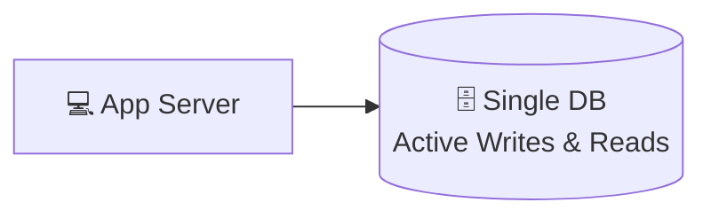
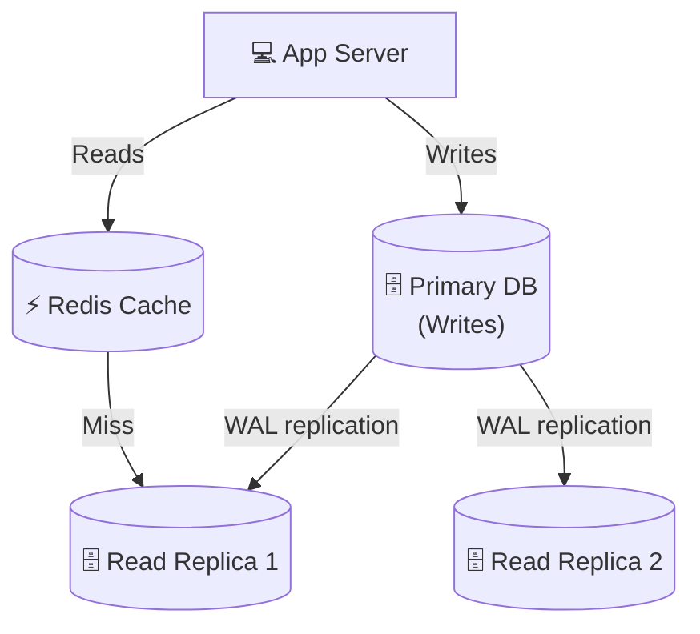
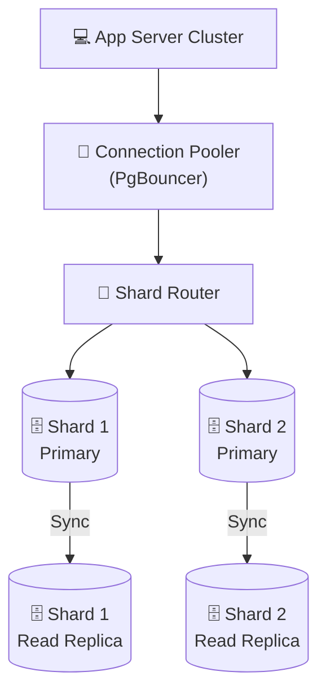
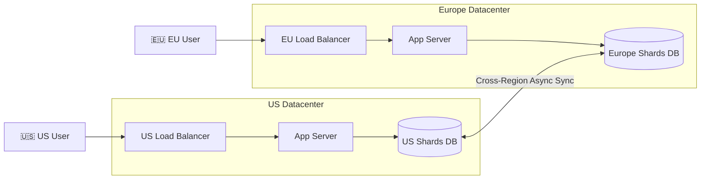
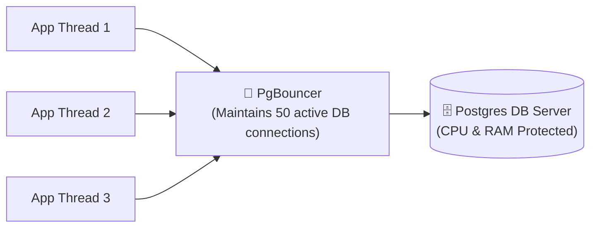
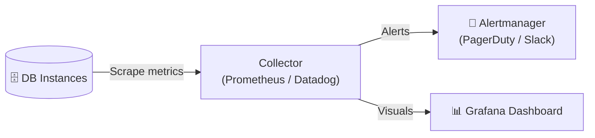

# Production Database Architecture

> Production database architectures are not built in a single day. They evolve incrementally as traffic, data, and organizational requirements grow. Understanding this evolution is critical for designing scalable systems under real-world constraints.

---

<div class="chapter-meta" markdown>
<span class="meta-item meta-reading-time">⏱ 15 min read</span>
<span class="meta-item meta-difficulty-advanced">🔴 Advanced</span>
<span class="meta-item meta-prerequisites">📋 [Chapter 4 — Sharding](04-sharding.md), [Chapter 6 — Replication](06-replication.md)</span>
</div>

---

## 🎯 Learning Objectives

After completing this chapter, you will understand:
- How database architectures scale from 1K to 100M+ users
- The role of Connection Pooling (e.g., PgBouncer) in preventing resource exhaustion
- Monitoring metrics (CPU, memory, disk I/O, lag) and alerting rules
- Capacity planning and database cost estimation frameworks
- Disaster Recovery metrics (RTO and RPO)
- High availability topologies combining caching, routing, sharding, and replication

---

<div class="key-terms" markdown>

#### 📖 Key Terms

Connection Pooling
:   A cache of database connections maintained so that connections can be reused when queries are executed, avoiding the high overhead of establishing a new TCP connection every time.

RPO (Recovery Point Objective)
:   The maximum targeted period in which data might be lost from an IT service due to a major incident (measured in time, e.g., "1 hour of data loss").

RTO (Recovery Time Objective)
:   The targeted duration of time and a service level within which a business process must be restored after a disaster (measured in time, e.g., "30 minutes to restore service").

PgBouncer
:   A popular lightweight connection pooler for PostgreSQL.

Prometheus & Grafana
:   The industry-standard open-source stack for gathering metrics (Prometheus) and visualizing them (Grafana).

</div>

---

## 🏗️ The Database Architecture Evolution

Production architectures scale through four distinct phases:

### 1. Small Scale (1K - 10K Users)
A single database server hosting both application state and media references. Very simple, low maintenance.



### 2. Medium Scale (10K - 1M Users)
Reads begin to outpace writes. We introduce a **Redis Cache** to intercept hot read queries, and **Read Replicas** to scale database read capacity. Writes go to the Primary.



### 3. Large Scale (1M - 10M Users)
The write traffic saturates the Primary disk, and the connection limit of the database is reached. We introduce a **Connection Pooler** (like PgBouncer) to multiplex database connections, and split the database into multiple **Shards**.



### 4. Enterprise Scale (10M - 100M+ Users)
A global, multi-region architecture. User traffic is routed to the nearest regional datacenter via Geo-DNS. Datacenters duplicate data asynchronously for backup and local reads, while write operations are coordinated across regions.



---

## 🔌 Connection Pooling: The Unsung Hero

When a client queries a database, the server allocates resources for a TCP handshake, authentication, and backend processes.
- For PostgreSQL, each client connection spawns a new operating system process consuming **~10MB of RAM**.
- If 1,000 application threads connect directly to PostgreSQL, you immediately lose **10GB of RAM** just to connection overhead, even before running a single query.

### Connection Pooler Solution
Middleware like **PgBouncer** sits between the application and database. It maintains a warm pool of database connections and multiplexes them:



**Key Benefit**: The application can open 10,000 virtual connections, but PgBouncer routes them through only 100 actual database connections, protecting the database from crashing due to memory exhaustion.

---

## 📊 The Production Monitoring Stack

You cannot scale what you do not measure. A production database architecture must be connected to a monitoring collector (like Prometheus) and visualized in Grafana.



### Key Metrics to Monitor & Alert On

| Metric Group | Specific Metric | Alerting Trigger | Action |
|--------------|-----------------|------------------|--------|
| **CPU** | CPU Utilization | > 75% for 5 mins | Add read replicas or scale instance up. |
| **Memory** | Swap Space Usage | > 10% usage | Database working set is spilling to disk. Upgrade RAM. |
| **Disk I/O** | Disk Queue Depth / IOPS | > 80% controller limit | Disk cannot keep up with writes. Enable sharding. |
| **Connections**| Connection Saturation | > 85% max_connections | Check PgBouncer scaling or application leaks. |
| **Replication**| Replication Lag | > 10 seconds | Network congestion or replica disk slowdown. |

---

## 📐 Capacity Planning & Cost Estimation Framework

Before deploying database infrastructure, you must calculate capacity and costs.

### Case: E-Commerce Product Catalog
- **Active Products**: 10 million
- **Average Size per Product Record**: 2 KB
- **Initial Data Size**: `10M * 2 KB = 20 GB`
- **Metadata, Audits, & Indexes Overhead**: ~100% of data size = `20 GB`
- **Total Initial Storage**: `40 GB`
- **Growth Estimate**: 100,000 new products/month = `100K * 2 KB * 2 (indices) = 400 MB/month`
- **Year 1 Target Storage**: `40 GB + (0.4 GB * 12) = 44.8 GB`

### Scaling RAM (Working Set rule)
To ensure sub-millisecond query performance, the **database index + active working set** (hot data) must fit entirely in RAM.
- *Rule of thumb*: Budget **20% of your total storage size as RAM**.
- For 44.8 GB storage, you need at least **9 GB of server RAM** (e.g., an AWS `db.m5.large` instance with 8GB RAM or `db.m5.xlarge` with 16GB RAM).

---

## 🛡️ Disaster Recovery: RTO vs RPO

Disaster recovery determines how your database architecture handles major outages (e.g., datacenter flood).

```text
Outage Event
    │
    ▼
◄─── RPO (Data Loss Limit) ───┼─── RTO (Recovery Time Limit) ───►
(Time since last backup)      (Time taken to promote replica)
```

- **RPO (Recovery Point Objective)**: How much data are you willing to lose?
    - *If RPO = 1 Hour*, you must take backups or replicate data at least every hour.
- **RTO (Recovery Time Objective)**: How long can your application stay down?
    - *If RTO = 1 Minute*, you cannot rely on restoring backups (which takes hours). You must have automated replica promotion (failover) ready.

---

## 🎯 Interview Cheat Sheet

??? note "One-Line Definition"

    Production database architecture is the combination of caching layers, connection poolers, sharding, and replication designed to meet specific scalability, cost, monitoring, and disaster recovery SLA targets.

??? note "Two-Minute Interview Answer"

    "A production-ready database architecture cannot rely on a single scaling strategy. It evolves based on capacity planning. For a mid-sized system with high read traffic, I'd design a Primary database for writes, utilizing asynchronous replication to 2-3 read replicas to scale read QPS. I'd place a Redis caching layer in front of the replicas to absorb 80% of hot read traffic. To manage database connections and prevent RAM exhaustion, I'd route application connections through a pooler like PgBouncer. As writes grow, I'd shard the database using a compound shard key. From an operational standpoint, this entire architecture must be monitored for CPU, swap usage, and replication lag using Prometheus and Grafana, with automated failover managed by consensus clusters to maintain our target RTO and RPO SLAs."

??? note "Common Interview Questions"

    **Q: How do you choose between PgBouncer transaction mode and session mode?**

    A: Session mode binds a server connection to a client for the entire connection duration (supports prepared statements). Transaction mode releases the connection back to the pool as soon as the transaction finishes, allowing much higher connection density, but does not support SQL features like temporary tables.

    **Q: What is the difference between RTO and RPO?**

    A: RTO is the maximum allowed downtime to restore the database system after a failure. RPO is the maximum allowed time span of data loss (e.g., how far back we have to restore from backup).

---

## ⚠️ Common Mistakes

!!! warning "Misconceptions to Avoid"

    **❌ "We don't need connection pooling because our cloud database handles infinite connections."**

    ✅ Cloud databases have hard physical RAM limits. Unlimited connections will quickly trigger Out-Of-Memory (OOM) crashes on the server.

    ---

    **❌ "Our RPO is zero, and our RTO is zero, always."**

    ✅ Zero data loss and zero downtime requires synchronous cross-region database replication, which introduces massive write latency and astronomical infrastructure costs. Always define realistic business SLAs.

    ---

    **❌ "We only need to monitor CPU usage to know if the database is healthy."**

    ✅ Memory swap usage and disk I/O queue depth are often early indicators of database saturation before CPU spike.

---

## 📑 Quick Revision

| Objective | Production Tool / Strategy |
|-----------|----------------------------|
| **Connection Overhead** | PgBouncer / HikariCP connection poolers |
| **Fast Reads** | Redis cache + Read Replicas |
| **Scale Writes** | Sharding + Compound keys |
| **High Availability** | Raft consensus failover |
| **Outage Planning** | Clear RTO and RPO metrics |
| **Monitoring** | Prometheus + Grafana dashboards |

---

## 📝 Summary

In this chapter, we learned:
- Database architectures evolve through phases from small single-nodes to sharded multi-region clusters.
- Connection poolers multiplex database connections to save server RAM and prevent OOM crashes.
- Capacity planning helps estimate storage growth and RAM requirements (working set rule).
- Prometheus and Grafana are used to monitor CPU, memory swap, disk I/O, and replication lag.
- RTO (downtime limit) and RPO (data loss limit) guide the design of disaster recovery systems.

---

## 🔗 Related Topics
- [Real-World Case Studies](08-amazon-at-scale.md) — How big tech companies scale database architectures
- [Interview Cheat Sheet](09-interview-cheatsheet.md) — Reviewing database scaling for interviews
- [Caching & Redis](../../index.md) — In-depth cache integration *(coming soon)*

---

<div class="navigation-footer" markdown>

[⬅️ Replication](06-replication.md)

[Real-World Case Studies ➡️](08-amazon-at-scale.md)

</div>