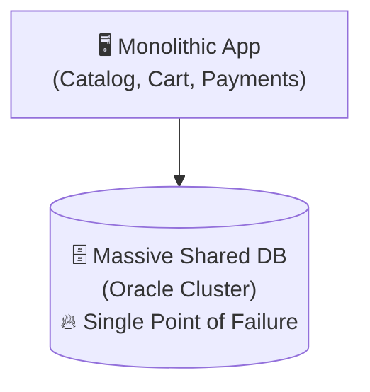
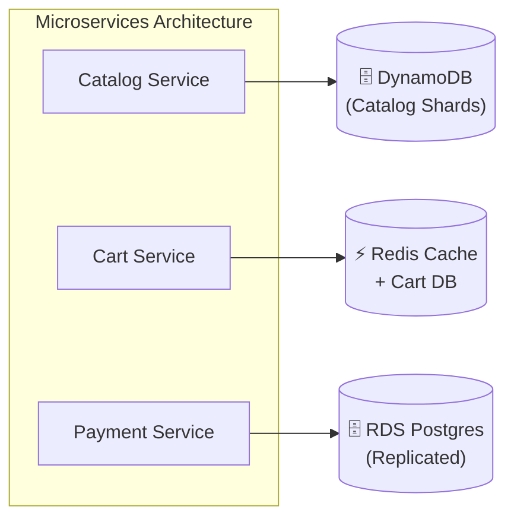
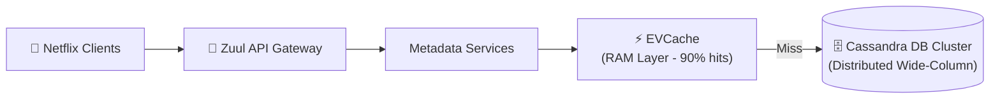
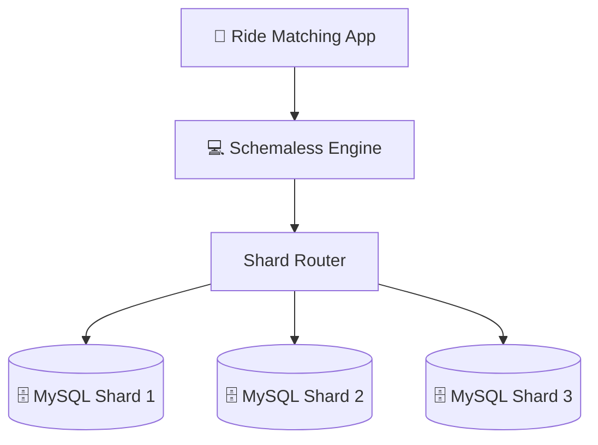

# Real-World Case Studies

> When designing systems at scale, theory only takes you so far. Examining the actual database architectures of companies like Amazon, Netflix, Uber, Instagram, and WhatsApp reveals the real engineering compromises and architectural evolutions that power global-scale applications.

---

<div class="chapter-meta" markdown>
<span class="meta-item meta-reading-time">⏱ 12 min read</span>
<span class="meta-item meta-difficulty-advanced">🔴 Advanced</span>
<span class="meta-item meta-prerequisites">📋 [Chapter 7 — Production Database Architecture](07-production-architecture.md)</span>
</div>

---

## 🎯 Learning Objectives

After completing this chapter, you will understand:
- How Amazon migrated from a monolithic database to sharded microservices
- How Netflix uses Cassandra and EVCache to deliver seamless video metadata
- How Uber designed "Schemaless" on top of MySQL to solve write scaling bottlenecks
- How Instagram sharded PostgreSQL to handle billions of media uploads
- How WhatsApp leverages Erlang and Mnesia for high-concurrency messaging
- Key lessons learned from these scale transformations

---

## 1. Amazon: Monolith to Microservices & DynamoDB

### The Monolith Era (Pre-2001)
In its early years, Amazon's entire e-commerce store was powered by a massive monolithic C++ application communicating with a single shared Oracle database cluster.
- **The Bottleneck**: A single schema change in the catalog table required coordinating dozens of development teams. The monolithic database cluster ran on the largest hardware Oracle could supply, but writes frequently saturated the CPU during holiday sales.



### The Transition
Amazon pioneered the migration to **Microservices** and database ownership:
- **No Shared Databases**: Every microservice owned its own private database. No service could query another service's database directly; they communicated exclusively via APIs.
- **DynamoDB Development**: Amazon built a highly available, partitioned, key-value store (Dynamo) which eventually became AWS DynamoDB. It uses consistent hashing to partition data across storage nodes, scaling writes horizontally.



---

## 2. Netflix: Cassandra & EVCache

Netflix accounts for a significant portion of downstream internet traffic. Delivering video metadata, user history, and personalized recommendations requires extreme throughput.



### The Database Stack
- **Apache Cassandra**: Netflix migrated from Oracle relational databases to Cassandra, a distributed NoSQL wide-column store. Cassandra has a masterless architecture with **native peer-to-peer sharding** (consistent hashing). It replicates data asynchronously across AWS zones and regions.
- **EVCache**: An open-source caching framework based on Memcached. Netflix deploys massive EVCache clusters in front of Cassandra. When a user logs in, EVCache serves their personalized catalog pages in under **10 milliseconds**.

---

## 3. Uber: Schemaless on top of MySQL

As Uber grew globally, they hit PostgreSQL scaling limits for write operations. PostgreSQL write-ahead logs (WAL) containing physical disk indices caused write latency spikes when indexes were updated frequently.

### The Solution: Schemaless
Uber designed a custom database engine called **Schemaless**, built on top of distributed MySQL shards:



- **Why MySQL?**: MySQL's InnoDB storage engine supports logical index clustering, which made writes more predictable under heavy index updates compared to PostgreSQL.
- **No Schema Enforcement**: Data is stored as JSON buffers (cells). Schema validation happens in the application layer, allowing developers to add columns without database-level schema migrations.
- **Append-Only writes**: Schemaless updates are appended as new rows with updated timestamps, preventing write locks on active rows.

---

## 4. Instagram: Sharding PostgreSQL

When Instagram launched, they stored media data in a single PostgreSQL database. Within months, uploads saturated the server.

### The Sharding Strategy
To keep operations simple, they decided to shard PostgreSQL manually rather than moving to NoSQL:

```text
Instagram Snowflake ID:
┌─────────────────────────┬───────────────────┬──────────────────┐
│  41 bits (Timestamp ms)  │ 13 bits (Shard ID)│ 10 bits (Sequence)│
└─────────────────────────┴───────────────────┴──────────────────┘
```

- **Shard Key**: `user_id`. All data for a single user (photos, comments, likes) resides on the same physical shard.
- **Snowflake IDs**: They generated custom 64-bit unique IDs for photos. The ID embeds the `Shard ID`. When an application fetches a photo by ID, the router extracts the Shard ID from the photo ID and routes the query directly to that shard, avoiding global lookup tables.

---

## 5. WhatsApp: Erlang & Mnesia

WhatsApp serves billions of messages daily with a small engineering team. Their architecture focuses on high concurrency and low latency.

- **Erlang**: They run their backend on the Erlang VM, which supports millions of concurrent light-weight processes.
- **Mnesia DB**: Erlang's native distributed DBMS. WhatsApp uses Mnesia to store transient user presence status and message routing tables directly in RAM. This bypasses disk read overhead and delivers instant messaging synchronization.

---

## ⚖️ Lessons Learned: Case Study Summary

| Company | Scaling Limit Hit | Solution | Database Choice | Key Architectural Lesson |
|---------|-------------------|----------|-----------------|--------------------------|
| **Amazon** | Monolithic shared DB conflicts | Microservices + key-value store | DynamoDB / PostgreSQL | Separate state by service; do not share databases. |
| **Netflix**| Relational ACID performance limits | NoSQL wide-column + RAM caching | Cassandra + EVCache | Trade consistency for availability (AP system) and fast reads. |
| **Uber** | PostgreSQL write indexing latency | Custom Schemaless engine | MySQL Shards | Match storage engine internals (e.g., InnoDB) to your write patterns. |
| **Instagram**| Single server storage limits | Manual user sharding + logical IDs | PostgreSQL Shards | Embed routing information (Shard ID) directly inside logical IDs. |
| **WhatsApp** | Messaging latency & connection count | In-memory distributed DB | Mnesia / Erlang | Serve highly transient data (presence) from memory structures. |

---

## 🎯 Interview Cheat Sheet

??? note "One-Line Definition"

    Real-world database scaling uses customized hybrid architectures combining relational sharding (Instagram), NoSQL peer-to-peer distribution (Netflix), and in-memory routing layers (WhatsApp) to bypass physical hardware limits.

??? note "Two-Minute Interview Answer"

    "Analyzing real-world architectures shows that there is no single database choice that fits all scale problems. Amazon teaches us that microservices must own their own database schemas to prevent development locks. Netflix demonstrates how NoSQL like Cassandra provides masterless write scaling and geographical distribution. Uber shows that when relational index updates saturate disks, denormalized, append-only key-value storage (Schemaless on MySQL) is a viable path. Instagram teaches us a clever pattern for query routing: embedding the shard index directly inside generated Snowflake IDs, avoiding lookups when fetching resources. The common thread is clear: these companies always scale vertically first, optimize cache layers, and then build specialized sharding models suited to their write and read query patterns."

??? note "Common Interview Questions"

    **Q: Why did Instagram shard PostgreSQL instead of migrating to a NoSQL database like MongoDB?**

    A: Their engineering team already had deep expertise in maintaining and debugging PostgreSQL. Moving to NoSQL would have introduced a steep learning curve and operational risks. They chose to solve the problem by writing custom sharding logic, proving that keeping the database engine simple and managing scaling in the application layer is often faster.

    **Q: What is the main benefit of embedding the Shard ID inside resource IDs (like Instagram's Snowflake IDs)?**

    A: It provides O(1) query routing. The application can read the resource ID, extract the shard number, and connect directly to the target database server, completely bypassing the need for a global lookup database or consistent hashing ring calculation.

---

## ⚠️ Common Mistakes

!!! warning "Misconceptions to Avoid"

    **❌ "Since Netflix uses Cassandra, we should use Cassandra for our startup."**

    ✅ Cassandra requires complex query planning and does not support relational JOINs. For small projects, a simple SQL database (like PostgreSQL) is much faster to build on.

    ---

    **❌ "All these companies designed custom databases, so we should build our own too."**

    ✅ Building custom storage engines (like Uber's Schemaless) takes years of engineering effort and introduces bugs. Use established tools like Vitess or Citus first.

    ---

    **❌ "Microservices should share a read replica of a database to get data."**

    ✅ Direct database sharing creates tight coupling. If Service A changes its schema, Service B will break. Services must only share data via APIs or message events.

---

## 📑 Quick Revision

- **Amazon**: Monolith → Microservices + DynamoDB
- **Netflix**: SQL → Cassandra NoSQL (Peer-to-peer) + RAM cache
- **Uber**: PostgreSQL indexes → MySQL shards + Custom JSON storage
- **Instagram**: Snowflake IDs with embedded Shard ID + PostgreSQL sharding
- **WhatsApp**: Distributed Erlang processes + Mnesia RAM database

---

## 📝 Summary

In this chapter, we learned:
- Amazon scaled by decoupling databases across microservices.
- Netflix leverages Cassandra's masterless replication for geo-distribution.
- Uber built Schemaless on MySQL to bypass physical disk write limits.
- Instagram sharded relational PostgreSQL using Snowflake IDs for routing.
- Real-world database choices depend on team operational expertise and specific access patterns, not just raw database features.

---

## 🔗 Related Topics
- [Production Database Architecture](07-production-architecture.md) — High-level database architecture patterns
- [Interview Cheat Sheet](09-interview-cheatsheet.md) — How to answer scaling questions
- [Monolith vs Microservices](../../index.md) — Architectural pattern trade-offs *(coming soon)*

---

<div class="navigation-footer" markdown>

[⬅️ Production Architecture](07-production-architecture.md)

[Interview Cheat Sheet ➡️](09-interview-cheatsheet.md)

</div>