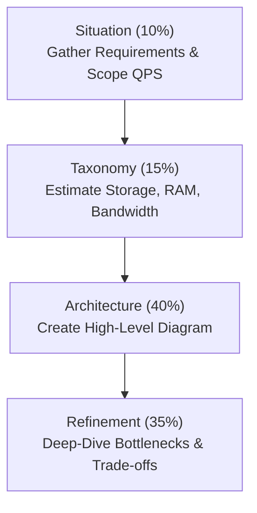
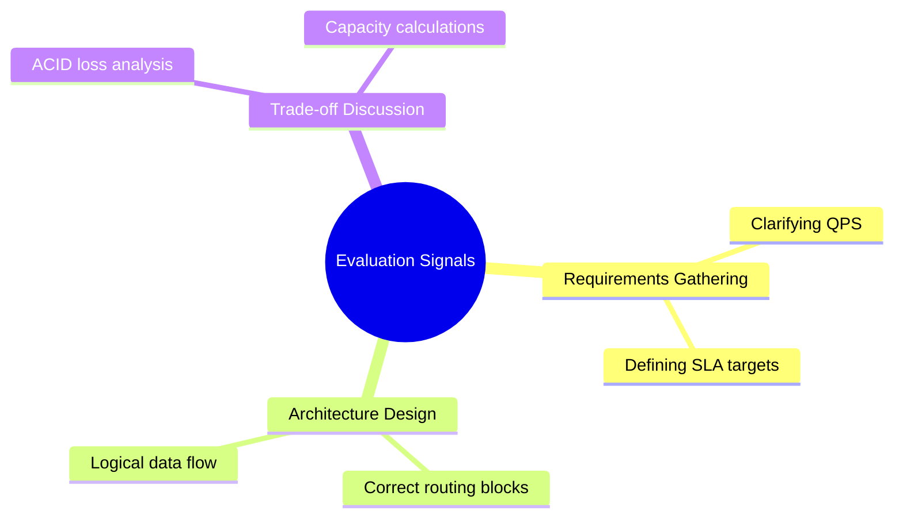

# Database Scaling Interview Cheat Sheet

> This page is optimized for **high-intensity interview preparation**. Review it to align your explanations with the standards expected for Senior and Staff-level software engineering roles.

---

⏱ 10 min read
🟢 All Levels
📋 Full Module Review

---

## 🏗️ The System Design Interview Framework

When asked a database scaling question, structure your response using the **System Design STAR Method**:

1. **Situation**: Clarify the read/write QPS, availability targets, and SLAs.
2. **Taxonomy (Scale math)**: Estimate data growth over 3-5 years, calculate RAM working set.
3. **Architecture**: Draw high-level blocks (Load Balancer → App → Connection Pooler → Cache → Database).
4. **Refinement**: Go deep on shard key design, replication lag mitigation, and failover boundaries.

---

## 🧠 Two-Minute Answers vs. Senior-Level Explanations

### 1. Vertical vs. Horizontal Scaling
??? note "Two-Minute Answer (Mid-level)"

    "Vertical scaling, or scaling up, means adding more resources like CPU, RAM, and disk storage to a single database server. It requires no code or schema changes but has a hardware ceiling and creates a Single Point of Failure (SPOF). Horizontal scaling, or scaling out, means adding more database servers and distributing data across them. It allows unlimited scaling and high availability, but introduces distributed systems complexity, network hops, and data consistency challenges."

??? note "Senior-Level Explanation (Senior/Staff)"

    "I view the vertical vs. horizontal decision as a cost-to-complexity trade-off. In production, we exhaust vertical scaling first because it keeps our transactional model simple (strong ACID compliance). However, as we approach physical server limits (like disk I/O controller saturation or memory limits on index caching), the cost curve of enterprise-tier database servers rises exponentially. At this point, we transition to horizontal scaling. The complexity is not just sharding the data; it's the loss of atomic multi-master writes. We have to design for eventual consistency, manage replication lag, and implement connection pooling (like PgBouncer) to prevent database process exhaustion. Our architecture should have vertically-scaled individual database nodes grouped into a horizontally-scaled distributed cluster."

---

### 2. Sharding vs. Partitioning
??? note "Two-Minute Answer (Mid-level)"

    "Partitioning divides a large table into smaller, more manageable logical pieces inside the same database engine, using strategies like range, list, or hash partitioning. Sharding is a horizontal partitioning technique where those pieces are distributed across completely separate physical database servers, meaning each shard is an independent database instance."

??? note "Senior-Level Explanation (Senior/Staff)"

    "The critical distinction lies in the **fault domain and resource sharing**. Partitioning keeps everything on a single host. While query planner partition pruning speeds up queries by skipping irrelevant files on disk, it does not scale write network throughput or CPU capacity because all operations share the same OS resources and disk controllers. Sharding, conversely, divides the data across physically separate hardware. Each shard is an isolated process with its own RAM, CPU, and disk. We use sharding when we hit write bottlenecks or run out of disk space on one host. However, sharding introduces a 'sharding tax': we lose foreign key constraints across shards, SQL JOINs require application-side processing, and we must implement a routing layer to map keys to servers."

---

### 3. Shard Key Selection
??? note "Two-Minute Answer (Mid-level)"

    "A Shard Key is the field that determines which database shard stores a particular row. A good shard key must have high cardinality to distribute data evenly across all database nodes and prevent hotspots. It should also be a column that is frequently used in query filters so that the router knows exactly which shard to query, avoiding scatter-gather operations."

??? note "Senior-Level Explanation (Senior/Staff)"

    "Shard key selection requires matching the key to the application's read and write boundaries. For a consumer application, hashing `user_id` is ideal because it provides high cardinality and locates all user records on a single shard, keeping query response times low. For B2B/SaaS systems, sharding by `tenant_id` preserves transactional boundaries for single-workspace joins. However, to prevent large tenants from creating hot shards, we must employ a compound shard key (like `tenant_id` + `user_id`) or geo-routing. Additionally, we must monitor for **data skew** and design a lookup registry or secondary index mapped to our primary keys to prevent non-shard-key queries from causing scatter-gather operations across the cluster."

---

### 4. Replication Lag & Failover
??? note "Two-Minute Answer (Mid-level)"

    "Replication lag is the delay between a write operation committing on the primary database and that same write being applied to read replicas. Failover is the process where a replica is promoted to primary when the primary database server crashes. We use consensus algorithms to avoid the Split-Brain problem during failover."

??? note "Senior-Level Explanation (Senior/Staff)"

    "Under eventual consistency models, replication lag is inevitable. To prevent anomalies like the read-your-own-writes issue, we implement query routing logic: if a client writes data, we route their subsequent reads to the primary database for a short time window (e.g., 5 seconds) or check replication log offsets. For failover, we use consensus clusters (like Raft or Paxos) to monitor primary heartbeats. When a failure is detected, a quorum election is held to promote a replica. We must enforce fence tokens or automatic STONITH ('Shoot The Other Node In The Head') procedures to immediately kill the crashed primary. This prevents the Split-Brain scenario, where two nodes accept writes concurrently and corrupt our state."

---

## ⚡ How Interviewers Evaluate Your Answers

Interviewers look for signals across three core competency areas:

1. **System Instinct**: Did you clarify the write-to-read ratio before suggesting sharding? (Suggesting sharding for a read-heavy system without trying caching first is a red flag).
2. **Operational Empathy**: Do you acknowledge the complexity of operations? (e.g., admitting that resharding Terabytes of live data is a nightmare).
3. **Hardware Realism**: Do you understand memory boundaries? (e.g., using the working set rule to estimate RAM size).

---

## ❌ Common Mistakes Candidates Make

!!! warning "Avoid These in Your Interview"

    **1. Suggesting Sharding Prematurely**
    - ❌ "We will immediately shard the database by user_id to scale."
    - ✅ "We will start with a single primary database, scale reads using Redis caching and read replicas, and only shard when write QPS saturates our disk controllers."

    **2. Ignoring Split-Brain in Failover**
    - ❌ "If the primary database goes down, we just promote the replica."
    - ✅ "If the primary goes down, our consensus cluster must establish quorum to promote a replica, and we must fence the old primary to prevent a Split-Brain scenario."

    **3. Relying on Cross-Shard SQL JOINs**
    - ❌ "We will shard the database and then JOIN the users and orders tables."
    - ✅ "Since SQL JOINs don't work across physical shard databases, we will denormalize our schema or fetch the data in the application layer."

---

## 📑 Comparison Matrices for Quick Reference

- For Vertical vs. Horizontal Scaling, see [Chapter 2 Comparisons](02-scaling-types.md#vertical-vs-horizontal-complete-comparison).
- For Partitioning vs. Sharding, see [Chapter 3 Comparisons](03-partitioning.md#partitioning-vs-sharding).
- For Sharding vs. Replication, see [Chapter 6 Comparisons](06-replication.md#sharding-vs-replication).
- For Production architecture blocks, see [Chapter 7 Architecture Evolution](07-production-architecture.md#the-database-architecture-evolution).

---

## 📝 Summary

In this chapter, we reviewed:
- The System Design STAR method for structuring scaling interviews.
- Senior-level arguments focusing on cost curves, fault domains, and operational limits.
- Evaluation metrics: requirements gathering, operational empathy, and trade-off analysis.
- Crucial candidate mistakes to avoid (premature sharding, ignoring split-brain, assuming cross-shard joins work).

---

## 🔗 Related Topics
- [Production Database Architecture](07-production-architecture.md) — Production layout blueprints
- [Real-World Case Studies](08-amazon-at-scale.md) — E-commerce and streaming databases at scale
- [CAP Theorem](../../index.md) — Trade-offs between Consistency and Availability *(coming soon)*

---

[⬅️ Real-World Case Studies](08-amazon-at-scale.md)

[Summary ➡️](10-summary.md)

