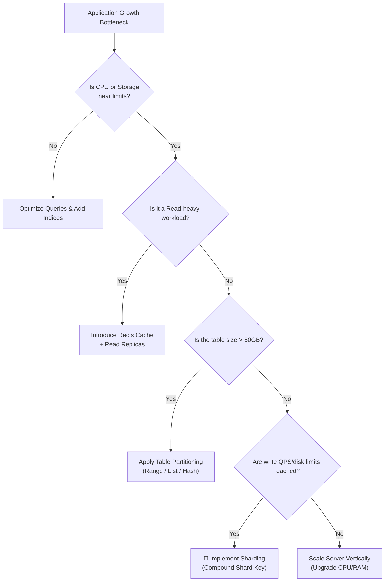
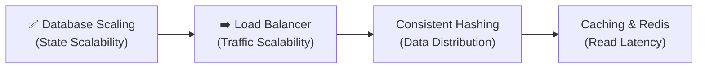

# Database Scaling Summary

> Congratulations! 🎉 You have completed the Database Scaling module. This chapter provides a final recap, a glossary of terms, a self-assessment quiz, and resources for further reading.

---

⏱ 8 min read
🟢 All Levels
📋 Completion of Chapters 1 - 9

---

## 🎯 What You Can Do Now

Having finished this module, you are now equipped to:
- Evaluate database workloads and identify CPU, Memory, Disk, and Connection bottlenecks.
- Present a clear business case for Vertical vs. Horizontal Scaling.
- Design range, list, and hash partitioning schemas in SQL.
- Formulate a sharding routing plan and select compound shard keys that prevent hot spots.
- Design replica failover strategies using consensus voting configurations to meet RTO and RPO targets.
- Create multi-tier database architectures incorporating load balancers, caching, connection pooling, and replication.

---

## 🏗️ Scaling Decision Tree

When evaluating a scaling problem, walk through this logical flow to select the most appropriate architecture:

---

## 🧠 Self-Assessment Quiz

Test your understanding of the concepts in this module. Click each question to reveal the answer.

??? question "Question 1: Does database replication scale write operations? Why or why not?"

    **Answer**: No. In a standard Primary-Replica architecture, all write queries must still route to the single Primary database node. Replicas are read-only. Adding more replicas only scales read throughput and increases availability. To scale write operations, you must partition writes across nodes using **Sharding**.

??? question "Question 2: What is the main danger of choosing a column with low cardinality as your shard key?"

    **Answer**: Low cardinality columns (like `country` or `status`) have very few unique values. If you attempt to distribute data using these keys, your data will clump onto a few shards while others sit empty. This creates severe **data skew** and **traffic hotspots**, defeating the purpose of horizontal scaling.

??? question "Question 3: How does PgBouncer prevent a PostgreSQL database from crashing under heavy connection loads?"

    **Answer**: PgBouncer is a connection pooler. PostgreSQL allocates a separate OS process (~10MB RAM) for each connection. PgBouncer sits between the application and database, allowing the application to open thousands of virtual connections while multiplexing them through a small pool of warm, active database connections (e.g., 100), keeping the database RAM usage within safe boundaries.

??? question "Question 4: What is the 'Split-Brain' scenario in database failover, and how do we prevent it?"

    **Answer**: Split-Brain occurs when a network partition cuts off the Primary node from the rest of the cluster. Replicas assume the Primary is dead, hold an election, and promote a new Primary. If the isolated old Primary continues to accept writes, both nodes diverge, corrupting database consistency. We prevent it by requiring a **strict majority (quorum)** to elect a primary and using **fencing tokens** to disable the old primary immediately.

??? question "Question 5: Why are cross-shard SQL JOINs slow and expensive?"

    **Answer**: Shards are located on physically separate database servers. A standard database engine cannot execute JOIN operations across network boundaries. To perform a cross-shard join, the application layer must query each shard individually, transfer the datasets over the network, and merge them in application memory, which consumes network bandwidth and CPU.

---

## 📚 Glossary of Terms

Vertical Scaling
:   Upgrading the CPU, RAM, or storage of an existing database server.

Horizontal Scaling
:   Distributing the database workload across multiple independent servers.

Partitioning
:   Splitting a database table logically into smaller sections *inside a single database server*.

Sharding
:   Distributing a table's rows across multiple physically independent database instances.

Shard Key
:   The routing column used to map a row to its designated database shard.

Write-Ahead Log (WAL)
:   An append-only database transaction log used for crash recovery and replication sync.

Replication Lag
:   The latency delay between a write committing on the Primary and syncing to Replicas.

Connection Pooler
:   A routing middleware that multiplexes database connections to save server RAM (e.g., PgBouncer).

RTO / RPO
:   Disaster recovery metrics defining maximum allowed downtime (RTO) and data loss (RPO).

---

## 📖 Further Reading & Engineering Blogs

For deeper study, explore the engineering blogs of companies that deal with scale daily:

- [The Google Spanner Paper](https://research.google/pubs/pub39966/) — Read about Google's globally-distributed, synchronous database.
- [Instagram Engineering: Sharding Postgres](https://instagram-engineering.com/sharding-ids-at-instagram-c1c5685d41f5) — The original post on how they built Snowflake IDs for sharded tables.
- [GitHub Engineering: MySQL High Availability](https://github.blog/2018-06-20-mysql-high-availability-at-github/) — How GitHub uses Orchestrator and Raft for failover.
- [Uber Engineering: Schemaless](https://www.uber.com/blog/schemaless-ubers-next-generation-datastore/) — Detailed analysis of how they scaled database writes on MySQL.

---

## 🚀 Next Steps in Your Learning Path

Now that you have completed Database Scaling, you are ready to tackle the adjacent components of distributed system architecture:

1. **[Load Balancer](../load-balancing/01-intro-load-balancing.md)**: Learn how to distribute incoming web traffic across stateless API servers.
2. **[Consistent Hashing](../load-balancing/04-consistent-hashing.md)**: Understand the ring-routing algorithm used by sharded clusters and CDNs to distribute keys dynamically.
3. **[Redis Caching](../load-balancing/03-database-bottlenecks-redis.md)**: Dive into Redis and Memcached caching deployment patterns.

---

[⬅️ Interview Cheat Sheet](09-interview-cheatsheet.md)

[🏠 Home Page](../../index.md)

