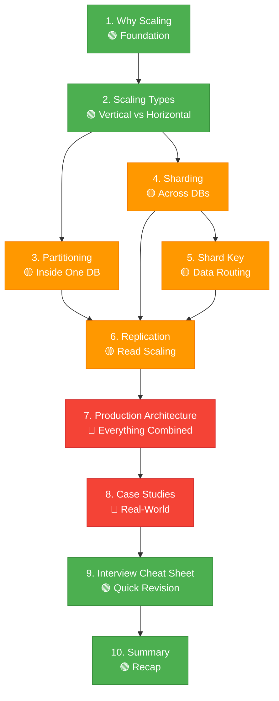
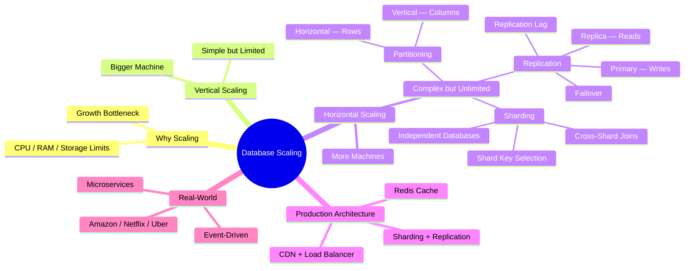

# 🚀 Database Scaling

> Modern applications don't become slow because of the application server first — they usually become slow because the **database becomes the bottleneck**. This module teaches you everything you need to know about scaling databases, from first principles to production architecture.

---

⏱ 60–90 min total
🟢 Beginner
🟡 Intermediate
🔴 Advanced
📋 SQL, Client-Server basics

---

## 🎯 Learning Objectives

After completing this module, you will be able to:

- [x] Explain why databases need scaling and when to trigger it
- [x] Choose between Vertical and Horizontal Scaling
- [x] Design partitioned tables with the correct strategy
- [x] Shard a database and select the optimal shard key
- [x] Set up Primary-Replica replication with read/write splitting
- [x] Design a production database architecture from scratch
- [x] Answer database scaling interview questions with confidence

---

## 📚 Prerequisites

Before starting this module, you should understand:

- **SQL Fundamentals** — SELECT, INSERT, UPDATE, DELETE, JOINs
- **Client-Server Architecture** — how a web application connects to a database
- **CRUD Operations** — basic application data flow
- **Basic Networking** — what a server is, what latency means

!!! tip "Don't have these?"

    If any of these are unfamiliar, you can still follow along — but you'll get more value if you review them first.

---

## 📖 Chapter Overview

| # | Chapter | What You'll Learn | Difficulty | Time |
|---|---------|------------------|------------|------|
| 1 | [Why Scaling](01-why-scaling.md) | Why databases fail under load | 🟢 Beginner | 7 min |
| 2 | [Scaling Types](02-scaling-types.md) | Vertical vs Horizontal Scaling | 🟢 Beginner | 10 min |
| 3 | [Partitioning](03-partitioning.md) | Splitting data inside one database | 🟡 Intermediate | 12 min |
| 4 | [Sharding](04-sharding.md) | Splitting data across databases | 🟡 Intermediate | 15 min |
| 5 | [Shard Key](05-shard-key.md) | Choosing the right shard key | 🟡 Intermediate | 10 min |
| 6 | [Replication](06-replication.md) | Primary-Replica architecture | 🟡 Intermediate | 15 min |
| 7 | [Production Architecture](07-production-architecture.md) | Combining everything together | 🔴 Advanced | 15 min |
| 8 | [Real-World Case Studies](08-amazon-at-scale.md) | How Amazon, Netflix, Uber do it | 🔴 Advanced | 12 min |
| 9 | [Interview Cheat Sheet](09-interview-cheatsheet.md) | Quick revision before interviews | 🟢 All Levels | 5 min |
| 10 | [Summary](10-summary.md) | Final recap and self-assessment | 🟢 All Levels | 5 min |

---

## 🗺️ Learning Roadmap

This module follows a progressive learning path. Each chapter builds on the previous one.

---

## 🧠 Concept Map

---

## 🌍 Real-World Context

!!! info "How Production Systems Work"

    Companies like **Amazon**, **Netflix**, **Google**, **Uber**, and **Meta** don't use a single scaling technique. They combine:

    - **Vertical Scaling** — for small, predictable workloads
    - **Horizontal Scaling** — for internet-scale traffic
    - **Partitioning** — to organize large tables efficiently
    - **Sharding** — to distribute data across regions
    - **Replication** — for read scaling and high availability
    - **Redis Caching** — to reduce database load by 80-90%
    - **Load Balancers** — to distribute API traffic
    - **Microservices** — for independent scaling of features

    This module teaches you each technique, when to use it, and how they work together.

---

## 📑 Quick Revision

| Concept | One-Line Summary |
|---------|-----------------|
| Vertical Scaling | Upgrade the same server (bigger machine) |
| Horizontal Scaling | Add more servers (more machines) |
| Partitioning | Split data inside one database |
| Sharding | Split data across multiple databases |
| Shard Key | Field that routes data to the right shard |
| Replication | Copy database for read scaling |
| Primary | Handles all writes |
| Replica | Handles reads |
| Failover | Promote replica when primary crashes |
| Replication Lag | Delay before replicas have latest data |

---

## 🔗 Related Topics

- [Load Balancing & Scaling](../load-balancing/index.md)
- [CAP Theorem](../../index.md) *(coming soon)*
- [Database Indexing](../../index.md) *(coming soon)*

---

## 🚀 Start Learning

➡️ **Next:** [Why Do We Need Scaling?](01-why-scaling.md)