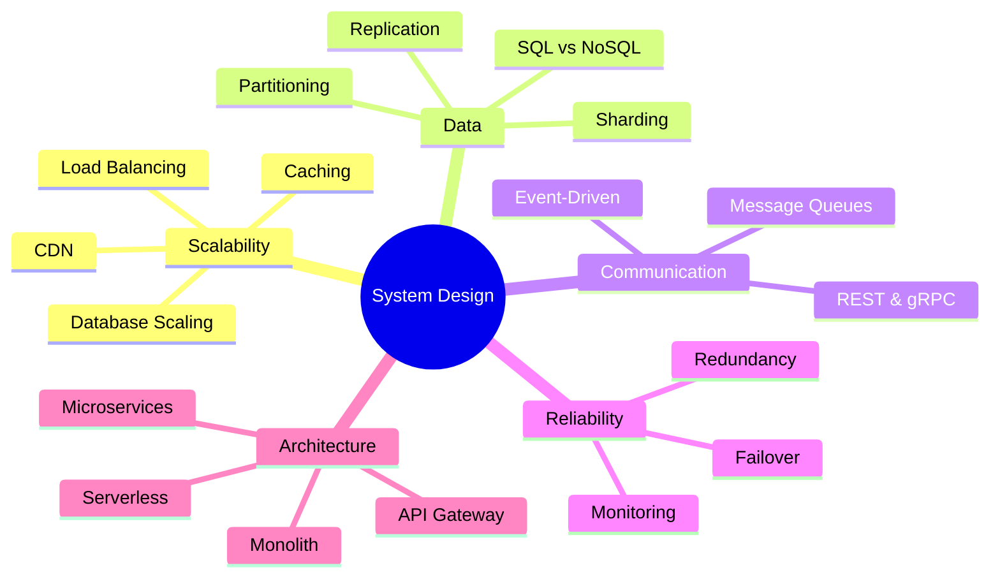

# 📚 System Design

> System Design is the process of defining the **architecture**, **components**, **modules**, **interfaces**, and **data flow** of a system to satisfy specified requirements at scale.

---

## 🧠 What Is System Design, Really?

System Design is not just about drawing boxes and arrows.

It's about making **engineering trade-offs** under constraints.

When an interviewer asks *"Design Twitter"* or *"Design a URL shortener"*, they're testing whether you can:

- Break a vague problem into concrete components
- Choose the right technologies for each component
- Handle scale (millions of users, billions of records)
- Design for failure (what happens when things break?)
- Make trade-offs and explain your reasoning

!!! info "The Key Insight"

    System Design is about **thinking like an engineer who has been paged at 3 AM** because the database is on fire.

    It's not about memorizing architectures. It's about understanding *why* each piece exists and *what breaks* if you remove it.

---

## 🌍 Why System Design Matters

### For Engineers

Every application you build will eventually face scaling challenges. Understanding System Design helps you:

- Avoid architectural mistakes that are expensive to fix later
- Make informed technology choices (SQL vs NoSQL, monolith vs microservices)
- Debug production issues faster
- Communicate effectively with senior engineers and architects

### For Interviews

System Design is the **highest-signal interview round** at most companies. It's the round that differentiates senior engineers from junior ones.

| Company | System Design Weight |
|---------|---------------------|
| Google | Very High — dedicated 45-min round |
| Amazon | High — embedded in behavioral + technical |
| Meta | Very High — separate system design loop |
| Netflix | High — focus on real production problems |
| Microsoft | Medium-High — increasingly important |
| Startups | Medium — focus on practical decisions |

---

## 🗺️ The System Design Landscape

---

## 📚 Topics Covered

| Module | What You'll Learn | Difficulty | Status |
|--------|------------------|------------|--------|
| [Database Scaling](database-scaling/index.md) | Vertical/horizontal scaling, partitioning, sharding, replication, production architecture | 🟢 → 🔴 | ✅ Complete |
| [Load Balancing](load-balancing/index.md) | L4/L7 balancing, stateless APIs, Redis caching, consistent hashing, virtual nodes | 🟢 → 🔴 | ✅ Complete |
| Caching | Redis, cache strategies, invalidation, distributed caching | 🟢 → 🔴 | ⏳ Coming Soon |
| CDN | Edge caching, static assets, global distribution | 🟢 → 🟡 | ⏳ Coming Soon |
| API Gateway | Routing, rate limiting, authentication, service mesh | 🟡 → 🔴 | ⏳ Coming Soon |
| Messaging | Kafka, RabbitMQ, pub/sub, event sourcing | 🟡 → 🔴 | ⏳ Coming Soon |
| Microservices | Service decomposition, saga pattern, service discovery | 🔴 | ⏳ Coming Soon |

---

## 🎯 How Interviewers Think About System Design

Understanding the evaluation criteria helps you give better answers.

### What Interviewers Look For

| Criteria | What It Means | Weight |
|----------|--------------|--------|
| **Requirements Gathering** | Do you ask clarifying questions before jumping to solutions? | High |
| **High-Level Design** | Can you sketch the major components and data flow? | High |
| **Deep Dive** | Can you go deep on 1-2 components when asked? | Very High |
| **Trade-offs** | Do you acknowledge pros/cons of your choices? | Very High |
| **Scalability** | Does your design handle 10x or 100x traffic? | High |
| **Reliability** | What happens when a component fails? | Medium-High |

### Common Mistakes

!!! warning "Avoid These"

    - **Jumping to solutions** without understanding the problem
    - **Over-engineering** — designing for Google scale when the company has 1K users
    - **No trade-offs** — every design decision has pros and cons
    - **Ignoring failure modes** — what happens when the database crashes?
    - **Monologue mode** — System Design is a conversation, not a presentation

---

## 🚀 Where to Start

!!! success "Recommended First Module"

    Start with **[Database Scaling](database-scaling/index.md)** — it introduces the most fundamental concepts in System Design:

    - Why single servers fail
    - How to scale reads and writes
    - How production systems combine multiple techniques

    These concepts are referenced in every other module.

---

➡️ **Next:** [Database Scaling](database-scaling/index.md)