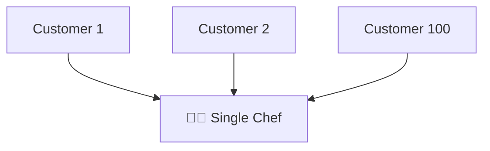
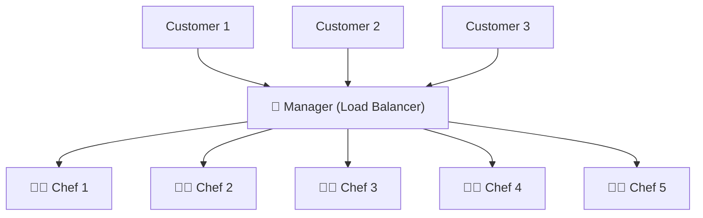
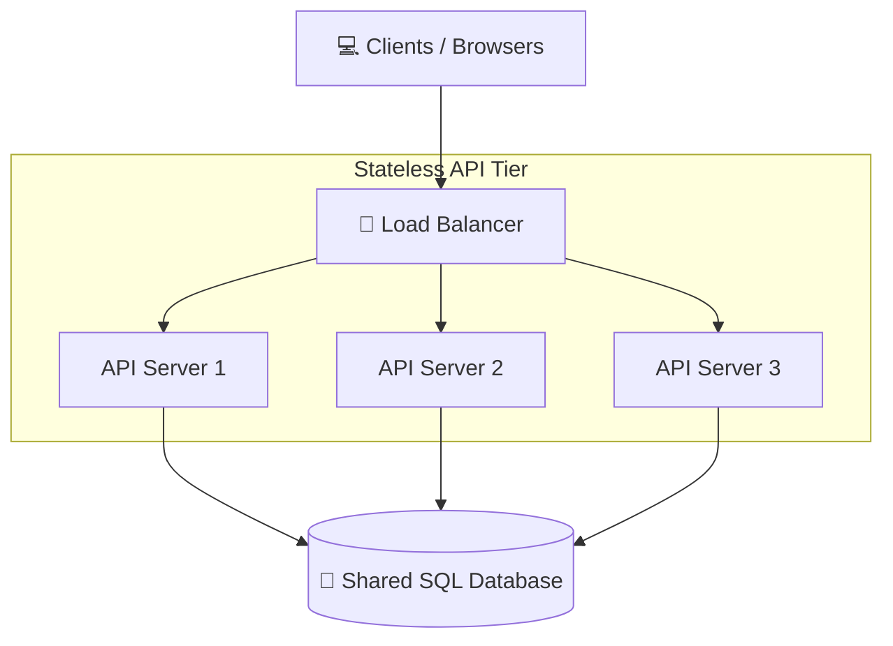

# 🚦 Why & How of Load Balancers

> In any scaling story, the first bottleneck is almost always the single application server. When traffic grows, we add more servers. But how do we decide which server handles which request? That is the job of the **Load Balancer**.

---

⏱ 8 min read
🟢 Beginner

---

## 🍽️ The Real-Life Metaphor: The Restaurant Chef

Imagine you open a restaurant called **MediSphere Cafe** with a single chef.

- When there are only **5 customers**, the chef handles it easily.
- When **100 customers** show up, the chef gets overloaded, orders are delayed, and eventually, the chef collapses (server crash!).

To solve this, you hire **5 chefs**. But if customers run straight into the kitchen, they will crowd the chefs. You need a **Manager** at the door.

In this setup:
- The **Manager** is the **Load Balancer**.
- The **Chefs** are your **API Servers**.

!!! success "The Manager's Golden Rules"
    - **Receives all orders** at the front door.
    - **Tracks who is busy** and distributes orders.
    - **Never cooks the food** themselves (doesn't execute business logic or store data).

---

## 💻 Software Architecture Diagram

Translating the metaphor into system architecture:

---

## ⚙️ Load Balancing Algorithms

A load balancer uses specific algorithms to decide which server receives the next request:

### 1. Round Robin
Requests are routed in a simple, cyclical sequence.
- **Example:** User 1 $\to$ Server 1, User 2 $\to$ Server 2, User 3 $\to$ Server 3, User 4 $\to$ Server 1.
- **Best for:** When all servers have identical hardware and workloads are uniform.

### 2. Least Connections
Requests are routed to the server that is currently handling the fewest active connections.
- **Example:** If Server 1 has 100 active users, Server 2 has 5, and Server 3 has 20, the next request goes to Server 2.
- **Best for:** Long-lived connection workloads (e.g., chat applications or database queries).

### 3. Least Response Time
Combines active connections with the server's current response latency. The load balancer pings servers to measure speeds and routes requests to the fastest, least-occupied node.
- **Best for:** Dynamically loaded environments where some requests require heavy computation.

### 4. IP Hash
The client’s IP address is hashed to calculate a server destination.
$$\text{Server Index} = hash(\text{Client IP Address}) \pmod N$$
- **Best for:** **Sticky Sessions** (ensuring the same client always reaches the same server). Useful when transitioning legacy stateful systems.

---

## 🔬 L4 vs L7 Load Balancing

Load balancers operate at different layers of the OSI model:

| Dimension | Layer 4 (L4) | Layer 7 (L7) |
|---|---|---|
| **OSI Layer** | Transport Layer (TCP/UDP) | Application Layer (HTTP/HTTPS/gRPC) |
| **Inspection Level** | Inspects IP addresses and ports. Cannot read headers or cookies. | Inspects full headers, HTTP methods, cookies, path, and body. |
| **Routing Decisons** | Fast, simple packets routing. | Smart routing (e.g., `/api/v1/auth` to Auth Server, `/images` to CDN). |
| **Performance** | Extremely high performance; low CPU overhead. | Slightly slower; requires parsing complete HTTP payloads. |
| **Security** | Simple firewall rules. | Acts as Web Application Firewall (WAF) to prevent SQLi/XSS. |

---

## 🧠 Self-Assessment Quiz

??? question "Question 1: Does a load balancer execute database queries or run business logic?"
    **Answer:** No. A load balancer is a pure proxy. Its only jobs are receiving requests, checking server health, and forwarding network traffic. Running application logic inside the load balancer would make it a massive bottleneck.

??? question "Question 2: What is a 'Sticky Session' and when is it useful?"
    **Answer:** A sticky session is a configuration where a user's requests are repeatedly routed to the same backend server. It is useful when your API layer is *stateful* and stores user session details in local RAM. However, sticky sessions hinder auto-scaling and failover.

??? question "Question 3: If a backend server crashes, how does the load balancer know not to send traffic there?"
    **Answer:** The load balancer uses **Health Checks**. It periodically pings backend servers (e.g., sending an HTTP GET `/healthz` request every 5 seconds). If a server returns an error or fails to respond, it is removed from the active routing pool.

---

[⬅️ Load Balancing Overview](index.md)

[➡️ Stateless APIs & Architectures](02-api-vs-db-stateless.md)

