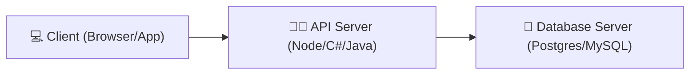
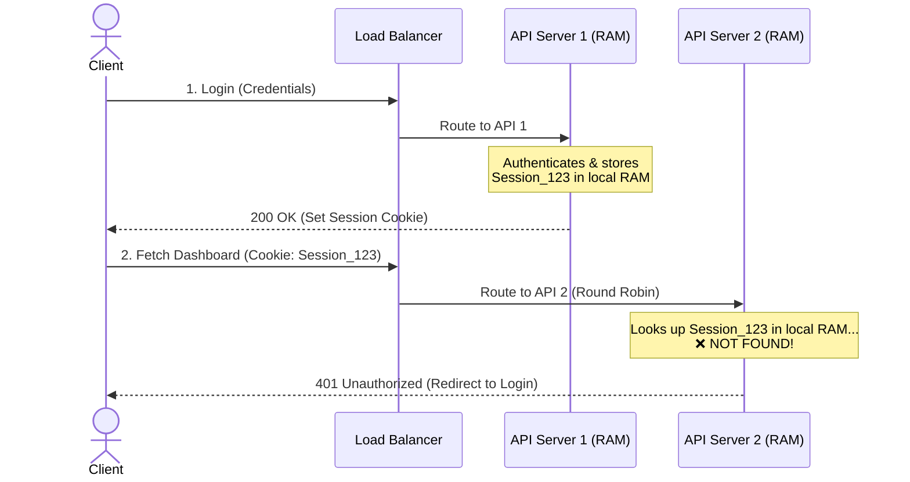
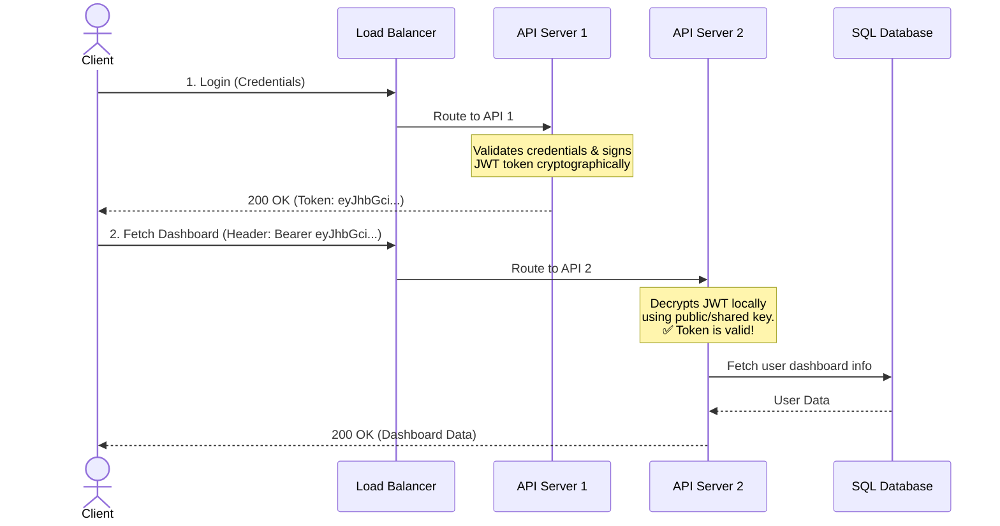
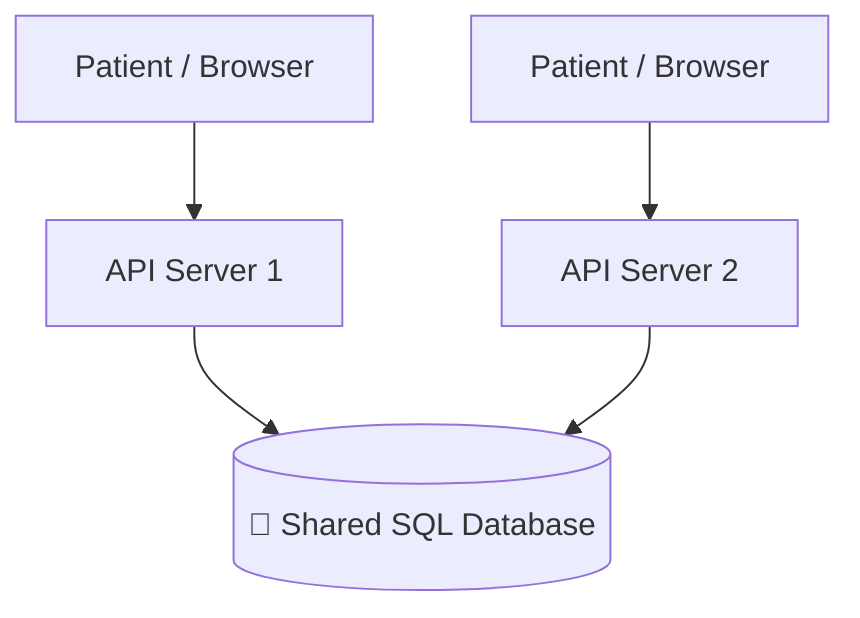

# 🪪 Stateless APIs & Architectures

> Many beginners confuse the Application API server with the Database server, thinking they are the same node or share the same responsibilities. To scale a system, we must enforce a strict separation of concerns and keep our API tier entirely **Stateless**.

---

⏱ 8 min read
🟢 Beginner

---

## 🏛️ API Server vs. Database Server

A system is divided into layers with distinct responsibilities:

| Layer | API Server | Database Server |
|---|---|---|
| **Tech Examples** | ASP.NET Core, Spring Boot, Express, Django | PostgreSQL, SQL Server, MySQL, MongoDB |
| **Primary Job** | Business logic, authentication, input validation | Storing, indexing, and retrieving persistent data |
| **Resource Usage**| High CPU (for running code, encoding JSON, security checks) | High Disk I/O & Memory (for page caches, table reads) |
| **State** | **Stateless** (Stores nothing in memory between requests) | **Stateful** (Stores the source-of-truth system state) |

---

## 🔄 Stateful vs. Stateless Architectures

### Stateful Architecture (The Scaling Nightmare)

In a stateful design, the server remembers details about who you are by storing a **Session ID** in its local RAM (volatile memory) after you log in.

!!! danger "Why Stateful Systems Crash at Scale"
    If **API Server 1** crashes, the local RAM is cleared. **All logged-in users routed to API 1 lose their sessions** and are forced to log back in. To fix this, you would have to configure "Sticky Sessions" in the load balancer—which leads to uneven traffic distribution and defeats the purpose of horizontal scaling.

---

### Stateless Architecture (The Modern Standard)

In a stateless system, the API servers store **nothing** in their local RAM. All session state is offloaded to the client (e.g., using a JSON Web Token - JWT) or a shared database.

!!! success "Why Stateless Scales Instantly"
    Since **API Server 2** doesn't need to know who logged you in, any API instance in your cluster can handle any request. If API Server 1 crashes, the Load Balancer instantly forwards traffic to API Server 2, and the client never notices a thing.

---

## 💾 Why API Servers Don't Store Persistent Data

Imagine a user booking an appointment on **MediSphere**:

1. **Patient** books an appointment. The request hits **API 1**.
2. **API 1** writes the appointment details directly into the **Shared SQL Database**.
3. Five minutes later, the patient checks their appointment list. The request lands on **API 2**.
4. **API 2** queries the **Shared SQL Database** and displays the same appointment.

Because the API tier is a stateless wrapper over a shared, persistent state (the database), we can create or destroy API instances on the fly using Cloud Auto-scaling (Kubernetes, AWS, Azure) to match current traffic demand.

---

## 🧠 Self-Assessment Quiz

??? question "Question 1: Does a stateless API ever connect to a database?"
    **Answer:** Yes, absolutely. "Stateless" means the API server does not store session state in its *local memory (RAM)*. It still queries the database or cache to fetch persistent data (like user profiles or transaction histories) on every request.

??? question "Question 2: What is the main drawback of using client-side JWTs for stateless APIs?"
    **Answer:** JWTs are self-contained and hard to invalidate before their expiration time. If a user logs out or is banned, the token remains valid unless you implement a token blocklist in a fast cache like Redis, which reintroduces a small dependency on shared state.

??? question "Question 3: If API servers are stateless, how do we handle file uploads (e.g., patient report PDFs)?"
    **Answer:** You must never save uploaded files to the API server's local hard drive (since other APIs can't access it, and auto-scaling destroys files on scale-down). Instead, the API should upload the file directly to distributed storage (e.g., AWS S3, Azure Blob Storage) and save the file URL in the database.

---

[⬅️ Why & How of Load Balancers](01-intro-load-balancing.md)

[➡️ Database Bottlenecks & Redis Caching](03-database-bottlenecks-redis.md)

