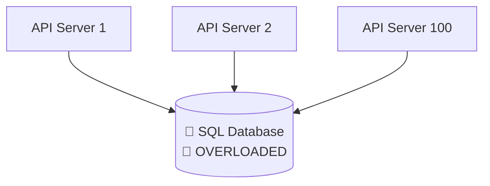
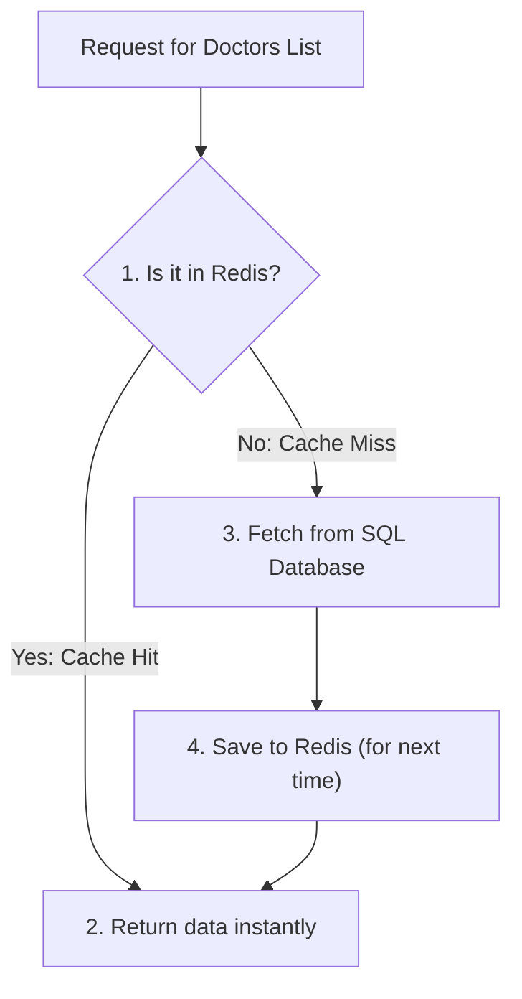

# 🧊 Database Bottlenecks & Redis Caching

> You can scale your stateless API tier to 1,000 servers. But if they all talk to a single, monolithic SQL database, the database becomes the ultimate bottleneck. This chapter teaches you how to relieve database load using in-memory caching.

---

<div class="chapter-meta" markdown>
<span class="meta-item meta-reading-time">⏱ 8 min read</span>
<span class="meta-item meta-difficulty-intermediate">🟡 Intermediate</span>
</div>

---

## 💥 The Database Bottleneck

As traffic scales, the ratio of API instances to Database instances becomes unbalanced.



Every incoming read request requires the database to scan tables, load pages into RAM, and execute CPU-intensive SQL queries.

!!! warning "Scale Gradually: The Scaling Hierarchy"
    Before adding a cache, always perform basic database optimization:
    1. **Query Optimization:** Refactor slow JOINs and SELECT statements.
    2. **Indexing:** Add `CREATE INDEX` on frequently queried search columns.
    3. **Connection Pooling:** Use tools like PgBouncer to prevent connection exhaustion.
    
    If optimizations are exhausted and read traffic is still slowing down the database, it's time to cache.

---

## 🧠 What is Redis?

**Redis** (Remote Dictionary Server) is an open-source, in-memory key-value database. 
- **Volatile (RAM-based):** Reading from RAM is orders of magnitude faster than reading from SSD/HDD.
- **Microsecond Latency:** Solves the bottleneck by serving static, hot data instantly.

!!! info "Important Note"
    Redis does **not** automatically copy data from your SQL database. You, the developer, must write code that decides when data is saved to and deleted from Redis.

---

## 🔄 The Cache-Aside Pattern

The most common caching pattern is the **Cache-Aside Pattern** (also called Lazy Caching).



### The Code Flow (Conceptual)

```python
def get_doctors_list():
    # 1. Attempt to fetch from Redis
    doctors = redis.get("doctors_list")
    
    if doctors is not None:
        # Cache Hit!
        return parse_json(doctors)
        
    # 2. Cache Miss - Query the Database
    doctors = db.query("SELECT * FROM doctors")
    
    # 3. Save to cache with a Time-To-Live (TTL) of 1 hour
    redis.setex("doctors_list", 3600, serialize_to_json(doctors))
    
    return doctors
```

---

## 🎯 Caching Boundaries: What to Cache?

Caching everything is a recipe for data corruption. You must set boundaries:

### 🟢 Cache These (High Read, Low Write)
* **Static Configuration:** Department lists, home page layouts, categories.
* **Frequently Accessed Profiles:** Active doctor schedules, hospitals lists.
* **Global Catalogs:** Medicine catalogs, search terms.

### 🔴 DO NOT Cache These (High Write, Instant Consistency Required)
* **Financial Transactions:** Account balances, bank transfers (must write to SQL with ACID transactions).
* **Payment Gates:** Session states, invoice completions.
* **Highly Dynamic States:** Live seat booking, appointment checkouts.

---

## 🧠 Self-Assessment Quiz

??? question "Question 1: What is 'Cache Invalidation' and why is it hard?"
    **Answer:** Cache Invalidation is the process of deleting stale data from the cache when the source database changes. For example, if a doctor changes their schedule in the database, the cache must be updated or deleted. If you forget to do this, users will see incorrect schedules.

??? question "Question 2: What is the purpose of setting a 'TTL' (Time-To-Live) on cached data?"
    **Answer:** TTL is an expiration timer. It guarantees that even if your cache invalidation logic fails, the stale cache will automatically expire after a set time (e.g., 10 minutes) and fetch fresh data from the database.

??? question "Question 3: Explain 'Cache Penentration' and how to mitigate it."
    **Answer:** Cache Penetration occurs when a client requests keys that do *not* exist in the database (e.g., searching for doctor ID `-999`). Every request bypasses the cache and hits the database, potentially crashing it. You mitigate this by caching empty/null values with a short TTL, or using a Bloom Filter.

---

<div class="navigation-footer" markdown>

[⬅️ Stateless APIs & Architectures](02-api-vs-db-stateless.md)

[➡️ Consistent Hashing Ring](04-consistent-hashing.md)

</div>
