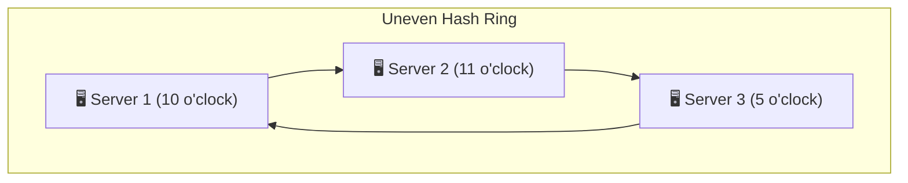
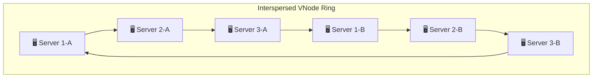
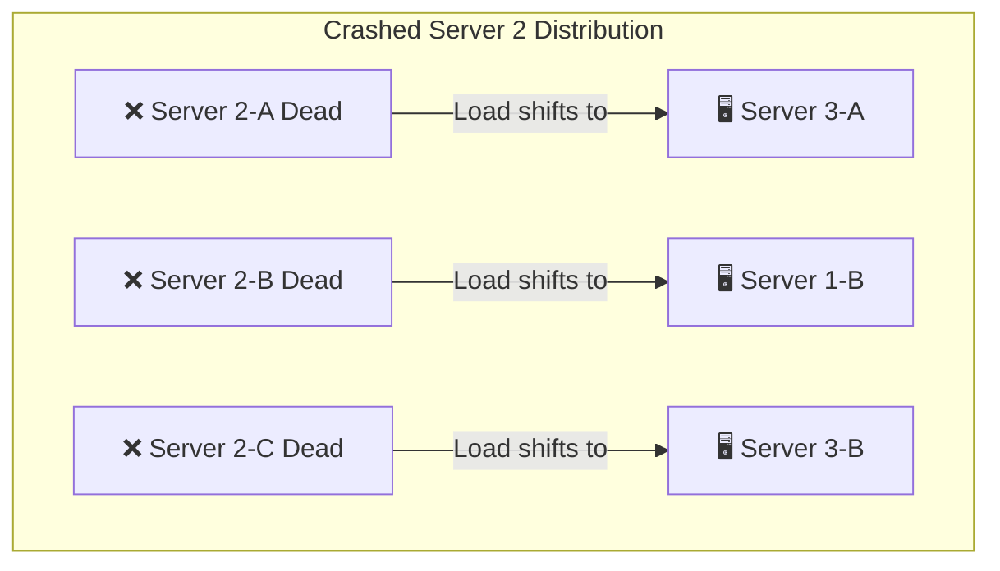

# 🌀 Virtual Nodes & Failure Recovery

> While consistent hashing reduces key migration, a basic ring has a fatal flaw: **load imbalance**. If servers are placed unevenly, one server can receive 80% of the traffic. We solve this using **Virtual Nodes (VNodes)**.

---

<div class="chapter-meta" markdown>
<span class="meta-item meta-reading-time">⏱ 10 min read</span>
<span class="meta-item meta-difficulty-advanced">🔴 Advanced</span>
</div>

---

## 🥵 The Hotspot Problem

If we only hash each physical server once, they will be distributed randomly on the ring. This creates highly unequal segments.



In the diagram above:
- The segment between **Server 2** and **Server 3** covers 50% of the ring.
- The segment between **Server 1** and **Server 2** covers only 8% of the ring.
- **Server 3** is a **hotspot**—it owns half the hash space and will receive 5x the traffic of Server 2.

---

## 🪑 The Solution: Virtual Nodes (VNodes)

Instead of mapping a physical server to a single point, we map it to **multiple logical positions** on the ring.

- **Physical Node:** `Server_1`
- **Virtual Nodes:** `Server_1_A`, `Server_1_B`, `Server_1_C`, `Server_1_D`



By increasing the number of virtual nodes per physical server (e.g., 100 or 200 VNodes per server), the positions become thoroughly interspersed on the ring. The segment sizes shrink, and the keys are distributed almost perfectly evenly.

!!! warning "Virtual Nodes Do Not Add Hardware Capacity"
    It is a common misconception that VNodes give you extra CPU or memory capacity. 
    **They do not.** If you have 3 physical servers, you still have the CPU of 3 machines. VNodes simply make sure that the existing workloads are divided **fairly** among them.

---

## 💥 Dealing with Server Crashes

What happens if **Server 2** crashes?

### ❌ Without VNodes: The Cascading Failure
If Server 2 dies, **all of Server 2's keys fall directly onto Server 3** (its clockwise neighbor). 
- Server 3's traffic suddenly doubles.
- Server 3 collapses under the load.
- Server 3's keys and Server 2's keys now crash into Server 1.
- Complete system outage (the cascading failure).

### ✅ With VNodes: The Load Dilution
Since Server 2 is split into VNodes (`Server_2_A`, `Server_2_B`, `Server_2_C`) interspersed around the ring:
- When Server 2 crashes, its virtual nodes disappear.
- The keys on `Server_2_A` fall to **Server 3-A**.
- The keys on `Server_2_B` fall to **Server 1-B**.
- The keys on `Server_2_C` fall to **Server 3-B**.

Instead of a single server absorbing 100% of the load, **the load of the crashed node is distributed evenly across all surviving servers.**



---

## 🛠️ Step-by-Step Failure Recovery Flow

When a storage node crashes in a production environment, the cloud architecture coordinates an automated recovery sequence:

```mermaid
sequenceDiagram
    participant H as Health Check / Monitor
    participant R as Hash Ring Manager
    participant C as Auto-Scaling (AWS/Azure)
    participant N as New Server Node

    Note over H: Node 2 stops responding
    H->>R: 1. Report Failure (Node 2 down)
    Note over R: Removes Node 2 VNodes<br/>from active hash ring
    Note over R: Traffic automatically routes<br/>to next clockwise nodes
    H->>C: 2. Trigger Scale Up
    Note over C: Provisions replacement VM
    C->>N: 3. Startup Node 2-Replacement
    N->>R: 4. Join Ring (Hash & Insert VNodes)
    Note over R: Rebalances keys;<br/>new node takes its share
```

---

## 🧠 Self-Assessment Quiz

??? question "Question 1: How do you choose the number of Virtual Nodes per physical server?"
    **Answer:** The number of VNodes is a trade-off. Adding more VNodes (e.g., 200) makes data distribution more balanced. However, it increases the memory footprint of the routing table and requires more CPU time to search the ring. Standard systems like Cassandra default to 128 or 256 VNodes.

??? question "Question 2: If we have servers with different hardware (e.g., Server A has 64GB RAM, Server B has 16GB RAM), how do we represent this in consistent hashing?"
    **Answer:** We assign VNodes proportionally to the server's capacity. We can configure **Server A** to have 200 VNodes and **Server B** to have 50 VNodes. Server A will occupy 4x more positions on the ring and handle 4x more traffic, matching its hardware advantage.

??? question "Question 3: Does consistent hashing solve replication and data backup?"
    **Answer:** No. Consistent hashing determines who *owns* the primary partition of a key. To prevent data loss, the key is also replicated to the next $N-1$ unique physical servers located clockwise along the ring.

---

<div class="navigation-footer" markdown>

[⬅️ Consistent Hashing Ring](04-consistent-hashing.md)

[➡️ Case Study: MediSphere Roadmap](06-medisphere-case-study.md)

</div>
