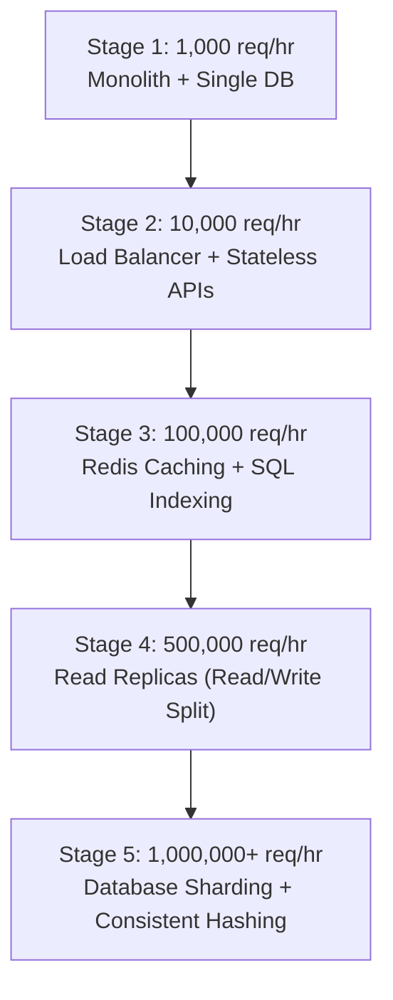
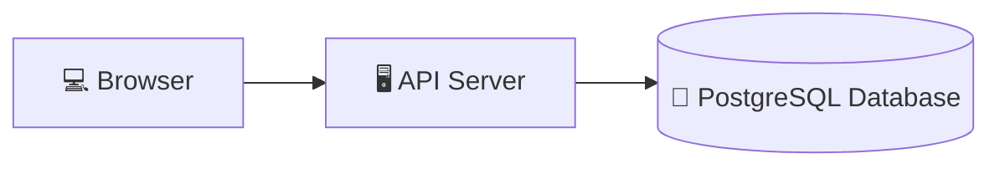
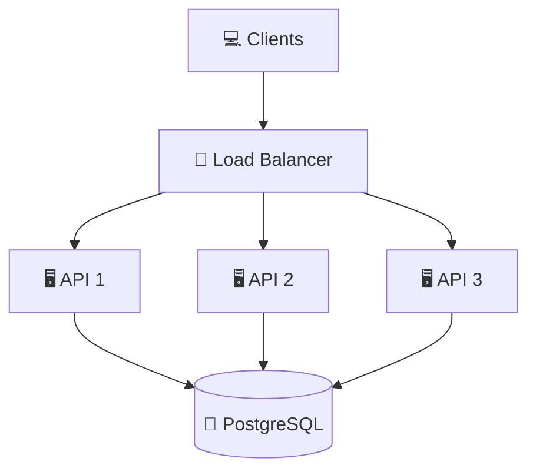
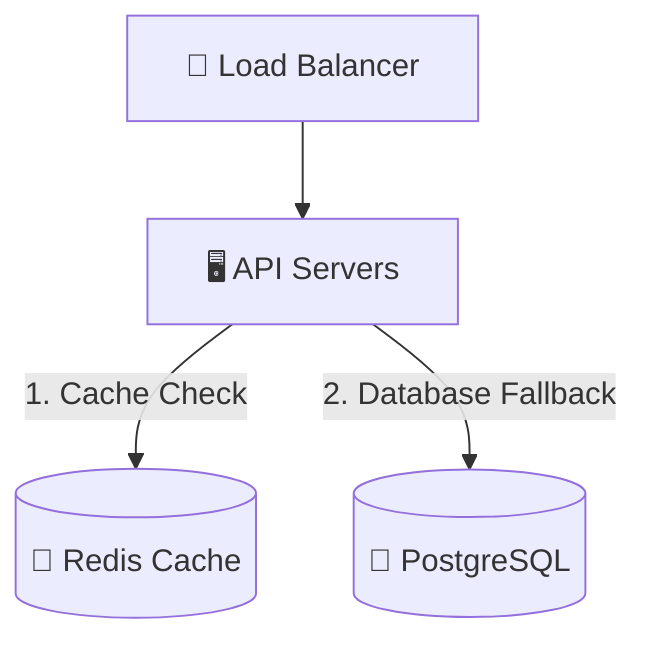
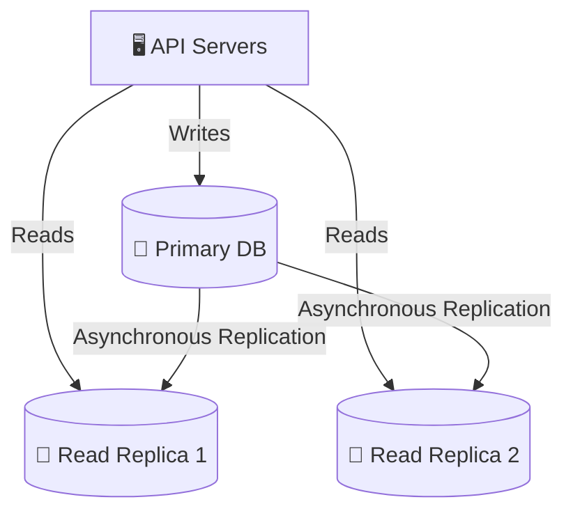

# 🏥 Case Study: MediSphere Roadmap

> Scaling is a marathon, not a sprint. Over-engineering on Day 1 will drain your budget and slow down development. This case study traces the gradual scaling journey of **MediSphere**, a digital healthcare platform, as it grows from a local clinic utility to a nationwide system.

---

⏱ 8 min read
🔴 Advanced

---

## 🗺️ The Scaling Architecture Lifecycle

Below is the evolution flow of MediSphere's architecture to handle traffic growth:

---

## 📈 Detailed Roadmap Stages

### Stage 1: 1,000 Requests/Hour (The Launch)
* **Goal:** Launch quickly, prove product-market fit, keep operational costs low.
* **Architecture:** A single client application talking to a monolithic ASP.NET Core API server, which connects to a single PostgreSQL database instance.
* **Storage Location:** The API server stores nothing; PostgreSQL holds all tables.

---

### Stage 2: 10,000 Requests/Hour (Going Horizontal)
* **Problem:** A single API server is hitting 85% CPU limits during peak morning appointment booking hours.
* **Solution:** 
  - Deploy **3 API Servers** behind an **Nginx Load Balancer** configured with Round Robin routing.
  - Refactor the API to be **Stateless**: sessions are converted from local server RAM to client-stored **JWT Tokens**.
  - All servers query the same shared PostgreSQL database.

---

### Stage 3: 100,000 Requests/Hour (Relieving Database Load)
* **Problem:** The PostgreSQL database is experiencing disk queue bottlenecks. The website load times are spiking to 8 seconds.
* **Solution:**
  - **Index Tuning:** Optimize SQL queries and create indexes for patient search columns.
  - **Redis Integration:** Set up a Redis cache cluster.
  - **Cache-Aside Pattern:** Cache static lists (specialties, active doctors list, clinical department list). Financial transactions, account balances, and booking completions bypass the cache to maintain strict database consistency.

---

### Stage 4: 500,000 Requests/Hour (Splitting Reads and Writes)
* **Problem:** Even with caching, write transactions (booking logs) combined with read reports (patient history downloads) saturate the SQL database.
* **Solution:**
  - Deploy **Read Replicas**.
  - Configure **Read/Write Splitting**: all database inserts/updates route to the **Primary Database**, while search and read-only queries route to the **Read Replicas**.
  - Replication lag is kept under 500ms.

---

### Stage 5: 1,000,000+ Requests/Hour (Distributed Partitioning)
* **Problem:** The Primary Database disk storage limit is reached, and write QPS has crossed hardware capacities.
* **Solution:**
  - **Database Sharding:** Split patients' data across three physical shards based on patient IDs.
  - **Consistent Hashing with Virtual Nodes:** Distribute data partitions onto shards using a hash ring.
  - VNodes ensure that if one shard goes offline, its write traffic is evenly distributed across the other two shards without causing cascading database failures.
  - Add message queues (RabbitMQ/Kafka) to process appointment email alerts asynchronously.

---

## 🧠 Self-Assessment Quiz

??? question "Question 1: Why did MediSphere avoid database sharding at Stage 1?"
    **Answer:** Sharding introduces massive engineering complexity: cross-shard joins are disabled, schema migrations become complex, and transactional consistency is hard to maintain. Sharding too early (over-engineering) wastes resources that are critical for product growth.

??? question "Question 2: What is replication lag, and why is it a problem in Stage 4?"
    **Answer:** Replication lag is the delay between a write committing on the Primary and being synced to the Replicas. If a patient updates their profile name and immediately refreshes the page, the read might hit a replica that hasn't synced yet, making it look like the update was lost.

??? question "Question 3: How does the final stage handle failures?"
    **Answer:** The architecture uses multi-level failovers:
    1. Load balancers redirect traffic if an API instance crashes.
    2. Redis clusters handle cache failures.
    3. Promoted database replicas step in if the primary node crashes.
    4. Consistent hashing rings rebalance partitions if a shard is lost.

---

[⬅️ Virtual Nodes & Failure Recovery](05-virtual-nodes-failures.md)

[➡️ Interview Cheat Sheet (Mana Style)](07-interview-cheatsheet.md)

