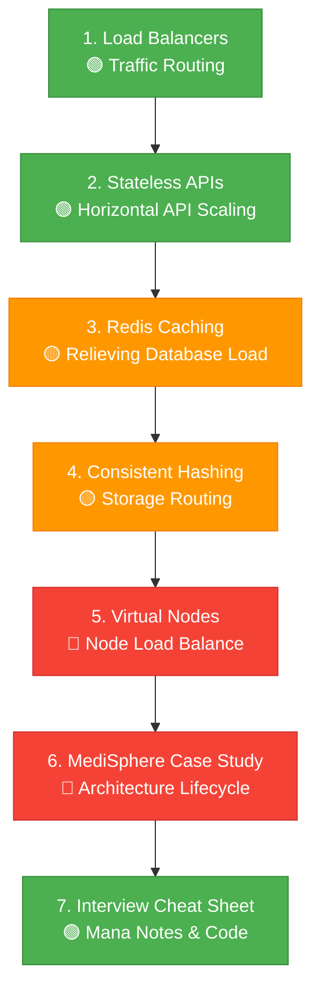
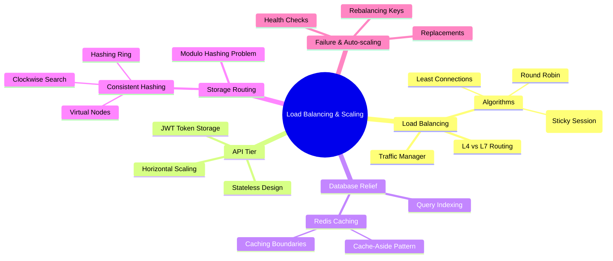

# 🚀 Load Balancing & System Scaling

> Building a highly scalable system isn't about buying a more expensive database server on Day 1. It's about understanding how to distribute traffic, separate concerns, caching frequently accessed records, and route storage keys efficiently. This module takes you through the lifecycle of scaling web applications—using **MediSphere** as our core case study.

---

⏱ 45–60 min total
🟢 Beginner
🟡 Intermediate
🔴 Advanced
📋 Client-Server Basics, Database Scaling basics

---

## 🎯 Learning Objectives

After completing this module, you will be able to:

- [ ] Explain the role of a Load Balancer and choose the appropriate routing algorithm
- [ ] Design stateless API layers that use token-based authentication (JWT) for horizontal scalability
- [ ] Implement the Cache-Aside pattern with Redis and define caching boundaries
- [ ] Compare modulo hashing with Consistent Hashing and explain why it prevents rehashing storms
- [ ] Explain how a hash ring works, mapping both servers and request keys on the same circle
- [ ] Configure Virtual Nodes to eliminate data hotspots and handle node failures gracefully
- [ ] Evolve an application from 1,000 req/hr to 1,000,000+ req/hr under a structured roadmap

---

## 📚 Prerequisites

Before starting this module, you should understand:

- **Client-Server Architecture** — HTTP requests, APIs, stateless protocols
- **Database Scaling Basics** — basic understanding of sharding and database bottlenecks
- **Hashing Basics** — how a standard hash function maps an input to a fixed-size integer

---

## 📖 Chapter Overview

| # | Chapter | What You'll Learn | Difficulty | Time |
|---|---------|------------------|------------|------|
| 1 | [Why & How of Load Balancers](01-intro-load-balancing.md) | Load balancer metaphors, traffic routing, L4/L7, and routing algorithms | 🟢 Beginner | 8 min |
| 2 | [Stateless APIs & Architectures](02-api-vs-db-stateless.md) | Differentiating API/DB layers, stateless APIs, JWT sessions | 🟢 Beginner | 8 min |
| 3 | [Database Bottlenecks & Redis Caching](03-database-bottlenecks-redis.md) | RAM caching, Cache-Aside pattern, Cache boundaries | 🟡 Intermediate | 8 min |
| 4 | [Consistent Hashing Ring](04-consistent-hashing.md) | Hashing ring, server & request placement, clockwise routing | 🟡 Intermediate | 10 min |
| 5 | [Virtual Nodes & Failure Recovery](05-virtual-nodes-failures.md) | Hotspotting, VNodes implementation, failovers and rebalancing | 🔴 Advanced | 10 min |
| 6 | [Case Study: MediSphere Roadmap](06-medisphere-case-study.md) | Scaling a real-world system from 1K to 1M+ requests/hour | 🔴 Advanced | 8 min |
| 7 | [Interview Cheat Sheet (Mana Style)](07-interview-cheatsheet.md) | One-line revision, full system design story, Python implementation | 🟢 All Levels | 8 min |

---

## 🗺️ Learning Roadmap

This module builds your knowledge progressively, mapping out a direct scaling lifecycle:

---

## 🧠 Concept Map

---

## 🌍 Real-World Context

!!! info "Load Balancing and Routing in Production"

    In production systems like Netflix, Amazon, and Uber:
    - **Load Balancers** handle incoming web requests and route them to stateless application containers.
    - **Redis / Memcached** caches read-heavy entities to keep the primary database from crashing.
    - **Consistent Hashing** partitions database stores (like Cassandra or DynamoDB) so that adding storage instances doesn't trigger massive data migrations.

---

## 📑 Quick Revision

| Concept | One-Line Summary |
|---------|-----------------|
| **Load Balancer** | A traffic controller that distributes HTTP/TCP requests across API nodes. |
| **Stateless API** | An API that stores no session context in local memory, relying on client tokens (JWT). |
| **Cache-Aside** | A cache design where the API reads from cache, falls back to SQL, and saves back to cache. |
| **Consistent Hashing** | A hashing algorithm where adding/removing nodes only disrupts $\frac{1}{N}$ keys. |
| **Virtual Nodes** | Mapping a physical machine to multiple locations on the ring for even distribution. |

---

## 🔗 Related Topics

- [Database Scaling](../database-scaling/index.md)
- [Caching Strategy (Coming Soon)](../../index.md)
- [System Architecture Patterns (Coming Soon)](../../index.md)

---

## 🚀 Start Learning

➡️ **Next:** [Why & How of Load Balancers](01-intro-load-balancing.md)
